Színek, grafikus ki- és bemeneti eszközök
=========================================

Színek
------

* Színérzékelés: retina, sárgafolt, pálcikák, csapok
* https://en.wikipedia.org/wiki/Photoreceptor_cell

A színeket alapvetően folytonos mennyiségeknek tekintjük, azokat különféle terekben tudjuk ábrázolni.

Szoktunk beszélni alapszínekről, melyek megválasztása a színkeverési módtól, a színtértől függ.

A következőkben néhány, gyakrabban előforduló színkeverési módot és színteret tekintünk át.

Additív színkeverés
~~~~~~~~~~~~~~~~~~~

* A fekete színből indulunk ki, amelyhez additív módon hozzá tudjuk adni a piros, zöld és a kék színeket.
* Például a fények keverésénél (például monitorok) találkozhatunk vele.
* Az alapszíneket szoktuk csatornáknak vagy komponenseknek is hívni.
* A tartományukat :math:`[0, 1]` folytonos vagy :math:`[0, 255]` egészes intervallumonszokták megadni.
* https://en.wikipedia.org/wiki/RGB_color_model

.. image:: images/additive.png
  :scale: 50%

A komponensek megadásához használt bitek száma adja a színmélységet (color depth).

* https://en.wikipedia.org/wiki/Color_depth

Egy színt egy :math:`(R, G, B)` hármas ad meg. :math:`[0, 1]` intervallumokat feltételezve néhány jellegzete szín:

.. csv-table::
  :header-rows: 1

  szín,R,G,B
  fekete,0,0,0
  piros,1,0,0
  sárga,1,1,0
  zöld,0,1,0
  türkiz,0,1,1
  kék,0,0,1
  magenta,1,0,1
  fehér,1,1,1

Az összes, így ábrázolható szín egy színkockán belül van.

.. image:: images/color_cube.png

:math:`\rhd` Ábrázoljuk a színkockát!

Szubtraktív színkeverés
~~~~~~~~~~~~~~~~~~~~~~~

* Kivonásra épülő színkeverés. A fehér színből vonjuk ki az alapszíneket.
* Például a nyomtatásban használják.
* Alapszínei a ciánkék (C), magenta (M) és a sárga (Y).
* Nyomdatechnikai okokból ki szokták még egészíteni egy fekete (K) színnel.
* https://en.wikipedia.org/wiki/CMYK_color_model

Az RGB színtérből egyszerű az átírás:

.. math::

  C = 1 - R, \quad M = 1 - G, \quad Y = 1 - B.

Átrendezéssel a visszaalakítást is egyszerűen megkapjuk:

.. math::

  R = 1 - C, \quad G = 1 - M, \quad B = 1 - Y.

A színtér ebben az esetben is egy kockán belül ábrázolható, amely gyakorlatilag az RGB színkocka tengelyek szerinti tükörképe.

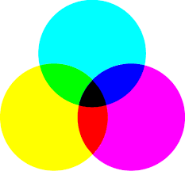

HSI, HSV és HSL színterek
~~~~~~~~~~~~~~~~~~~~~~~~~

Az RGB és a CMY a színek keverésére összpontosít, az árnyalatot, és a szín további jellemzőit, mint származtatott mennyiségeket kaphatjuk. Vannak viszont színterek, amelyek az árnyalatot (hue) külön paraméterként kezelik, továbbá figyelembe veszik a fény erősségét (intensity, value vagy lightness) és telítettségét (saturation).

* https://en.wikipedia.org/wiki/HSL_and_HSV

Az árnyalat értékét egy színkörön, szög formájában (jellemzően fokokban) szokás megadni.

A fény erősségére és a telítettségre vonatkozóan különféle elnevezések és számítási módok vannak. Az RGB színtérből való konvertáláshoz érdemes bevezetni néhány plusz jelölést:

.. math::

  m = \min(R, G, B), \quad M = \max(R, G, B), \quad C = M - m.

(A :math:`C`-t szokás tartománynak, terjedelemnek hívni.)

A fényerősségre a következő, alternatív definíciók vannak:

* Intensity: :math:`I = \dfrac{R + G + B}{3}`.
* Value: :math:`V = \max(R, G, B)`.
* Lightness: :math:`L = \dfrac{m + M}{2}`.

A fényerősséghez a következő definíciókat szokták használni a telítettség jellemzéséhez:

.. math::

  S_I = \begin{cases}
  0, & \text{ha } I = 0, \\
  1 - \dfrac{m}{I}, & \text{egyébként}.
  \end{cases}

.. math::

  S_V = \begin{cases}
  0, & \text{ha } V = 0, \\
  \dfrac{C}{V}, & \text{egyébként}.
  \end{cases}

.. math::

  S_L = \begin{cases}
  0, & \text{ha } L \in \{0, 1\}, \\
  \dfrac{C}{1 - |2L - 1|}, & \text{egyébként}.
  \end{cases}

A színteret hengeren vagy tölcséren (kúpon) lehet ábrázolni.

.. image:: images/HSL_cylinder.png
  :scale: 50%

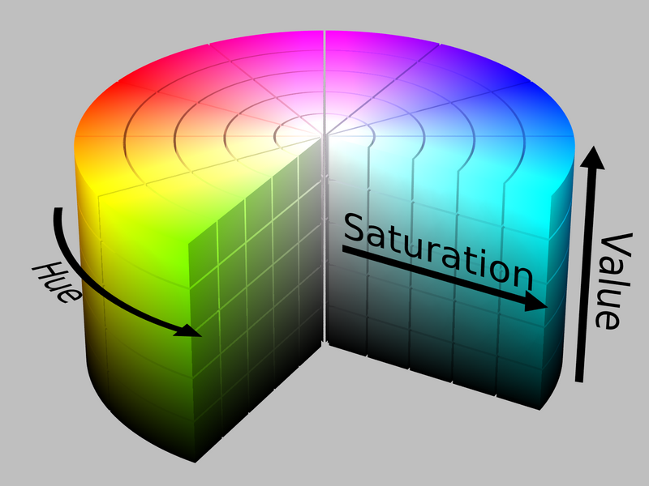

.. image:: images/HSL_cone.png
  :scale: 50%

.. image:: images/HSV_cone.png
  :scale: 50%

:math:`\rhd` Ábrázoljuk a színteret a jellegzetes színekkel!

:math:`\rhd` CMY színtérben adott a :math:`(0.2, 0.9, 0.3)` szín. Határozzuk meg a HSI, HSV és HSL színterekben a fényerősség és a telítettség értékeket!

Megjelenítő rendszerek
----------------------

A grafikus megjelenítő rendszerek fontos részei a ki- és bemeneti eszközök. A következőkben azt láthatjuk majd, hogy milyen változatos megoldások születtek, mi a működési elvük, milyen előnyökkel és hátrányokkal rendelkeznek.

Raszteres megjelenítés
~~~~~~~~~~~~~~~~~~~~~~

* A színeknek egy skalár vagy vektor értéket feleltetünk meg.
* Létrehozunk egy képmátrixot, amelyben tároljuk a színértékeket.
* A reprezentációs mód a rácsra nem illeszkedő alakzatoknál torzít.
* Az ábrázolás részletességét a raszter felbontása határozza meg.
* Adott raszteren a képek tárigénye megegyezik. (*A fájlformátumokról, és a tömörítésből adódó előnyökről még később lesz szó.*)
* A tengelyek mentén történő egész pixeles eltolási műveletek egyszerűek.
* A skálázás művelet abban az esetben egyszerű (hibamentesen kivitelezhető), hogy ha a középpontja rácspontra esik, és a tengelyek szerint egész értékekkel skálázunk.
* Az egyéb eltolás, skálázás és forgatás műveletek torzítást okoznak. ("okoznak" - lehet olyan kép, amelyiknél nem, de általánosságban az adott raszterhez tartozó összes lehetséges képet tekintjük.)
* https://en.wikipedia.org/wiki/Raster_graphics

Vektorgrafikus megjelenítés
~~~~~~~~~~~~~~~~~~~~~~~~~~~

* A megjelenítendő alakzatok előállítási módját írjuk le.
* Felbontásról nem szükséges beszélnünk.
* A reprezentációhoz szükséges tárigényt az alakzatok száma, azok bonyolultsága határozza meg.
* Az eltolás, skálázás és forgatás transzformációk (és a további, mátrixszal leírhatóak is) pontosan elvégezhetőek.
* https://en.wikipedia.org/wiki/Vector_graphics

:math:`\rhd` Soroljunk fel jellegzetesen előforduló vektorgrafikus alapelemeket!

.. note::

  A fájlformátumokat és a grafikus szerkesztőprogramokat is alapvetően az előbbi két csoportba szokás sorolni.

Színmélység
~~~~~~~~~~~

* Az egy képpont színének megadásához szükséges bitek száma.
* Használják még a szín egy adott csatornájához tartozó érték leírásához szükséges bitek számára is.
* :math:`k` darab bit esetén :math:`2^k` féle szín áll rendelkezésünkre. (Feltéve, hogy színes kép esetén a :math:`k` mindhárom komponenst egyidejűleg tartalmazza.)
* https://en.wikipedia.org/wiki/Color_depth

.. note::

  A *megjeleníthető színek száma* és az *egyidejűleg megjeleníthető színek száma* bizonyos esetekben eltér. Például színpaletta használatával, pixelenként 8 bittel is tudunk használni :math:`2^{24}` féle színt, azonban ezek közül egyszerre csak maximum 256 féle lehet látható.

.. note::

  A paletta forgatásával lehet animációt készíteni.

  * https://en.wikipedia.org/wiki/Color_cycling
  * https://www.youtube.com/watch?v=LUbrzg21X9c

.. image:: images/canvas-cycle.gif
  :scale: 50%

Képfrissítési frekvencia
~~~~~~~~~~~~~~~~~~~~~~~~

* A megjelenített képek váltogatásához szükséges idő reciproka.
* Mértékegysége Hz.
* Jellemzően *Frame Rate* vagy *Frame Per Second* néven hivatkoznak rá.
* https://en.wikipedia.org/wiki/Frame_rate

Kimeneti eszközök
-----------------

A megjelenített felület lehet

* sík (jellemzően ezt preferáljuk),
* domború (technológiai korlát miatt például),
* homorú (hogy közelebbről nagyobbnak tűnjön),
* egyéb (mert képesek vagyunk rá).

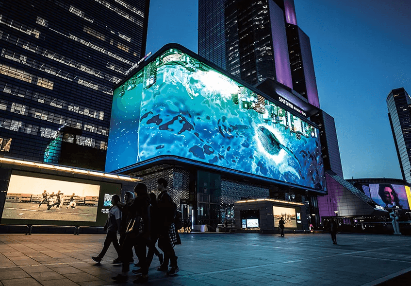

A megjelenítési tartomány többségében négyzet alakú, de akadnak kivételek, például

* okosórák,
* *notch*,
* Apple Vision külső megjelenítője.

.. image:: images/non-rect.jpeg
  :scale: 50%

Kijelzők
~~~~~~~~

* Szegmentált kijelző
* Például digitális órák, számológépek
* https://en.wikipedia.org/wiki/Seven-segment_display

Monitorok
~~~~~~~~~

CRT monitorok

* *Cathode Ray Tube*
* https://en.wikipedia.org/wiki/Cathode-ray_tube

.. image:: images/crt.png
  :scale: 50%

Vektorgrafikus megjelenítés

* Hardver szintjén is megoldható a vektorgrafikus megjelenítés.
* https://en.wikipedia.org/wiki/Vector_monitor

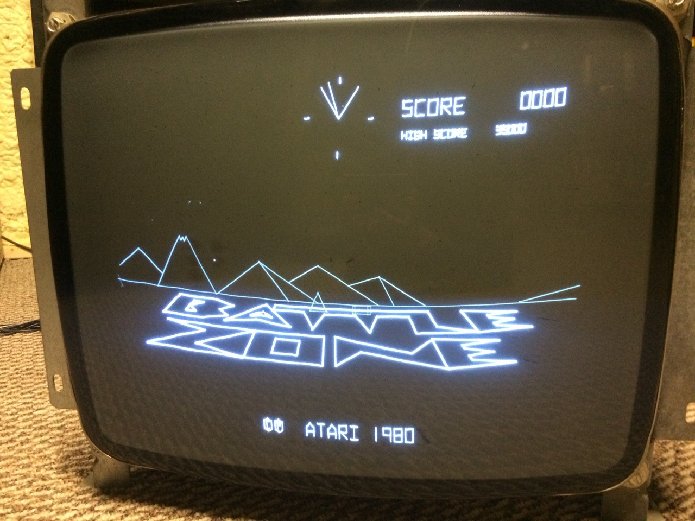

Raszteres megjelenítés

* Manapság ez a gyakoribb.
* Többségében RGB színkeverés történik.
* A pixelek alakja, és a csatornák elrendezése változatos.

.. image:: images/rgb-arrangement.jpg
  :scale: 30%

Technológiák

* LCD: *Liquid-Crystal Display*, https://en.wikipedia.org/wiki/Liquid-crystal_display
* LED: *Light Emitting Diode*, https://en.wikipedia.org/wiki/LED_display
* IPS: *In-Plane Switching*, https://en.wikipedia.org/wiki/IPS_panel
* OLED: *Organic Light Emitting Diode*, https://en.wikipedia.org/wiki/OLED
* QLED: *Quantum dot LED*, https://en.wikipedia.org/wiki/Quantum_dot_display

.. warning::

  A klasszikus LCD megjelenítőknél szükség van fehér háttérvilágításra, amelyet például fehér LED-ekkel oldanak meg. Figyelni kell arra, hogy a kijelzőben a LED pontosan mire szolgál!

:math:`\rhd` Tekintsük át, hogy monitor vásárlásánál milyen funkcionális és nem funkcionális követelmények jöhetnek szóba!

Projektorok
~~~~~~~~~~~

* Speciális optikával ellátott, nagy fényerejű LCD kijelzők többségében.
* Az energiafelvétel és a hűtés is probléma.
* Különféle korrekciós lehetőségek, például fókusz beállítás, trapéz korrekció.
* Az interfészét és beállítási lehetőségeit tekintve nagyon hasonlít a monitorokra.
* A megjelenítés minőségét erősen befolyásolja a vászon és a fényviszonyok.

Statikus megjelenítő eszközök
~~~~~~~~~~~~~~~~~~~~~~~~~~~~~

A statikus alatt számos dolgot érthetünk. A következő részben a *statikus* azt jelenti, hogy ha a kijelzőt kikapcsoljuk, akkor a legutoljára megjelenített kép megmarad rajta.

* Analóg órák
* Tekerős órák (például mérőórák)
* Forgatható naptár
* Buszokon, állomásokon tekerős kijelzők (kis felbontású raszteres)

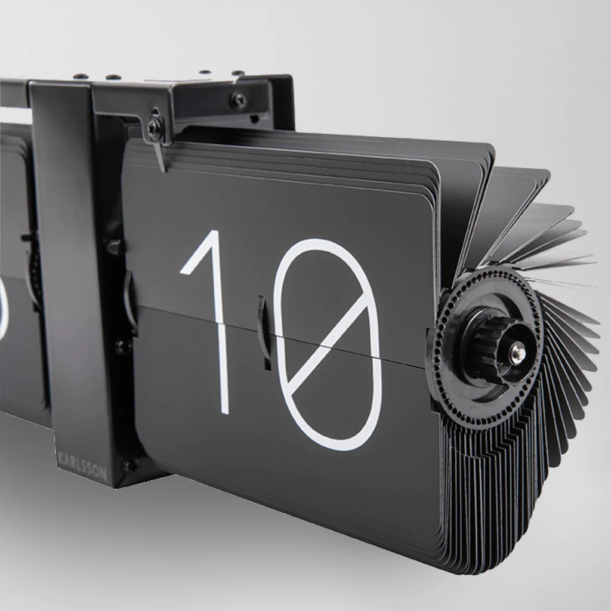

eInk kijelző

* Például boltokban
* Jellemző problémája az alacsony képfrissítési frekvencia és a szellemkép (*ghosting*).
* Külső (vagy saját beépített) megvilágítást igényel. A fénynek vissza kell róla verődnie, vagy a kép hátuljának megvilágítva kell lennie.
* A 2020-as évektől kezdve már protípus szintjén kezdtek megjelenni a színes változatok.
* https://en.wikipedia.org/wiki/E_Ink

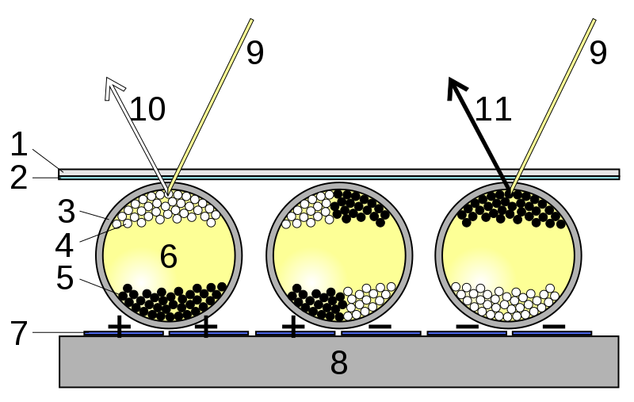

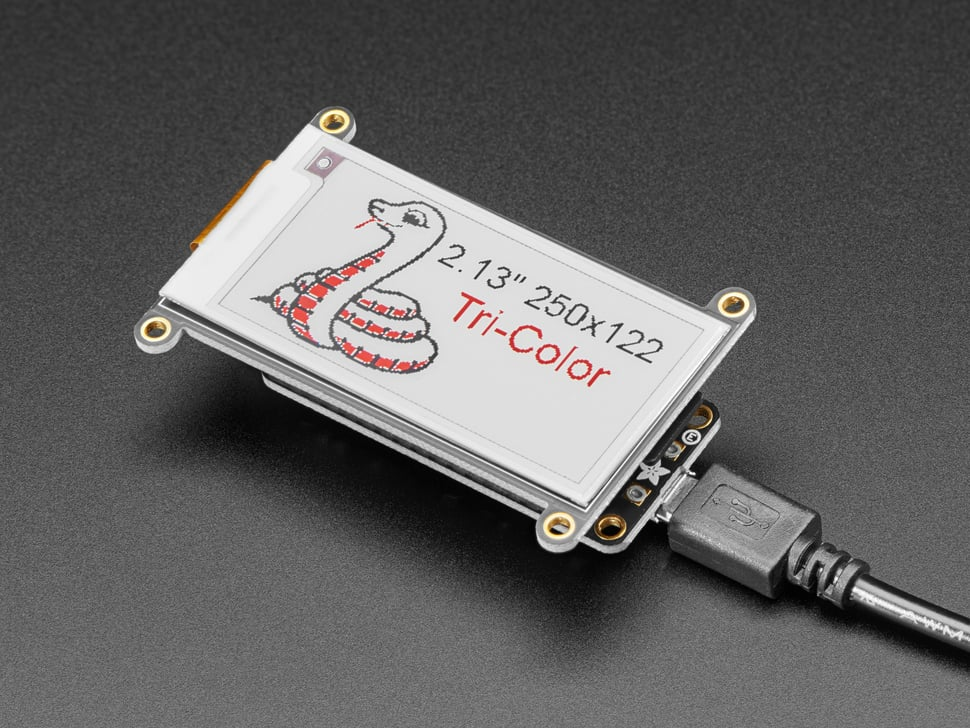

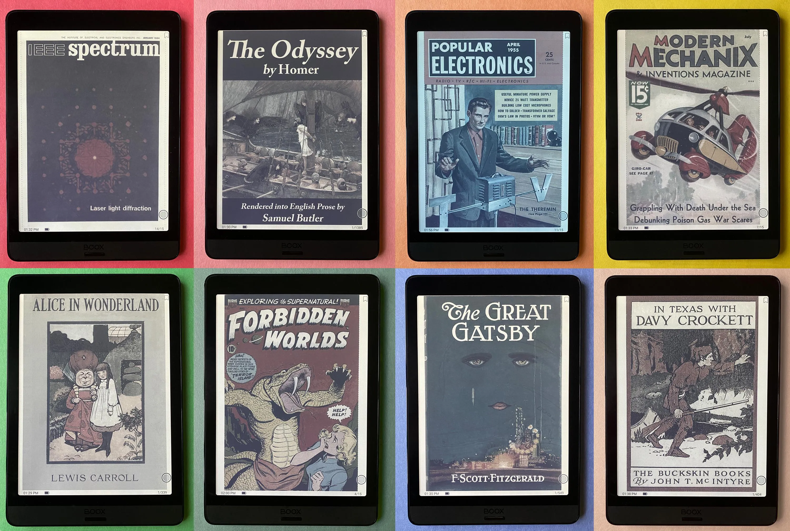

Nyomtatók
~~~~~~~~~

Külön említésre kerülnek, de tekinthetők a statikus kijelzők egy szélsőséges esetének.

* A számítógépek elsődleges kimeneti eszközei voltak igen sokáig.
* Az operációs rendszerekben ezeknek a nyomait a mai napi felfedezhetjük, például:

.. code:: python

  print('Hello, World!')

Technológiák

* Automatizált írógépek
* Mátrix
* Tintasugaras
* Lézer
* https://en.wikipedia.org/wiki/Printer_(computing)
* https://en.wikipedia.org/wiki/Inkjet_printing

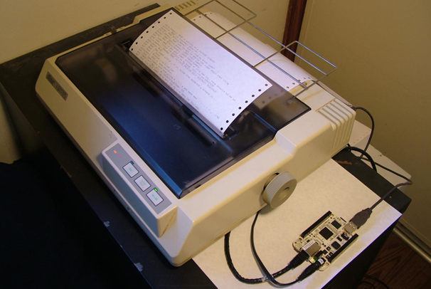

.. image:: images/inkjet.gif

Színes nyomtatás esetében a CMYK színkeverési módszer gazdaságosabb, mint a CMY.

:math:`\rhd` Gyűjtsük össze, hogy milyen szempontok lehetnek egy nyomtató vásárlásánál, használatánál!

Plotterek

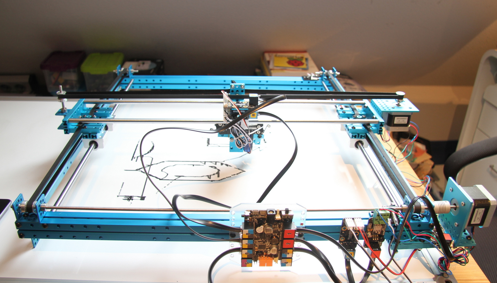

3D nyomtató

* Extruder-es
* Gyantás gyomtatás

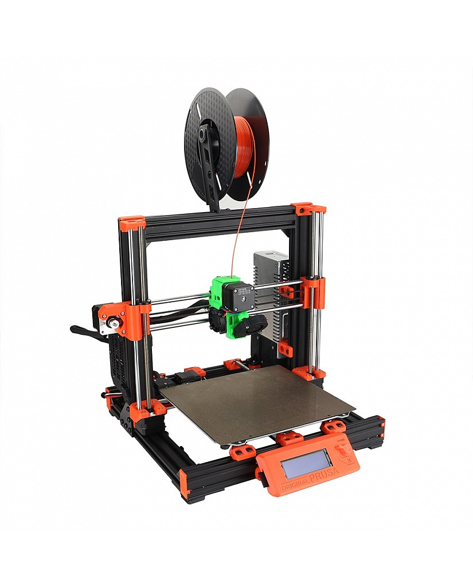

.. image:: images/resin-printer.webp
  :scale: 40%

CNC gépek

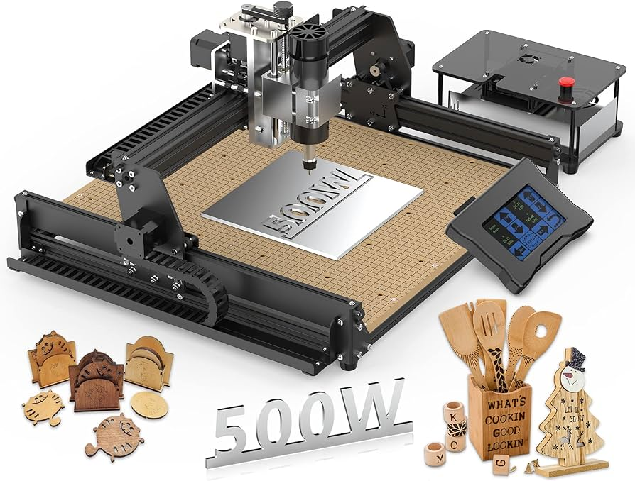

Bemeneti eszközök
-----------------

Kamera
~~~~~~

* Optika
* CCD: *Charge Coupled Device*
* Optikai és szoftveres zoom-olás

.. image:: images/ccd.jpg
  :scale: 40%

Szkenner
~~~~~~~~

* síkágyas
* kézi
* 3D szkenner
* Face ID

.. image:: images/3d-scanner.webp

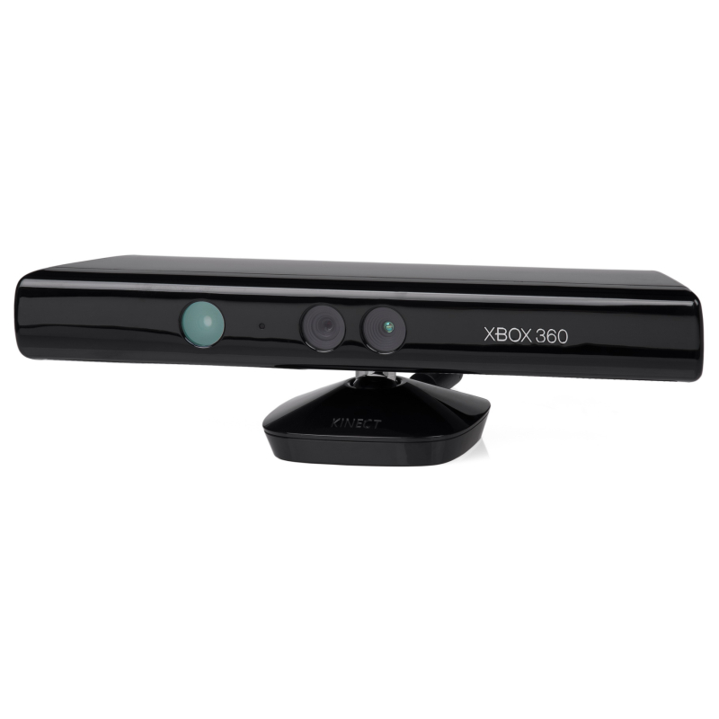

Billentyűzet
~~~~~~~~~~~~

* Kiosztás
* Kapcsoló mechanika
* Vezetékes/vezeték nélküli
* Ergonomikus
* Osztott
* https://en.wikipedia.org/wiki/Computer_keyboard

.. image:: images/mx-blue.gif

.. image:: images/circle-board.webp
  :scale: 40%

.. image:: images/projection-keyboard.jpg
  :scale: 60%

Egér
~~~~

* Golyós, optikai
* Vezetékes/vezeték nélküli
* Ergonomikus
* https://en.wikipedia.org/wiki/Computer_mouse

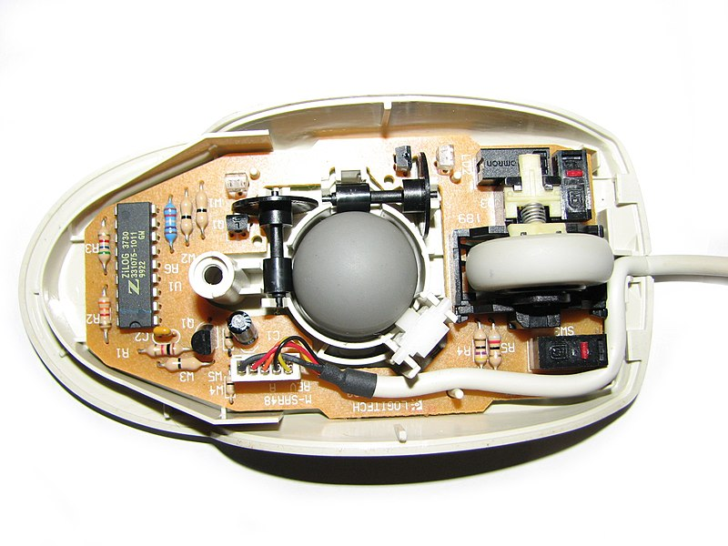

Joystick
~~~~~~~~

* Botkormány
* Kontrollereken, billentyűzeteken
* https://en.wikipedia.org/wiki/Joystick

Érintőfelület
~~~~~~~~~~~~~

* Fejlettebb változata multitouch.
* Gyakran a kijelzőbe építik.

Fényceruza
~~~~~~~~~~

* CRT kompatibilis pozícionáló eszköz
* Például kazettás, lövöldözős játékoknál
* https://en.wikipedia.org/wiki/Light_pen

VR headset-ek
~~~~~~~~~~~~~

* Egyidejűleg ki- és bemeneti eszköz.
* Szenzor fúzió

Kérdések
--------

* Rajzolja le az RGB színkockát, és jelölje be, hogy az egyes csúcsaihoz milyen színek tartoznak!
* Milyen színek vannak az RGB színkocka :math:`(0, 0, 0)` és :math:`(1, 1, 1)` pontját összekötő szakaszon?
* Ábrázolja a HSV színteret, és jelölje be rajta a jellegzetes színeket!
* Milyen előnyei és hátrányai vannak a raszteres és a vektorgrafikus megjelenítésnek?
* Hogy ha 12 bit a színmélység, akkor hány színt tudunk használni?
* Milyen paramétereket érdemes figyelembe venni egy monitor megvásárlásánál?

Számítási feladatok
-------------------

* Egy színt a CMY színtérben a :math:`(0.2, 0.7, 0.4)` komponensekkel adtunk meg. Határozza meg a HSI, HSV és HSL színtérbeli értékeket!
* Számítsuk ki, hogy mennyi MBit/s adatátviteli sebességre van ahhoz szükség, hogy egy 1280x1024 felbontású videófolyamot 30 FPS-sel folyamatosan küldjünk (tömörítés nélkül)!

Programozási feladatok
----------------------

Mátrixok, transzformációk
~~~~~~~~~~~~~~~~~~~~~~~~~

* Nézzük át a jegyzetben a koordináta transzformációkkal foglalkozó részt!
* Nézzük át a ``matrices`` példát az ``me-courses`` repository-ban!

Végezzük el a kódban az alábbi bővítéseket!

* Definiáljunk egy ``init_identity_matrix`` függvényt, amelyik az egységmátrixot inicializálja!
* Definiáljunk függvényt a mátrix skalárral való szorzásához!
* A ``multiply_matrices`` függvényben implementáljunk a mátrix szorzást!
* Definiáljuk a ``transform_point`` függvényt, amelyik egy síkbeli, homogén koordinátákkal adott pontra végzi el a paraméterben kapott mátrix által leírt transzformációt!
* Írjunk 3 függvényt a transzformációkhoz, amelyik módosítja az első paraméterében kapott transzformációs mátrixot! A függvények neve legyen ``scale``, ``shift``, ``rotate``! A skálázás és a forgatás origó középpontú legyen!
* Készítsünk példát minden elkészített függvény használatára vonatkozóan!

Transzformációs verem
~~~~~~~~~~~~~~~~~~~~~

* Készítsünk egy verem struktúrát, amelynek az elemei transzformációs mátrixok!
* Valósítsuk meg a ``push_matrix`` és ``pop_matrix`` műveleteket!
* Készítsünk példát, amelyben ennek a segítségével "visszavonhatóak" lesznek a műveletek!

