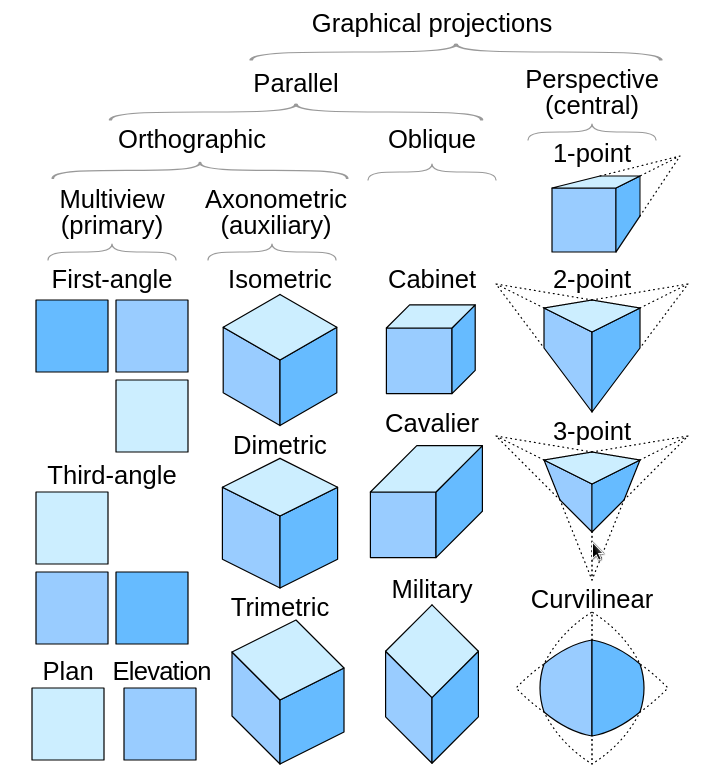
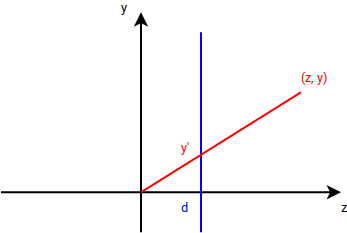
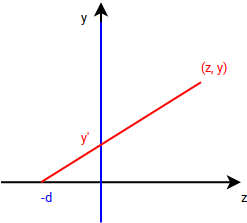
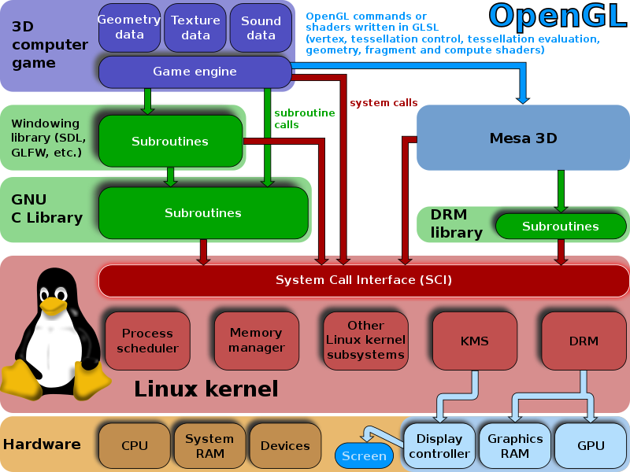
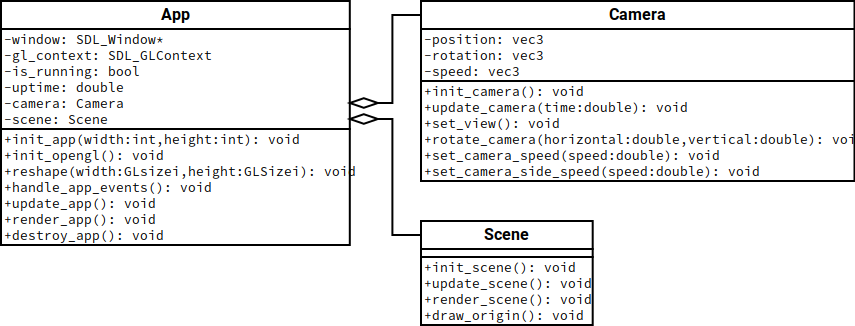

Térbeli alakzatok leképzése síkra
=================================

Az alapvető célunk jelen esetben: térbeli objektumok ábrázolása síkon.

* Jellemzően a 3 dimenziós teret képezzük le 2 dimenziósra.
* Ezt a transzformációt szokták nézeti transzformációnak nevezni.
* A vetítés egy dimenzióvesztő leképzés.
* Elvész a mélységinformáció.
* A vetített képből nem tudjuk teljesen rekonstruálni az eredeti térbeli objektumot.
* https://en.wikipedia.org/wiki/3D_projection

Párhuzamos vetítés
------------------

A tér pontjait párhuzamos fénysugarak segítségével vetítjük egy síkra.

* Az eredetileg párhuzamosok a vetítést követően is párhuzamosok maradnak.
* Az arányokat nem feltétlenül tartja meg.
* A kép egészét nézve azt mondhatjuk, hogy a kameránknak tulajdonképpen nincs pozíciója. (Azt végtelenül távolinak tekinthetjük.)
* A világ és a képi koordinátarendszert tekintve értelmezhetjük a kameránk pozícióját.

Orthogonális vetítés
--------------------

* Merőleges vetítés, orthografikus projekció, analemma
* A párhuzamos vetítés egy alapesete.
* Izometrikus megjelenítés. (A játékok esetében azt is gyakran így nevezik, ahol az élek nem :math:`120^\circ` szöget zárnak be.)
* Két és fél 3D
* https://en.wikipedia.org/wiki/Oblique_projection
* https://en.wikipedia.org/wiki/Isometric_video_game_graphics
* https://rocketbrush.com/blog/isometric-games-how-isometry-benefits-game-developers

.. math::

  P = \begin{bmatrix}
  1 & 0 & \dfrac{1}{2}\cos \alpha \\
  0 & 1 & \dfrac{1}{2}\sin \alpha \\
  0 & 0 & 0 \\
  \end{bmatrix}.

Az :math:`\alpha` azt a szöget adja meg, amellyel a :math:`z` tengely irányú eltérést szemléltetjük.

Az :math:`(x, y)` síkra történő vetítés homogén koordinátákkal az alábbi mátrixszal is felírható:

.. math::

  P = \begin{bmatrix}
  1 & 0 & 0 & 0 \\
  0 & 1 & 0 & 0 \\
  0 & 0 & 0 & 1 \\
  \end{bmatrix}.

Ez tulajdonképpen a :math:`z` tengely szerinti értékek elhagyását jelenti.

Perspektivikus vetítés
----------------------

* Egy, két és három pontos perspektíva.
* Középpontos vetítés.
* A vetítés középpontjának a szempozíciót tekintjük.

:math:`\rhd` Rajzoljunk fel egy kockát egy, két és három pontos perspektivikus ábrázolással!

.. note::

  A valódi kamerákhoz képest az egyik eltérés, hogy általában nem vesszük figyelembe a lencsék torzítását.

A vetítési mód vizsgálatához feltételezzük a következőket!

* Egy :math:`(e_x, e_y, e_z)` pontból szemléljük a teret.
* A tér pontjait az :math:`z` tengelyre merőleges síkra szeretnénk vetíteni.

Ezen belül további, két egyszerű esetet is meg tudunk különböztetni.

* Amennyiben feltételezzük, hogy a szempozíciónk az origóban van, és a képernyő síkja a szemtől :math:`d` távolságra van, akkor a tér pontjait erre a síkra az alábbi formában vetíthetjük:

.. math::

  x' = x \cdot \dfrac{d}{z}, \quad
  y' = y \cdot \dfrac{d}{z}.

* Hogy ha azt feltételezzük, hogy a képernyő síkja tartalmazza az origót, a szempozíciónk mögötte, a :math:`(0, 0, -e_z)` pontban van, akkor a számítás a következő:

.. math::

  x' = x \cdot \dfrac{-e_z}{z - e_z}, \quad
  y' = y \cdot \dfrac{-e_z}{z - e_z}.

Hogy ha ugyanezt szempozíció helyett a képernyő síkjától való távolsággal adjuk meg, akkor a következőt kapjuk:

.. math::

  x' = x \cdot \dfrac{d}{d + z}, \quad
  y' = y \cdot \dfrac{d}{d + z}.

.. TODO: Mutatni rá játékokból példákat!

OpenGL
------

* Open Graphics Library
* Khronos Group
* 1997-ben jelent meg az 1.1-es változata
* https://en.wikipedia.org/wiki/OpenGL

* Az API-ban jellegzetesen :code:`gl` prefixszel kezdődnek az OpenGL specifikus függvények.
* Egy állapotgépről van szó.

:math:`\rhd` Tekintsük át a :code:`gl.h` fejléc állományt!

:math:`\rhd` Milyen alternatívái vannak az OpenGL-nek?

Grafikus alapelemek
~~~~~~~~~~~~~~~~~~~

.. image:: images/04/opengl_primitives.png
  :scale: 60%

:math:`\rhd` Nézzünk meg példákat az egyes alapelemek használatára!

:math:`\rhd` Hogyan jeleníthetünk meg kúpot, hengert vagy gömböt?

:math:`\rhd` Rajzoltassuk ki egy kocka éleit az alábbi kódrésszel!

.. code:: cpp

    glBegin(GL_LINES);
    glColor3f(1, 1, 1);

    glVertex3f(-1, -1, -1);
    glVertex3f(1, -1, -1);
    glVertex3f(1, -1, -1);
    glVertex3f(1, 1, -1);
    glVertex3f(1, 1, -1);
    glVertex3f(-1, 1, -1);
    glVertex3f(-1, 1, -1);
    glVertex3f(-1, -1, -1);

    glVertex3f(-1, -1, 1);
    glVertex3f(1, -1, 1);
    glVertex3f(1, -1, 1);
    glVertex3f(1, 1, 1);
    glVertex3f(1, 1, 1);
    glVertex3f(-1, 1, 1);
    glVertex3f(-1, 1, 1);
    glVertex3f(-1, -1, 1);

    glVertex3f(-1, -1, -1);
    glVertex3f(-1, -1, 1);
    glVertex3f(-1, 1, -1);
    glVertex3f(-1, 1, 1);
    glVertex3f(1, 1, -1);
    glVertex3f(1, 1, 1);
    glVertex3f(1, -1, -1);
    glVertex3f(1, -1, 1);

    glEnd();

.. note::

  A vonalak vastagsága a :code:`glLineWidth` függvény segítségével beállítható. (https://registry.khronos.org/OpenGL-Refpages/gl4/html/glLineWidth.xhtml)

A leképzett térrész
~~~~~~~~~~~~~~~~~~~

* A téglalap alakú képernyőnkre, elülső és hátsó vágósík használatával (jellemzően) a tér egy téglalap vagy csonka gúla alakú részét tudjuk leképezni.
* A térrész leírásához a bal, jobb, alsó, felső, elülső és hátsó értékek megadása szükséges.

Orthogonális leképzés
~~~~~~~~~~~~~~~~~~~~~

Orthogonális leképzéshez a :code:`glOrtho` függvényt használhatjuk.

* A megjelenített térrész egy téglalapon belül van.
* https://registry.khronos.org/OpenGL-Refpages/gl2.1/xhtml/glOrtho.xml

.. code:: cpp

  void glOrtho(
    GLdouble left,
    GLdouble right,
    GLdouble bottom,
    GLdouble top,
    GLdouble near,
    GLdouble far
  );

A transzformáció leírásához vezessük be a következő jelöléseket:

* :math:`l`: A képtér bal (*left*) oldala.
* :math:`r`: A képtér jobb (*right*) oldala.
* :math:`t`: A képtér felső (*top*) oldala.
* :math:`b`: A képtér alsó (*bottom*) oldala.
* :math:`n`: A nézőpont távolsága az elülső (*near*) vagósíktól.
* :math:`f`: A nézőpont távolsága a hátsó (*far*) vagósíktól.

A transzformáció a következő transzformációs mátrixszal írható le:

.. math::

  P = \begin{bmatrix}
  \dfrac{2}{r-l} & 0 & 0 & t_x \\
  0 & \dfrac{2}{t-b} & 0 & t_y \\
  0 & 0 & \dfrac{-2}{f-n} & t_z \\
  0 & 0 & 0 & 1 \\
  \end{bmatrix},

ahol

.. math::

  t_x = \dfrac{r+l}{r-l}, \quad t_y = \dfrac{t+b}{t-b}, \quad t_z = \dfrac{f+n}{f-n}.

:math:`\rhd` Vizsgáljuk meg a :code:`glOrtho` függvény használatát a *Pong* példa esetében!

Perspektív leképzés
~~~~~~~~~~~~~~~~~~~

Perspektivikus leképzéshez a :code:`glFrustum` függvényt használhatjuk.

* A megjelenített térrész egy csonka gúla. Ezt nevezzük nézeti gúlának.
* https://www.scratchapixel.com/lessons/3d-basic-rendering/perspective-and-orthographic-projection-matrix/opengl-perspective-projection-matrix.html
* https://registry.khronos.org/OpenGL-Refpages/gl2.1/xhtml/glFrustum.xml

.. code:: cpp
  void glFrustum(
    GLdouble left,
    GLdouble right,
    GLdouble bottom,
    GLdouble top,
    GLdouble near,
    GLdouble far
  );

.. image:: images/04/fustrum.png
  :scale: 40%

*forrás*: https://www.songho.ca/opengl/gl_transform.html

A transzformáció mátrixa:

.. math::

  P = \begin{bmatrix}
  \dfrac{2n}{r-l} & 0 & \dfrac{r+l}{r-l} & 0 \\
  0 & \dfrac{2n}{t-b} & \dfrac{t+b}{t-b} & 0 \\
  0 & 0 & -\dfrac{f+n}{f-n} & -\dfrac{2fn}{f-n} \\
  0 & 0 & -1 & 0 \\
  \end{bmatrix}.

Kamera implementálása
~~~~~~~~~~~~~~~~~~~~~

Objektum orientált szemlélet szerint a kamerát is egy különálló, nevesített elemnek tekinthetjük.

:math:`\rhd` Vizsgáljuk meg, hogy hogyan tudjuk mozgatni a kamerát a térben!

Kérdések
--------

* Milyen grafikus alapelemeket képes megjeleníteni az OpenGL?
* Mi a menete egy háromszög megjelenítésének programkód szintjén (az aktuálisan használt változatban/példaprogramokban)?
* Hogyan tudunk gömböt, hengert és kúpot megjeleníteni OpenGL segítségével?
* Hogyan oldjuk meg a kamera kezelését?

Számítási feladatok
-------------------

#. Tegyük fel, hogy orthogonálisan szeretnénk vetíteni az :math:`(x, z)` síkra. A szempozíciónk a :math:`(3, 5, 7)` pontban van. Írja fel a vetítéshez tartozó mátrixot!

#. Orthogonális vetítést feltételezünk. A térbeli :math:`(7, -1, 2)` pontot az :math:`x = 6, z = 3` pontra vetítettük le. Melyik síkra történt a vetítés? Hol volt a szempozíciónk a térben?

#. Adott a :math:`(2, -8, 10)` pont a térben. Perspektivikus leképzést feltételezve hova kerül a síkon, hogy ha a szempozíciónk az origó, és a képernyősík attól 3 egység távolságra van?

#. Perspektív transzformációval a :math:`(2, -8, 10)` pontot a :math:`(0.2, -0.8)` pontba képeztük le. Milyen messze van a szempozíciónk a képernyő síkjától?

Programozási feladatok
----------------------

Pong
~~~~

* Nézzük át a ``pong`` példát az ``me-courses`` repository-ból!
* Változtassuk meg a labda sebességét!
* Javítsuk ki a programot, hogy csak akkor ütközzön vissza a labda bal és jobb oldalt, ha ott van az ütő alatta!
* Kattintással lehessen áthelyezni a labdát!
* Billentyűk segítségével lehessen változtatni a labda méretét bizonyos határokon belül!
* Oldjuk meg, hogy forogjon is a labda egyenletes sebességgel! Ütközés esetén ez a sebesség változzon (például attól függően, hogy melyik oldalnak vagy milyen irányból ütközött neki)!
* Készítsünk két számlálót, amelyik nyilvántartja, hogy melyik játékosnak mennyi pontja van. Ezt valahogyan jelenítsük meg!

