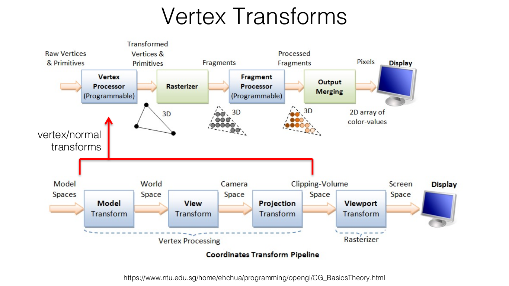
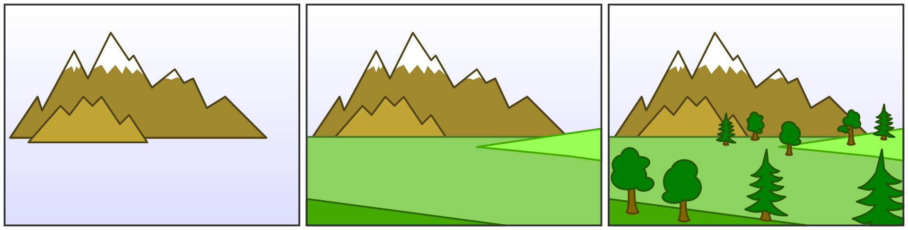

A grafikus megjelenítési folyamat
=================================

A teljes megjelenítési folyamatot, mint egy transzformációs láncot képzelhetjük el.

Mivel egy cső, futószalag szerű feldolgozásról van szó, ezért ezt szokták *nézeti csővezeték* nek, vagy angolul *rendering pipeline* -nak hívni.

* Nem egyetlen konkrét kialakítás van.
* Különböző absztrakciós szinteken szokták tárgyalni.
* https://stanford.edu/class/ee267/lectures/lecture2.pdf
* https://web.cse.ohio-state.edu/~shen.94/781/Site/Slides_files/pipeline.pdf

A megjelenítési folyamathoz tartozó fő transzformációk tehát:

* Modell transzformáció,
* Nézeti transzformáció,
* Vetítési transzformáció,
* Képtér transzformáció.

A modellek és a kamera transzformációját a korábbi témákból már ismerjük. Aktuálisan azt vizsgáljuk, hogy milyen további módszerek szükségesek ahhoz, hogy valószerűbbé, és hatékonyabbá tehessük a megjelenítést.

Láthatóság
----------

A vetítési transzformációk önmagukban nem garantálják, hogy csak az látszódjon a képen, aminek a kamerából ténylegesen kellene. Az objektumok kirajzolásának sorrendjétől függhet az, hogy mi látszik majd a képen.

.. TODO: Példa különböző megjelenítési sorrendekre ábrával.

Takarási problémaként hivatkozunk arra a feladatra, amely során megállapítjuk, hogy a színtér mely részeinek kell látszódnia, és melyek lesznek takarásban az eredményként kapott képen.

Mivel a festésnél is hasonló problémáról van szó, ezért a közvetlen sorbarendezést használó algoritmust szokták nevezni *painter's algorithm*-nek is:

* https://en.wikipedia.org/wiki/Painter%27s_algorithm

Az algoritmusnak nem minden esetben lehet egyáltalán megoldása, hogy ha egy objektum kirajzolását egy elemi lépésnek tekintjük.

:math:`\rhd` Adjunk példát olyan esetre, amelyet sorbarendezéssel nem lehet megoldani!

A következőkben a láthatósági probléma lehetséges megközelítéseit vizsgáljuk.

Objektumok sorba rendezése
~~~~~~~~~~~~~~~~~~~~~~~~~~

Egyszerűbb (speciális) esetekben megtehetjük azt, hogy előre meghatározzuk az objektumok megjelenítési sorrendjét, és a szerint rajzoltatjuk ki őket.

* Feltételezzük, hogy egy-egy objektumot önmagában megfelelően meg tudunk jeleníteni. (Konvexek, és a hátsó lapjaik nem látszódnak.)
* A sorrend meghatározása függ az összes objektum és a kamera pozíciójától is.
* Általános esetben nem oldja meg a problémát.

:math:`\rhd` Vizsgáljuk meg egy-egy konkrét esetre, hogy hogyan tudnánk megoldani a sorbarendezést!

Háromszögek sorba rendezése
~~~~~~~~~~~~~~~~~~~~~~~~~~~

Egy fokkal általánosabb megoldást kapunk, hogy ha az objektumok kirajzolásához használt háromszögeket rendezzük sorba.

* Lényegesen nagyobb a számításigénye, mint az objektum szintű rendezésnek.
* Az egymást metsző háromszögek problémájával nem tud mit kezdeni.

Z-buffer
~~~~~~~~

A láthatóság vizsgálatát képpontok szintjén szeretnénk elvégezni. Ehhez definiálunk egy buffert, amely a megjelenített térbeli pont kamerától vett távolságát tartalmazza.

Amikor egy képpontot meg szeretnénk jeleníteni, akkor először

* kiszámítjuk, hogy az milyen távolságra van a kamerától,
* hogy ha ez a távolság kisebb, mint a Z-buffer adott helyen vett értéke, akkor megjelenítjük, és felülírjuk a Z-buffer értékét,
* hogy ha nem, akkor felhagyunk a képpont megjelenítésével.

A módszer előnye, hogy

* általánosan megoldja a takarási problémát, és
* egyszerűen implementálható.

Hátránya, hogy

* külön buffer szükséges a mélységértékek tárolásához. (Manapság ez már nem lényegi probléma.)
* Az átlátszóságot, féligátlátszóságot nem tudja kezelni. (Egy közeli átlátszó elem "kitakarja" a mögötte lévő objektumokat.)

:math:`\rhd` Vizsgáljuk meg két egymás mögötti négyzetre, hogy hogy működik az alkalmazás, hogy ha be-, és ha kikapcsoljuk a Z buffert!

.. code:: cpp

  glBegin(GL_QUADS);

  glColor3f(1, 0, 0);
  glVertex3f(0, 0, 0);
  glVertex3f(0, 0, 1);
  glVertex3f(1, 0, 1);
  glVertex3f(1, 0, 0);

  glColor3f(0, 1, 0);
  glVertex3f(0, 1, 0);
  glVertex3f(0, 1, 1);
  glVertex3f(1, 1, 1);
  glVertex3f(1, 1, 0);

  glEnd();

A számábrázolásból adódóan közel azonos Z értékekre "érdekes" megjelenítést kaphatunk:

* https://en.wikipedia.org/wiki/Z-fighting

:math:`\rhd` Állítsuk át az előző példát, hogy közel egymáson legyenek a négyzetek, és nézzük meg az eredményt!

.. code:: cpp

  glBegin(GL_QUADS);

  glColor3f(1, 0, 0);
  glVertex3f(0, 0, 0);
  glVertex3f(0, 0, 1);
  glVertex3f(1, 0, 1);
  glVertex3f(1, 0, 0);

  glColor3f(0, 1, 0);
  glVertex3f(0, 1e-5, 0);
  glVertex3f(0, 0, 1);
  glVertex3f(1, 0, 1);
  glVertex3f(1, 0, 0);

  glEnd();

Hátsó lapok eldobása
~~~~~~~~~~~~~~~~~~~~

A megjelenített objektumokat gyakran 3 dimenziós testeknek nevezzük, de technikailag általában csak a felületükkel szoktunk foglalkozni (mivel ez az, amivel a fény kölcsönhatásba lép). Mivel a hátsó lapok egy alakzatnál nem látszódnak, ezért megtehetjük, hogy nem próbáljuk meg megjeleníteni azokat.

Egy lapról úgy tudjuk eldönteni, hogy az elülső, vagy hátsó lap, hogy megnézzük, hogy a felületi normálisa milyen szöget zár be a kamera nézőpontjával.

.. TODO: Ábrával szemléltetni a számítási módot!

.. TODO: Csinálni 2 dimenziós demo-t hozzá, amiben látszik, hogy a normál vektorok szerint mi az aminek látszódnia kell, és mi az aminek nem.

Mivel egy nagyon egyszerű feltételről van szó, ezért triviális lapeldobásként szoktunk rá hivatkozni.

OpenGL-ben a következőképpen lehet bekapcsolni:

.. code:: cpp

  glEnable(GL_CULL_FACE);

Be lehet állítani, hogy az elülső, vagy a hátsó lapok kerüljenek-e eldobásra.

.. code:: cpp

  glCullFace(GL_FRONT);
  glCullFace(GL_BACK);

* https://learnopengl.com/Advanced-OpenGL/Face-culling

Félig átlátszó felületek megjelenítése
--------------------------------------

A Z-buffer használata abból a feltételezésből indul ki, hogy a közelebb lévő pontok eltakarják a hátrébb lévőket. Hogy ha átlátszó felületrészekkel, vagy félig átlátszó felületekkel dolgozunk, akkor ez nem teljesül.

Dupla bufferelés, tripla bufferelés
-----------------------------------

Alapvetően az alakzatok (többségében háromszögek) kirajzolása szekvenciálisan, sorrendben történik. A megjelenítendő kép létrehozása közben lévő tranziens állapotokat viszont általában nem szeretnénk látni.

A **dupla bufferelés** azt feltételezi, hogy van egy megjelenített (*front buffer*) és egy rejtett (*back buffer*) képbufferünk.

Az algoritmusa egyszerűen a következő:

* Rajzoljunk a rejtett bufferbe.
* Amikor elkészült a megjelenítendő kép, akkor cseréljük meg a rejtett és a megjelenített buffereket.

Az utóbbi tipikusan jelentheti akár csak egy mutató átállítását. Általában az ehhez tartozó függvény neve tartalmazza a *swap* szót, például :code:`SwapBuffer`.

A **tripla bufferelés** akkor lehet szükséges, hogy ha a videókártyáról a kép másolása várni kellene arra, hogy a következő kép összeállítása megkezdődhessen.

:math:`\rhd` Ábrázoljuk, hogy milyen három fázisa van a tripla bufferelésnek!

* https://en.wikipedia.org/wiki/Multiple_buffering

Modellformátumok
----------------

Wavefront OBJ
~~~~~~~~~~~~~

* Wavefront Technologies, 1984.
* Egyszerű, szöveges formátum
* A sorok első szava jelzi, hogy milyen adatokat tartalmaz a sor.
* https://en.wikipedia.org/wiki/Wavefront_.obj_file

Egy háromszög paraméterei:

.. code::

  f v1/vt1/vn1 v2/vt2/vn2 v3/vt3/vn3

:math:`\rhd` Nézzünk bele néhány `.obj` kiterjesztésű modellfájlba!

STL formátum
~~~~~~~~~~~~

* *STereoLithography*
* Albert Consulting Group for 3D Systems, 1987.
* Főként 3D nyomtatásnál használják
* Szöveges és bináris formátumként is használják.
* https://en.wikipedia.org/wiki/STL_(file_format)
* https://danbscott.ghost.io/writing-an-stl-file-from-scratch/

.. code:: stl

  solid dart
    facet normal 0 1 0
      outer loop
        vertex 3 1 2
        vertex 2 0 -1
        vertex 8 4 2
      endloop
    endfacet
    facet normal 0 0 1
      outer loop
        vertex 3 9 -10
        vertex 5 1 3
        vertex 4 7 -2
      endloop
    endfacet
  endsolid

3DS formátum
~~~~~~~~~~~~

* Autodesk 3D Studio, 3ds MAX
* Bináris formátum
* https://en.wikipedia.org/wiki/.3ds

Kérdések
--------

* Milyen fő transzformációk tartoznak a megjelenítési folyamathoz?
* Mit nevezünk láthatósági problémának?
* Hogyan működik a festő algoritmus?
* Például milyen esetet nem képes megoldani a festő algoritmus?
* Mire szolgál a mélységbuffer és hogyan működik?
* Mire szolgál a hátsó lapok eldobása, és hogyan működik a módszer?
* Miért van szükség dupla bufferelésre?
* Hogyan működik a dupla bufferelés?

* Milyen előnyei és hátrányai vannak az adatok bináris és a szöveges fájlokban történő tárolásának?
* A modellekhez milyen adatok tartoznak, amelyeket az OBJ fájlokban tárolunk?
* Milyen módon tárolja az Wavefront OBJ szabványa a modellekhez tartozó adatokat?
* Egy betöltött modellt meg tudunk-e jeleníteni több különböző helyen a virtuális terünkben?
* Hogyan néz ki egy tetraéder adatait tartalmazó OBJ fájl?
* Mennyi számértéket fog tartalmazni egy szabályos oktaéder adatait tartalmazó OBJ fájl?
* Hogyan tárolja az OBJ fájl magukat a textúrákat?
* Miért előnyös, hogy ha a normálvektorok le vannak tárolva a modellfájlban?

Számítási feladatok
-------------------

* Tegyük fel, hogy egy :math:`1024 \times 768` felbontású képet szeretnénk megjeleníteni! A mélységbufferünkben a távolságok számításához használjunk dupla pontosságú lebegőpontos számokat. Mennyi helyet foglal így a mélységbuffer?

Programozási feladatok
----------------------

Origin
~~~~~~

Töltsük le és nézzük át a ``origin`` példát az ``me-courses`` repository-ból, majd végezzük el az alábbi módosításokat!

* Oldjuk meg, hogy a kamerát függőlegesen is lehessen mozgatni felfelé és lefelé ``q`` és ``e`` billentyűk segítségével!
* Állítsuk be a ``j`` és ``l`` billentyűkre a kamera balra és jobbra forgatását!
* Az egységkockán belül jelenítsünk meg egy színes háromszöget, melynek sárga, cián és magenta színűek a sarkai!
* Jelenítsünk meg egy szürke (tesszellált) gömböt az egységkockán belül!
* Válasszuk kicsire a tesszelláció mértékét, és forgassuk meg a gömböt egyenletes sebességgel valamelyik tengely körül!
* Írjuk át a kamera kezelését úgy, hogy a Google Maps-hez hasonlóan lehessen forgatni a nézetet!
* Rajzoljunk ki egy sakktábla mintát az egységkockánk x-y síkjába (ahol z értéke 0)!
* Rajzoljuk ki egy henger és egy kúp közelítését! Használjuk hozzá a *triangle strip* és *triangle fan* primitíveket!

