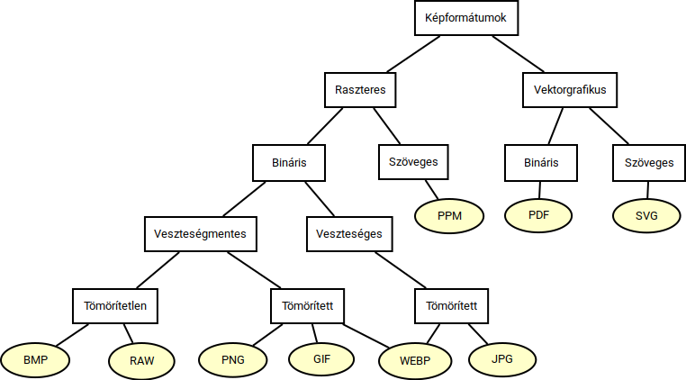

Textúrázás
==========

A megjelenítendő alakzatainkat a korábban bemutatott módszerekkel már gyakorlatilag tetszőleges pontossággal le tudnánk írni. A megjelenítés minősége szempontjából textúrákat nem feltétlenül lenne szükséges, viszont számos érv szól a használatuk mellett.

* A megjelenítés hatékonyságát lényegesen javítja, hogy ha egy bizonyos részletességi szintet már csak képként veszünk számításba.
* A kétdimenziós képek tárigénye kisebb, mint ha a geometriát, a színeket és az anyagjellemzőket egyidejűleg tárolnánk.
* A mintázatokat gyakran két dimenziós képként (például lefényképezve) tudjuk legegyszerűbben digitalizálni. Textúraként azok (minimális átalakítással) használhatók.
* Gyakran előfordul, hogy azonos modelleket különböző mintázatokkal szeretnénk megjeleníteni. Ilyen esetben a modelltől függetlenül tudjuk kezelni a mintázatát.
* A mintázat szerkesztését két dimenzióban lényegesen egyszerűbb elvégezni, mint háromban.
* A textúrázás segítséget jelent, hogy ha különböző részletességi szinteket (*Level of Details*) szeretnénk használni.

A textúrázás folyamata
----------------------

Ahhoz, hogy textúrákat használjunk, az alábbi részproblémák megoldására van szükségünk.

* Be kell töltenünk a textúrához tartozó képeket egy (jellemzően ismert képformátumú) fájlból.
* Be kell kapcsolnunk a textúrázást.
* Létre kell hoznunk OpenGL-ben egy textúra objektumoat, amelyre azt követően az OpenGL-től visszakapott azonosítóval tudunk hivatkozni.
* Meg kell adnunk azt a leképzést, amellyel a mintázatot az adott modellre "feszítjük".

.. note::

  Az említett lépések közben további számos beállítási lehetőségünk van, és az esetleges hibákat kezelni kell!

Képformátumok
-------------

A képformátumokat jellemzően a kiterjesztésük szerint nevezzük. A következőkben néhány elterjedt képformátumot tekintünk át.

A formátumokat különféle szempontok alapján tudjuk csoportosítani, például:

* Vektorgrafikusak vagy raszteresek?
* Binárisak vagy szövegesek?
* Veszteségesek vagy veszteségmentesek?
* Tömörítettek vagy tömörítetlenek?
* Támogatják a palettás színmegadást?
* Mennyi színt képesek kezelni (összesen és egyidejűleg)?
* Lehet-e bennük animációt tárolni?
* Támogatják az átlátszóságot?
* Támogatják az *interlacing*-et?
* Milyen a licenszük?
* Mennyire támogatottak?

.. note::

  Általában bináris formátumokat használnak, de szöveges formátumként is találkozhatunk például a PPM-mel.

BMP
~~~

* Bitmap (*BitMaP*)
* Egyszerű, tömörítetlen formátum
* A Microsoft dolgozta ki.
* Egy fejléc részt követően a képpontok színei kerülnek benne felsorolásra.
* https://en.wikipedia.org/wiki/BMP_file_format

GIF
~~~

* *Graphics Interchange Format*
* Aránylag egyszerű, kevés színből álló képekhez dolgozták ki.
* Támogatja a palettás színtárolást.
* Támogatja az átlátszóságot.
* Animációk tárolására is alkalmas.
* Támogatja az *interlacing*-et.
* LZW, veszteségmentes tömörítést használ.
* https://en.wikipedia.org/wiki/GIF

JPG, JPEG
~~~~~~~~~

* *Joint Photographic Expert Group*
* Főként fénykép jellegű képek tárolására használják.
* Veszteséges, tömörített formátum (általában).
* https://en.wikipedia.org/wiki/JPEG

PNG
~~~

* *Portable Network Graphics*
* Veszteségmentes, tömörített formátum (általában).
* Támogatja az átlátszóságot.
* Támogatja az *interlacing*-et.
* Animált változata az *MNG* és az *APNG*.
* A kezdetektől nyílt szabvány.
* https://en.wikipedia.org/wiki/PNG

WebP
~~~~

* WebP (*Web Picture*), WebM (*Web Media*)
* A Google fejlesztette a GIF, JPG és a PNG leváltása céljából.
* Támogatja a tömörítetlen és a tömörített tárolást, az átlátszóságot és az animációt.
* https://en.wikipedia.org/wiki/WebP

Áttekintés
~~~~~~~~~~

Textúra betöltés
----------------

SDL2 részről
~~~~~~~~~~~~

SDL2-höz tartozik egy *SDL Image* nevű kiegészítő library:

* https://www.libsdl.org/projects/old/SDL_image/docs/index.html

A következő *include* szükséges hozzá:

.. code:: cpp

  #include <SDL2/SDL_image.h>

A programon belül inicializálni kell:

.. code:: cpp

  int inited = IMG_Init(IMG_INIT_PNG);

Kép betöltése:

.. code:: cpp

  SDL_Surface* surface = IMG_Load(path);

A képet (mint :code:`Surface` struktúrát) fel is kell szabadítanunk, ha már nem használjuk:

.. code:: cpp

  SDL_FreeSurface(surface);

OpenGL részről
~~~~~~~~~~~~~~

.. code:: cpp

  GLuint texture_name;
  glGenTextures(1, &texture_name);

A textúra *neve*, az gyakorlatilag az egyedi azonosítója.

Ki tudjuk választani az aktuális textúrát:

.. code:: cpp

  glBindTexture(GL_TEXTURE_2D, texture_name);

Az aktuális textúrához hozzá tudjuk rendelni a pixeltömböt:

.. code:: cpp

  typedef GLubyte Pixel[3];
  // ...
  glTexImage2D(
    GL_TEXTURE_2D,
    0,
    GL_RGB,
    surface->w,
    surface->h,
    0,
    GL_RGB,
    GL_UNSIGNED_BYTE,
    (Pixel*)(surface->pixels)
  );

Paraméterezése:

.. code:: cpp

  void glTexImage2D(
    GLenum target,
    GLint level,
    GLint internalformat,
    GLsizei width,
    GLsizei height,
    GLint border,
    GLenum format,
    GLenum type,
    const void* data
  );

Referencia:

* https://registry.khronos.org/OpenGL-Refpages/gl4/html/glTexImage2D.xhtml

.. warning::

  Az OpenGL a kettő hatványnak megfelelő felbontású (többségében négyzetes) textúrákat preferálja.

.. TODO: A teljes képbetöltési folyamatot részletezni, tipikus hibákat említeni!

Textúra leképzés
----------------

A textúrák terét egy két dimenziós térnek tekintjük, melyekben a képpontokat :math:`(u, v)` koordinátákkal adjuk meg. A textúraként használt képet ezen belül is a :math:`[0, 1]^2` egységnégyzeten belül rögzítjük.

A megjelenítésnél a megjelenítendő képpontokhoz meg kell határoznunk, hogy milyen :math:`(u, v)` koordináták tartoznak.

Egy felületi pontot két paraméterrel szoktunk megadni. A leképzés központi problémája az, hogy ezen paraméterekhez hogyan rendeljük hozzá a megfelelő :math:`(u, v)` értékeket. A hozzárendelés módja alakzatonként változó.

A Föld térképének készítésénél és csomagolásnál is hasonló problémák merülnek fel. A leképzés

* nem feltétlenül tartja meg a távolságokat, arányokat,
* a leképzés nem feltétlenül invertálható.

Egységnégyzet
~~~~~~~~~~~~~

Tegyük fel, hogy a textúrázandó alakzatunk egy egységnyi oldalhosszúságú négyzet. Az ehhez tartozó felületi pontokhoz használjuk az :math:`(x, y)` koordinátákat. Ekkor a leképzés egyszerűen az :math:`(u, v) = (x, y)` alakban írható föl.

:math:`\rhd` Hogyan képezhetjük le egy téglalap pontjait?

Háromszög
~~~~~~~~~

Tegyük fel, hogy adott egy háromszög. A csúcsaihoz a textúra térben az :math:`(u_1, v_1)`, :math:`(u_2, v_2)` és :math:`(u_3, v_3)` pontokat rendeljük. A képtérben meghatározzuk a megjelenítendő felületi ponthoz tartozó :math:`(s, t)` koordinátákat, majd ezek alapján kiszámítjuk a keresett :math:`(u, v)` koordinátákat.

Henger
~~~~~~

A henger palástjának felületi pontjait jellemezzük a :math:`(\varphi, h)` koordinátákkal, ahol :math:`\varphi \in [0, 2\pi)` és :math:`h \in [0, 1]`. Egy jellemző textúra leképzési mód:

.. math::

  u = \dfrac{\varphi}{2\pi}, \quad v = h.

A henger tengelyétől való távolságot jelöljük :math:`r \in [0, 1]` értékkel! A henger körlapjaira a textúrát (polár koordináták alapján leképezve) például az alábbi formában adhatjuk meg:

.. math::

  u = \dfrac{r \cdot \cos \varphi + 1}{2}, \quad v = \dfrac{r \cdot \sin \varphi + 1}{2}.

:math:`\rhd` Hogyan képezhetjük le egy kúp felületének pontjait?

Gömb
~~~~

A megjelenítendő gömb felületi pontjait adjuk meg a :math:`(\varphi, \vartheta)` gömbi koordinátákkal, ahol :math:`\varphi \in [0, 2\pi)` és :math:`\vartheta \in [-\pi, \pi]`! A leképzés definiálható például az alábbi formában:

.. math::

  u = \dfrac{\varphi}{2\pi}, \quad v = \dfrac{\vartheta + \dfrac{\pi}{2}}{\pi}.

Modellek textúrázása
--------------------

A textúrázáshoz a poligon modelljeinket ki kell teríteni a síkba.

* *Unwrapping*
* Ez egy komplikált topológiai, gráfelméleti, optimalizálási probléma.
* Több lehetséges megoldási mód is adódik.
* Általában "kézzel", modellszerkesztő használatával lehet végrehajtani.

:math:`\rhd` Vizsgáljuk meg konkrét modellek esetében, hogy hogyan oldották meg az UV leképzést!

Mintavételezés
--------------

A képtér felbontása általában nem ugyanakkora, mint a textúratér felbontása. Emiatt előfordulhat, hogy

* a textúrákat nagyítani kell (valamelyik tengely szerint), de az is, hogy
* kicsinyíteni kell (valamilyen tengely szerint).

:math:`\rhd` Mutassunk példát olyan esetre, amelynél egyik tengely szerint nagyítunk, a másik szerint kicsinyítünk!

A textúra nagyításánál a textúratér belső pontjait mintavételezni kell.

* Választhatjuk a legközelebbi képpont színét (:code:`GL_NEAREST`), vagy
* bilineáris interpolációval közelíthetjük a színt (:code:`GL_LINEAR`).

:math:`\rhd` Vizsgáljuk meg, hogy milyen hatása van az említett paramétereknek a kép minőségére!

Kicsinyítés esetén a környező képpontok intenzitásait kell átlagolni.

* Ez egy számításigényes művelet, ezért előre ki szokták számolni a kisebb felbontású textúrákat.
* Ezeket textúra piramisokba (*MIP-maps*, *texture pyramids*) szervezik.
* https://en.wikipedia.org/wiki/Mipmap
* https://en.wikipedia.org/wiki/Anisotropic_filtering
* https://www.beyond3d.com/content/articles/34/4

Átlátszóság kezelése
--------------------

* *Blending*
* A már megjelenítendő képpont színét módosítja.
* A *color buffer* itt *destination buffer*-ként fordul elő.
* Hogy ha nem adunk meg alfa értéket, akkor az alapértelmezés szerint 1.

A blending-et a következőképpen írhatjuk le:

.. math::

  C_f = S \cdot C_s + D \cdot C_d,

ahol

* :math:`C_f`: az eredményként kapott szín (*final*),
* :math:`S \in [0, 1]`: az új szín skálázási tényezője,
* :math:`C_s`: az újonnan megjelenő szín (*source*),
* :math:`D \in [0, 1]`: az aktuális szín skálázási tényezője,
* :math:`C_d`: az aktuális szín (*destination*).

.. note::

  Ez csak egy egyszerűbb egyenlet a beállíthatók közül!

A blending-et OpenGL-ben a fényekhez és textúrákhoz hasonlóan lehet bekapcsolni:

.. code::

  glEnable(GL_BLEND);

Az átlátszóság beállításához általában az alábbi paraméterek megadása szükséges:

.. code:: cpp

  glBlendFunc(GL_SRC_ALPHA, GL_ONE_MINUS_SRC_ALPHA);

A függvény paraméterezése:

.. code:: cpp

  void glBlendFunc(
    GLenum sfactor,
    GLenum dfactor
  );

Ez tehát azt jelenti, hogy

.. math::

  C_f = \alpha \cdot C_s + (1 - \alpha) \cdot C_d.

* https://www.informit.com/articles/article.aspx?p=1616796&seqNum=5
* https://www.khronos.org/opengl/wiki/Blending
* https://learnopengl.com/Advanced-OpenGL/Blending

.. admonition:: Példa

  Tegyük fel, hogy egy képpont :math:`(0.2, 0.8, 0.1)` színű. Milyen lesz az eredményként kapott szín, hogy ha erre egy :math:`(1, 0, 0.3)` színnel, :math:`\alpha = 0.5` értékkel rajzolunk?

  A kapott szín: :math:`(0.6, 0.8, 0.2)`.

Kérdések
--------

* Miért van szükség textúrákra? Meg tudnánk-e jeleníteni ugyanazt a virtuális teret texturák nélkül is?
* Hogyan tudjuk felhasználni ugyanazon texturát több modell esetében is?
* Praktikusan milyen méretezésűnek kell lenni egy textúrának?
* Melyek az elterjedt tömörített és tömörítetlen képformátumok?
* Melyek az elterjedt veszteséges és veszteségmentes képformátumok?
* Mit jelent a bilineáris transzformáció textúrázás esetében? Miért van rá szükség?
* Mi alapján tudunk egy texturát hivatkozni egy OpenGL programban?
* Milyen szempontok alapján tudjuk csoportosítani a képformátumokat?
* Milyen előnyei és hátrányai vannak a veszteséges képformátumoknak?
* Mit jelent a palettás színkezelés a képformátumok esetében?
* Soroljon fel legalább 3 olyan képformátumot (rövidítéssel és teljes névvel), amelyik támogatja az átlátszóságot!
* Egy 1 megapixeles fényképet letárolunk BMP, PNG és JPG formátumban. Milyen sorrendben következnek a fájlformátumok a fájl feltételezett mérete alapján? Mi ennek az oka?

Számítási feladatok
-------------------

* Egy egység magas, egységnyi sugarú körökkel adott henger palástjának :math:`30^{\circ}`-hoz és 0.2 egység magasságához tartozó pontjának színét szeretnénk meghatározni. Milyen :math:`(u, v)` koordináták tartoznak hozzá?
* Határozzuk meg egy gömbfelület :math:`\varphi = 15^{\circ}` és :math:`\vartheta = 100^{\circ}` paramétereihez tartozó :math:`(u, v)` koordinátákat!
* Bilineáris interpolációval mintavételezni szeretnénk egy textúrát. A legközelebbi ismert pontokban a :math:`(8, 2)` színe kék, a :math:`(8, 3)` színe sárga, a :math:`(9, 2)` színe fekete a :math:`(9, 3)` színe pedig piros. Milyen színű lesz a :math:`(8.7, 2.2)` pont színe?
* Adott egy :math:`1024 \times 1024` méretű, RGB formátumú textúra. Az eredeti textúrával együtt mennyi tárterületet fog foglalni az előállított MIP-maps?

.. note::

  A feladatok megoldásához rajzoljunk ábrát is, és részletezzük a számításokat!

Programozási feladatok
----------------------

.. * Fordítsuk le és nézzük meg a `fox <https://www.uni-miskolc.hu/~matip/downloads/grafika/fox.zip>`_ nevű programot!

* Oldjuk meg, hogy a különböző lapokon különböző textúra legyen!
* Vizsgáljuk a textúrázást a ``cube`` példában!
* Állítsuk be a fényeket és az anyagjellemzőket is!
.. * Nézzük meg néhány példa esetén, hogy hogy néz ki kiterítve a textúra! Ehhez használjuk az `uv_map <https://web.uni-miskolc.hu/~matip/downloads/grafika/uv_map.zip>`_ nevű programot!
* Jelenítsünk meg egy képet úgy, hogy közben nem perspektivikus vetítést használunk!
* Generáljunk sakktábla mintás textúrát!
* Rajzoljunk egy körlapot egy textúrára!
* Készítsünk színátmenetes textúrát!
* Mozgassuk az :math:`(u, v)` koordinátákat!
* Idő függvényében váltogassuk egy modell textúráját!
* Textúrázzuk az ütőket, hátteret és a labdát a ``pong`` játékban!

