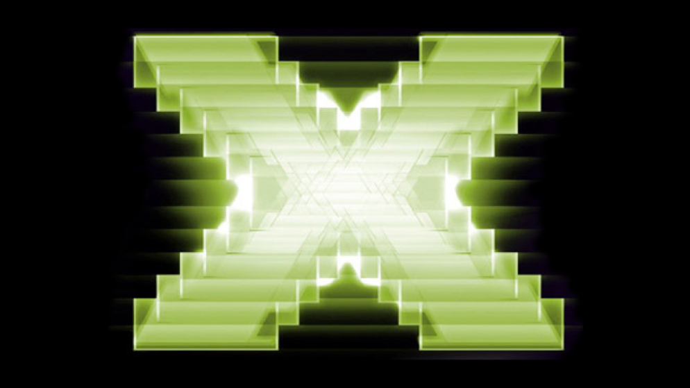
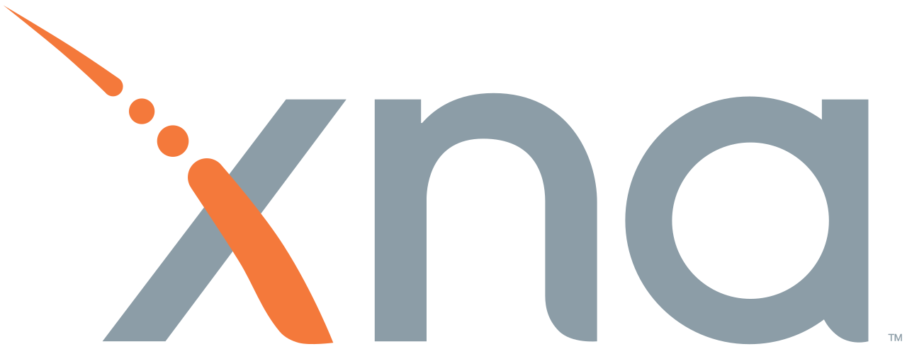
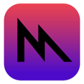
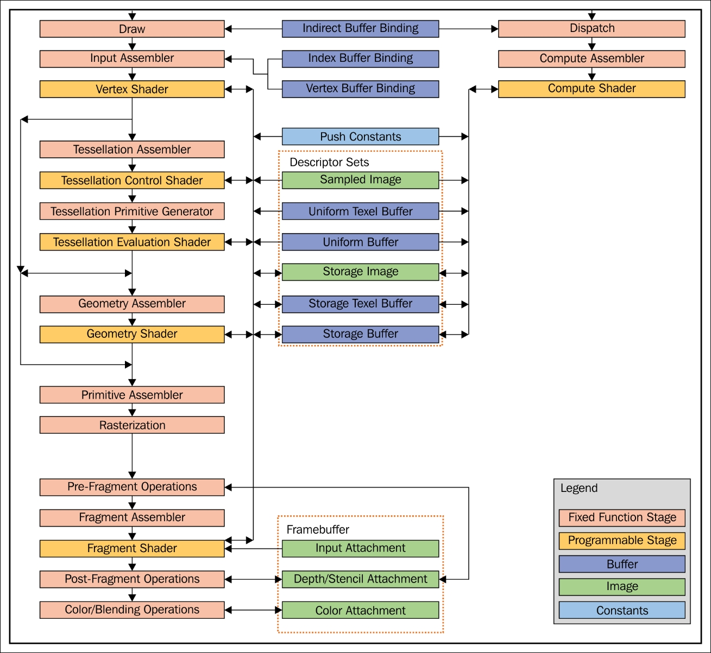
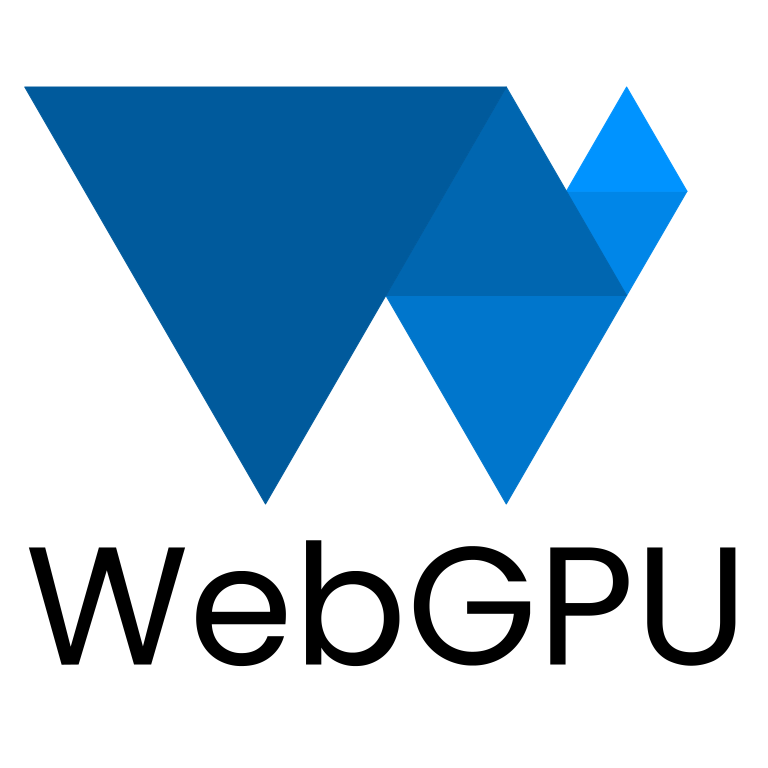

Szabványok, keretrendszerek, függvénykönyvtárak
===============================================

A grafikus hardverek és szoftverek fejlődésével az OpenGL-nek számos változata és alternatívája terjedt el. Ezen kívül különféle multimédiás keretrendszerek is megjelentek.

.. TODO: Történeti áttekintés (mindegyikről)

.. TODO: Szervezeteket említeni!

DirectX
-------

A DirectX egy API gyűjtemény multimédiás alkalmazások fejlesztéséhez.

* Windows és Xbox platformokon használják elsősorban.
* A COM (*Component Object Model*) elemekre építkezik. (Az alacsony szintű API-k objektum orientált megfelelője.)
* A COM az Object Pascal (Delphi), MS Visual C++, C# és Visual Basic .NET nyelvekkel használható.
* A 12-es verziója 2015-ben jelent meg.
* https://en.wikipedia.org/wiki/Comparison_of_OpenGL_and_Direct3D

Többek között az alábbi elemeket tartalmazza.

**Direct3D**

* Tulajdonképpen az OpenGL alternatívájának tekinthető.
* Próbálja absztrahálni a grafikus hardvert. (Az OpenGL ezzel szemben a hardveres gyorsításra épít, amelyet szükség esetén szoftveressel lehet kiváltani.)
* Az erőforrásokat nem menedzseli közvetlenül, azt az alkalmazásra bízza. (Szemben az OpenGL-el, ahol annak az implementációja kezeli.)
* A 12-es változata már a Vulkan API-ra hasonlít.
* A shader programozáshoz HLSL-t (*High Level Shading Language*) használ.
* http://www.directxtutorial.com/LessonList.aspx?listid=112

**DirectDraw**

* 2D grafikához készült.
* Hardveres gyorsítást használ.
* Támogatja a dupla bufferelést, sprite-okat (*bit blitting*, *bit block transfer*)
* https://en.wikipedia.org/wiki/DirectDraw

**DirectSound**

* A hangok lejátszásáért felelős API.
* 2008-tól az *XAudio2* váltotta fel.
* https://en.wikipedia.org/wiki/DirectSound

**DirectPlay**

* Elsősorban a számítógépes játékok hálózati kommunikációjáért felelős API.
* UDP protokollt használ.
* A *Games for Windows - Live* technológia megjelenése után elavultnak tekintik.

XNA
---

* Az *XNA's Not Acronymed* rövidítése.
* 2004. március 24-én jelentették be.
* A .NET keretrendszerre épül.
* Az *Xbox Live Indie Games* elsődleges platformja.
* Az *XNA Game Studio* volt az IDE hozzá.
* Azt lehet mondani, hogy a Unity kiszorította.
* https://en.wikipedia.org/wiki/Microsoft_XNA

Metal
-----

* Az Apple saját szabványa. 2014 óta elérhető.
* Alacsony szintű, törekszik a kis *overhead*-re.
* Az OpenGL és az OpenCL funkcionalitását igyekszik ötvözni.
* A Vulkan és DirectX 12 API-khoz hasonló szintű.
* Objektum orientált. Elsősorban a Swift, Objective-C és a C++17 nyelvekhez készült.
* A saját shader leíró nyelve az MSL (*Metal Shading Language*).
* https://developer.apple.com/metal/
* https://metaltutorial.com/

Modern OpenGL
-------------

OpenGL verziók
~~~~~~~~~~~~~~

* Az OpenGL 1.0 1992-ben jelent meg.
* Az OpenGL 2.0 (2004) bevezette az árnyalókat. (*Shading Language* 1.10)
* Az OpenGL 4.6 2017-ben jelent meg.
* https://www.khronos.org/opengl/wiki/History_of_OpenGL

Shader programozás
~~~~~~~~~~~~~~~~~~

* GLSL: *OpenGL Shading Language*
* Egy külön, C jellegű programozási nyelv.
* *uniform*: gyakorlatilag globális változók, amelyeket a shader program futtatása előtt be lehet állítani.
* https://antongerdelan.net/opengl/
* https://www.khronos.org/opengl/wiki/Rendering_Pipeline_Overview
* https://www.geeksforgeeks.org/opengl-rendering-pipeline-overview/

Vulkan
------

.. image:: images/10/vulkan_logo.svg
  :width: 40%

* Alacsony szintű elérési módot ad a grafikus kártyához.
* Azt igyekszik kihasználni, hogy a videókártyákban egyre több a szabadon programozható rész.
* https://vulkan-tutorial.com/resources/vulkan_tutorial_en.pdf

WebGL
-----

.. image:: images/10/webgl_logo.svg
  :width: 40%

* Khronos szabvány az OpenGL böngészőben való futtatásához.
*
* https://developer.mozilla.org/en-US/docs/Web/API/WebGL_API/Tutorial
* https://webglfundamentals.org/
* http://webglplayground.net/gallery

WebGPU
------

* JavaScript API. A WebGL szabványt igyekszik leváltani. (*WebGL Next*-nek is hívták.)
* Elsőként a Google Chrome kezdte támogatni (2023. áprilisától).
* HTML5 Canvas-re lehet vele rajzolni.
* Árnyaláshoz a WGSL, Rust jellegű nyelvet használja.
* https://webgpufundamentals.org/webgpu/lessons/webgpu-wgsl.html

