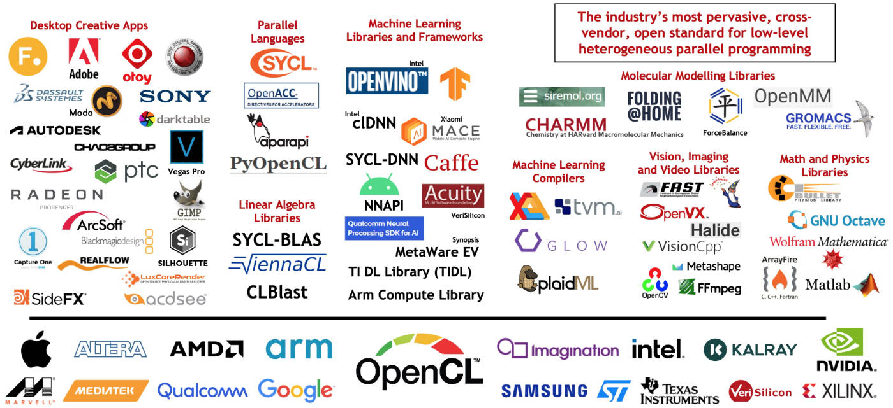
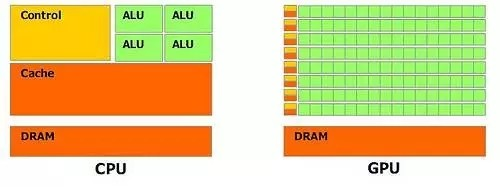
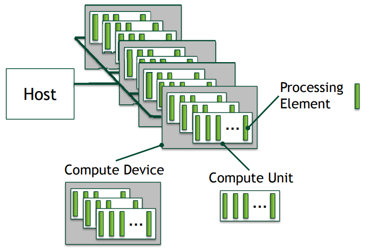
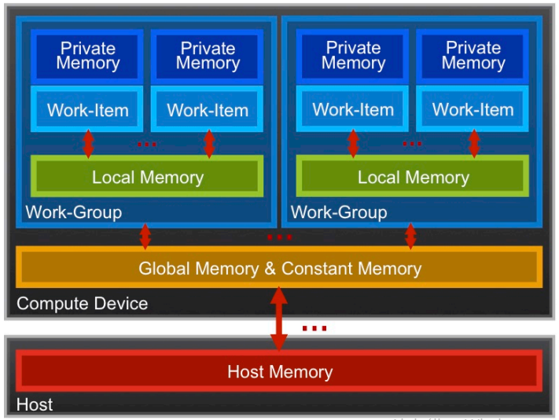

# Az OpenCL szabvány

## Rövidítések

* GPGPU: *General Purpose Graphics Processing Unit*
* OpenCL: *Open Computing Language*
* OpenACC: *for Open ACCelerators*
* CUDA: *Compute Unified Device Architecture*
* SPIR: *Standard Portable Intermediate Representation*
* ICD: *Installable Client Driver*

## Heterogén számítási modell

Tendenciaként megfigyelhető, hogy

* a számítási teljesítmény javítása frekvencia növeléssel, miniatürizálással már nem tartható,
* a processzorokban a számítási magok száma fokozatosan növekszik (CPU),
* a videókártyákban lévő számítási egységek egyre általánosabb műveletek végrehajtására alkalmasak (GPGPU).

Egyre inkább átfedésbe kerülnek a CPU-ra és a GPU-ra fejlesztés módszerei.

* Az OpenCL ezt igyekszik szabványosítani.

## A Khronos Group

* Egy konzorcium, amelyik nyílt API-k létrehozásával, szabványosításával foglalkozik.
* Komoly ipari szereplők vannak benne.



Kapcsolódó szabványok

* COLLADA
* OpenGL, OpenGL ES
* OpenMAX
* OpenVG
* OpenSL ES

*forrás*:

* [https://www.khronos.org/api/opencl](https://www.khronos.org/api/opencl)
* [Khronos-Overview-SIGGRAPH-Asia_Dec11.pdf](https://www.khronos.org/assets/uploads/developers/library/2011-siggraph-asia/Khronos-Overview-SIGGRAPH-Asia_Dec11.pdf)

## CUDA vs OpenCL

Processzor, grafikus gyorsító gyártók: AMD, Intel, NVIDIA

* A CUDA-t az NVIDIA fejleszti, ezért az eszközein jellemzően gyorsabban tud működni, mint az OpenCL.
* Mindkettő működik Windows, Linux és MacOS alatt. Az OpenCL további platformokra (például FPGA-k) is elérhető.
* Az NVIDIA erőteljesen fejleszti, támogatja a CUDA-t hardveres és szoftveres részről. Az AMD OpenCL viszonylatában visszafogottabb.
* A CUDA egy platform, amelynek van egy programozási modellje, nem egy programozási nyelv.
* A CUDA egységesebben kezelhető, mivel az NVIDIA saját áramköreire fejleszti. Az OpenCL a nyílt, gyártó független szabvány miatt figyelmet kell fordítson a különféle gyártók hardvereire.
* A CUDA az egységes kódbázist speciális fordítóval (NVCC - NVIDIA C Compiler) host és device kódra tudja fordítani.

*forrás*:

* [https://www.run.ai/guides/nvidia-cuda-basics-and-best-practices/cuda-vs-opencl](https://www.run.ai/guides/nvidia-cuda-basics-and-best-practices/cuda-vs-opencl)
* [https://www.incredibuild.com/blog/cuda-vs-opencl-which-to-use-for-gpu-programming](https://www.incredibuild.com/blog/cuda-vs-opencl-which-to-use-for-gpu-programming)

## A CPU és a GPU architekturája

!!! task "Flynn"

    * Tekintsük át a számítógép architektúrák Flynn-féle besorolását!
    * [https://en.wikipedia.org/wiki/Flynn%27s_taxonomy](https://en.wikipedia.org/wiki/Flynn%27s_taxonomy)



## Platform modell

A heterogén környezetben a különféle hardverek egységes elérési módjára, kezelésére szükség volt egy általános modellre.



Az NVIDIA esetében:

* Host &rarr; CPU
* Compute Device &rarr; CUDA GPU
* Compute Unit &rarr; CUDA Streaming Multiprocessor
* Processing Element &rarr; CUDA Streaming Processor

## Az alkalmazások felépítése

Megkülönböztetünk **host** és **device** kódot.

*Host kód*

* Ez fut a CPU-n.
* Jellemzően C/C++ nyelven készül (de más nyelvekből is elérhető).
* Alapvetően soros működésű.

*Device kód*

* Ez magán a számítási eszközön (jellemzően GPU-n) fut.
* A kód OpenCL C nyelven készül.
* Párhuzamosan futtatandó programrészeket ír le.

Platformokból és eszközökből is többféle van.

* Le kell tudnunk kérdezni ezek adatait.
* Az aktuális konfigurációt kontextus formájában tudjuk kezelni.
* A *device*-nak megfelelő programkódot kell tudnunk fordítani.
* Meg kell oldanunk a kommunikációt a *host* és a *device* között (sorok segítségével).

## Logikai számítási egységek

A problémateret hierarchikusan szintekre bontjuk.

* *host*
* *work group*
* *work item*
* *kernel*

A problémateret 1, 2 vagy 3 dimenziósként kezelhetjük.

A work group absztrakció előnyei:

* A Compute Unit-ok számától függetlenül jól skálázható, egyszerűbben átvihető.
* A work group-on belül a work item-ek hatékonyan tudnak kommunikálni (osztott memórián keresztül).
* A work group-ok tetszőleges sorrendben, konkurrens vagy szekvenciális módon is futtathatók.

!!! warning ""

    Szinkronizáció csak *work group*-on belül, a *work item*-ek között lehetséges.

## Memória modell

A végrehajtáshoz hasonlóan a memóriaszervezés is hierarchikus.

* Vannak gyorsan elérhető, kis méretű, regiszter jellegű memóriaterületek.
* Vannak nagyobb méretű, lassabban elérhető területek.
* Az ezek közötti adatkezelést nekünk kell megoldani (nem transzparens).



## Hierarchia áttekintése

|Hardver|Platform model|Végrehajtási egység|Memória modell|
|-------|--------------|-------------------|--------------|
|CPU|host|host|host memory|
|GPU|Compute Device|work groups|global & constant memory|
|Multiprocessor|Compute Unit|work items|local memory|
|Processor|Processing Element|work item|private memory|

## Az OpenCL C szerű nyelve

Az ISO C99 nyelvből származik. Vannak benne bizonyos megkötések.

* Nem használhatunk függvénypointereket.
* Mutatókra mutathatunk pointerekkel, de azokat kernel argumentumként nem adhatjuk át.
* A bitmezők nem támogatottak.
* Változó méretű tömbök és struktúrák nem támogatottak.
* A rekurzió nem (vagy csak részben) támogatott.
* A dupla pontosság nem egységesen támogatott. (Implementációnként változó, hogy támogatott-e.)

!!! task "Rekurzió?"

    Mi lehet annak az oka, hogy a rekurzió nem támogatott?

Minősítők (*qualifiers*):

* függvény: `__kernel`
* címtér: `__global`, `__local`, `__constant`, `__private`

Work item függvények:

* `uint get_work_dim()`: NDRange dimenzióinak a száma (1, 2, 3)
* `size_t get_global_id(uint dimension)`: a globális work item azonosító (adott dimenziója)
* `size_t get_local_id(uint dimension)`: a work item azonosító (adott dimenziója) work group-on belül
* `size_t get_group_id(uint dimension)`: a work group azonosító (adott dimenziója)
* `size_t get_global_size(uint dimension)`: a probléma méretének adott dimenziója
* `size_t get_local_size(uint dimension)`: a work item-ek száma work group-on belül

*forrás*:

* [http://people.cs.bris.ac.uk/~simonm/SC13/OpenCL_slides_SC13.pdf](http://people.cs.bris.ac.uk/~simonm/SC13/OpenCL_slides_SC13.pdf)
* [1409-OpenCL-GPU-Pre-Conference-Tutorial.pdf](https://on-demand.gputechconf.com/gtc/2009/presentations/1409-OpenCL-GPU-Pre-Conference-Tutorial.pdf)
* [OpenCL_programming.pdf](https://agenda.infn.it/event/14351/contributions/24177/attachments/17206/19529/OpenCL_programming.pdf)

## Eszközadatok lekérdezése

!!! task "GPU Caps Viewer"

    * Nézzük meg a GPU Caps Viewer segítségével, hogy milyen adottságokkal rendelkezik a hardverünk! (`GPU_Caps_Viewer.exe`)
    * Nézzük meg a hozzá tartozó további demo-kat is!

!!! note "Példa"

    Nézzük meg az `examples/00_info` példát!

Program fordítása:
```bash
$ gcc info.c -o info -lOpenCL
```

Függvények részletes leírásai:

* [clGetPlatformIDs](https://registry.khronos.org/OpenCL/sdk/3.0/docs/man/html/clGetPlatformIDs.html)
* [clGetPlatformInfo](https://registry.khronos.org/OpenCL/sdk/3.0/docs/man/html/clGetPlatformInfo.html)
* [clGetDeviceIDs](https://registry.khronos.org/OpenCL/sdk/3.0/docs/man/html/clGetDeviceIDs.html)
* [clGetDeviceInfo](https://registry.khronos.org/OpenCL/sdk/3.0/docs/man/html/clGetDeviceInfo.html)

!!! task "clinfo"

    Nézzünk meg egy részletes `clinfo` kimenetet!

    * [https://www.uni-miskolc.hu/~matip/_downloads/GTX_1050_Ti.txt](https://www.uni-miskolc.hu/~matip/_downloads/GTX_1050_Ti.txt)

## Hello, OpenCL!

Egy egyszerű OpenCL program működése a következő lépésekből áll:

* Platform azonosító lekérdezése.
* Device azonosító lekérdezése.
* OpenCL kontextus létrehozása.
* Kernel program lefordítása.
* Host buffer inicializálása.
* Device buffer létrehozása.
* Kernel argumentumok beállítása.
* Command Queue létrehozása.
* Device buffer feltöltése.
* Problémaméret megadása.
* Kernelek futtatása.
* Adatok visszaolvasása a Device buffer-ből.
* Eredmények megjelenítése.
* Erőforrások felszabadítása.

!!! note "Példa"

    * Nézzük meg az `examples/01_hello` példát!
    * Vizsgáljuk meg a felhasznált függvények paraméterezését!

Program fordítása:
```bash
$ gcc hello.c -o hello -lOpenCL
```

## Kérdések

* Mit jelent az, hogy heterogén számítás?
* Melyek azok a nevezetes szabványok, amelyek a Khronos Group-hoz kötődnek?
* Mi a különbség az OpenCL és a CUDA között?
* Melyek a platform modell részei?
* Mennyi dimenziós lehet a problématér (OpenCL esetében)?
* Miért jó, hogy munkacsoportokat használhatunk?
* Milyen fajta memóriákat különböztet meg az OpenCL memóriamodellje?
* Milyen azonosítók tartoznak egy *work item*-hez, és azokat hogyan kérdezhetjük le?
* Mire szolgál a *Command Queue*?

## Feladatok

**1. Eszközinformációk kiíratása**

* Nézzük meg, hogy a `clinfo` program kimenetét hogyan tudnánk saját programmal előállítani!

**2. Kódbetöltő készítése**

* Készítsünk egy programrészt, amelyik a kernel forráskódját egy `cl` kiterjesztésű szöveges fájlból olvassa be!
* Szervezzük át az előző programokat, hogy a kernelek például `kernels/hello_kernel.cl` útvonalról legyenek betöltve!

**3. Leképzés (*mapping*) megvalósítása**

* Az eredménytömbbe állítsuk be a globális/lokális indexet!
* Adjuk meg az elemeket visszafele sorrendben!
* Cseréljük meg a szomszédos, páros és páratlan indexeken lévő elemeket!
* Adjunk további példákat hasonló formában megoldható problémákra!

**4. Vektorok összeadása**

* Készítsünk programot két valós vektor összeadására!
* Szervezzük át a programot úgy, hogy a függvény hívásakor ne látszódjon, hogy OpenCL-es implementációról van szó!
* Szekvenciális programmal ellenőríztessük az eredmény helyességét!

**5. Hiányzó elemek pótlása**

Tegyük fel, hogy egy nemnegatív egészeket tartalmazó tömbből elszórtan hiányoznak elemek. Pótoljuk ezeket a szomszédos elemek átlagával!

* Feltételezzük, hogy a hiányzó elemek mindkét szomszéd ismert.
* Készítsünk függvényt, amelyik ilyen bemenetet tud előállítani!

**6. Rang számítása**

Egy elem rangját jelentse az, hogy az adott elemnél mennyi kisebb elem fordul elő a tömbben.

* Számítsuk ki egy egészeket tartalmazó tömb összes elemének a rangját! 

**7. Elemek előfordulásának a száma**

* Egy egészeket tartalmazó tömb minden eleméhez adjuk meg, hogy az adott elem hányszor fordul elő a tömbben!
* Vizsgáljuk meg, hogy egy tömbben minden érték egyedi-e!

**8. Szélsőérték vizsgálat**

* Számoljuk ki konstans időben egy tömb minimumát/maximumát!
* Próbáljuk meg minimalizálni a felhasznált processzormagok számát!

**9. Csúszóátlag számítása**

* Egy valós vektor minden eleméhez számítsuk ki az adott környezeten (sugáron) belül lévő átlagot!

**10. Prím vizsgálat**

* Egy természetes számot vizsgáljunk meg, hogy prímszám-e!
* Először minden számítási egység csak egy adott osztót vizsgáljon!
* Oldjuk meg úgy, hogy a számítási egységekhez egy osztótartomány tartozik!
* Osszuk ki előre a kernelekhez a prímeket!

&starf; Próbáljuk meg a prímeket tartalmazó tömb előállítását úgy megoldani, hogy ahhoz is magát az OpenCL-t használjuk!
