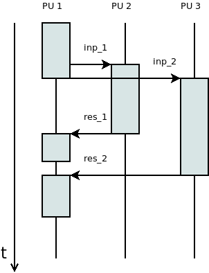
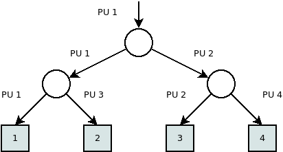

1. Előadás - Alapfogalmak, tételek
==================================

A párhuzamosítás szükségessége
------------------------------

**Moore törvénye**

* Gordon Earle Moore, Intel társalapítója, 1965.
* A chip-ekben a tranzisztorok száma 18-24 havonta duplázódik.
* A törvény 1971-2011 mindenképpen érvényben volt.

https://en.wikipedia.org/wiki/Moore%27s_law

**Fizikális korlátok**

* Az elemi, elektromos számítási egységek sebessége tovább már nem növelhető.
* Magasabb órajelhez nagyobb feszültség kell. :math:`\rightarrow` Tápellátási és hűtési problémák.
* A vezetékek lehetséges vastagsága elérte a minimális limitet.

A számítási teljesítmény növelésére alapvetően a számítási egységek növelésével van lehetőség.

**Free lunch**

* Régebben lehetett arra hagyatkozni, hogy az új gépeken a szoftverek gyorsabban fognak tudni futni.
* Aktuálisan ez csak párhuzamosítással oldható meg.

**További szempontok**

* A számítási teljesítmény mellett a memória és tár is szükségessé teheti elosztott rendszer kialakítását.
* Bizonyos számításoknál a redundancia is szempont lehet. (Például blokkláncok, felhasználókhoz kiszervezett számítások.)
* Adott feladat gyorsabb megoldásán túl szempont lehet a korábbiaknál lényegesen nagyobb problémák megoldását kitűzni célul.
* A probléma nagysága jelenthet nagyobb számítási pontosságot is (például szimulációk, előrejelzések, renderelés esetében).
* Egyre nagyobb mennyiségű adat áll rendelkezésre (például képek, videók, szenzoradatok).

**Programok párhuzamosítása**

* Lényegesen más megközelítést igényel. Más eszközök kellenek. Más problémák jelentkeznek.
* Gyakran az algoritmus egészét érinti a változás.
* Egyfajta érdekes optimalizálási problémáról beszélhetünk.

**Programozás szempontjából**

* A programokkal szeretnénk kihasználni a rendelkezésre álló erőforrásokat.
* Az aktuálisan elérhető hardverek, rendszerek támogatják a párhuzamos végrehajtást.
* Az elosztott rendszerekben ugyanazok a párhuzamosításból, aszinkron végrehajtásból eredő problémák jelennek meg, mint amilyenekkel például több szálas programoknál egy programon belül, vagy egy gépen belül több folyamat esetében találkozhatunk.

Alapfogalmak
------------

**Konkurrens**

* A feladatok végrehajtása időben átfedésben van.
* Például a második feladat hamarabb kezdődik, mint hogy az első véget ért volna.

**Párhuzamos**

* A végrehajtás időben egyszerre történik.
* Szimultán, szinkron

.. warning::

	A konkurrens végrehajtás jelenthet aszinkron vagy időosztásos működést is!

:math:`\rhd` Adjunk példát olyan konkurrens végrehajtásra, amely nem párhuzamos!

**Flynn-féle osztályozás**

* Michael J. Flynn, 1966.
* Single/Multiple, Instruction/Data
* https://en.wikipedia.org/wiki/Flynn%27s_taxonomy

Lehetséges kombinációk

* SISD: Soros végrehajtás
* SIMD: Vektor processzorok
* MISD: Csővezeték elvű gépek
* MIMD: A párhuzamos gépek általában ide tartoznak.

Párhuzamos gép modellek
-----------------------

PRAM modell
~~~~~~~~~~~

* PRAM: *Parallel Random Access Machine*
* PU: *Processing Unit*

.. warning::

	A PU-t magyarul *számítási egység*-nek fordíthatjuk. Az egyszerűség kedvéért tekinthetjük ezeket processzoroknak vagy szálaknak. Mivel egyelőre nem kötődünk fizikai megvalósításhoz, ezért csak azt feltételezzük, hogy szekvenciális végrehajtásra alkalmas.

Egy absztrakt modellről van szó.

* A PU-k száma tetszőleges sok lehet.
* A memória méretére vonatkozóan nem ad meg limitet.
* Minden PU szimultán hozzá tud férni a memóriához.

(Ezek a feltételezések valós gépek esetén sajnos nem állnak fenn.)

A modellt a memóriához való hozzáférés alapján tovább szokták pontosítani.

**CREW**: *Concurrent Read - Exclusive Write*

* Egy adott memóriacellát minden PU tud olvasni tetszőleges időpontban, viszont
* egyszerre csak egy tudja írni.

**CRCW**: *Concurrent Read - Concurrent Write*

Feltételezi, hogy mindegyik PU egyszerre tud olvasni és írni is egy adott memória cellát.
Ez az érték beállítása szempontjából problémás lehet, ezért erre vonatkozóan külön megközelítések vannak.

* *tetszőleges mód*: Nincs definiálva, hogy konkurrens hozzáférés esetén mi fog történni. Egy nem-determinisztikus gépet kapunk így.
* *konzisztens mód*: Mindegyik PU-nak ugyanazt az értéket lehet csak beírnia.
* *prioritásos mód*: A PU-k között van egy sorrend, amely alapján mindig eldönthető, hogy ütközés esetén melyiknek az értéke kerül be a memóriába.
* *fúziós mód*: Egyidejű írás esetén egy aggregálást hajt végre. A művelet kommutatív és asszociatív kell, hogy legyen, mint például a minimum, maximum, AND, OR, szummázás műveletek.

**EREW**: *Exclusive Read - Exclusive Write*

* Ez a leginkább realisztikus modell.
* Egyidejűleg egy cellához csak egy PU férhet hozzá.

:math:`\rhd` Melyik kombináció maradt ki? Mi lehet annak az oka?

Számítási költség és hatékonyság
~~~~~~~~~~~~~~~~~~~~~~~~~~~~~~~~

Vezessük be a következő jelöléseket!

* :math:`P`: a megoldandó probléma
* :math:`n`: a probléma mérete
* :math:`T_{\text{seq}}(n)`: számítási idő szekvenciális végrehajtás esetén
* :math:`T_{\text{par}}(p, n)`: számítási idő párhuzamos végrehajtás esetén :math:`p` darab PU-val.

**Költség (Cost)**

.. math::

  C_p(n) = p \cdot T_{\text{par}}(p, n)

**Munka (Work)**

:math:`W_p(n)`: Az összes PU-n elvégzett műveletek összege.

* Ideális esetben a munka és a költség meg kellene, hogy egyezzen.
* A költség akkor lesz minimális, hogy ha minden PU hasznosan tölti az időt (nem várakozik).
* Szekvenciális esetben a kettő megegyezik. (Ez tekinthető a :math:`p = 1` esetnek is.)

**Gyorsítás (Speed-Up)**

.. math::

  S_p(n) = \dfrac{T_{\text{seq}}(n)}{T_{\text{par}}(p, n)}

* Ideális esetben a párhuzamos végrehajtás gyorsabb, mint a szekvenciális, így egy 1-nél nagyobb értéket kapunk.
* A mennyiséget gyakran százalékos formában használják.
* **Tétel**: :math:`p`-nél nagyobb gyorsítás nem érhető el!

**Hatékonyság (Efficiency)**

.. math::

  E_p(n) = \dfrac{S_p(n)}{p} = \dfrac{T_{\text{seq}}(n)}{p \cdot T_{\text{par}}(p, n)}

:math:`\rhd` A definiált értékekből hogyan lehetne egyszerűen kiszámítani a hatékonyságot?

:math:`\rhd` Milyen intervallumon változhat a hatékonyság értéke?

A hatékonyság romlásának lehetséges okai:

* Kiegyenlítetlenség
* Kommunikációs költség, adminisztrációs költség (*overhead*)

:math:`\rhd` Miért lehet fontos a futási idő és a gyorsítás mellett a hatékonysággal is foglalkozni?

**Számítási példa**

.. image:: images/brick.png

Számítsuk ki a költség, munka, gyorsítás és hatékonyság értékeket!

**Komplexitás mérése**

:math:`\rhd` Milyen ordo szimbólumok vannak, és mit jelentenek?

:math:`f(n) = \mathcal{O}(g(n))`, ha :math:`\exists c > 0` és :math:`n_0 > 0`, hogy ha :math:`n \geq n_0`, akkor :math:`0 \leq f(n) \leq c \cdot g(n)`.

:math:`f(n) = \Omega(g(n))`, ha :math:`\exists c > 0` és :math:`n_0 > 0`, hogy ha :math:`n \geq n_0`, akkor :math:`0 \leq c \cdot g(n) \leq f(n)`.

:math:`f(n) = \Theta(g(n))`, ha :math:`\exists c_1, c_2 > 0` és :math:`n_0 > 0`, hogy ha :math:`n \geq n_0`, akkor :math:`0 \leq c_1 \cdot g(n) \leq f(n) \leq c_2 \cdot g(n)`.

:math:`f(n) = \mathcal{o}(g(n))`, ha :math:`\forall c > 0`-ra :math:`\exists n_0 > 0`, hogy ha :math:`n \geq n_0`, akkor :math:`0 \leq f(n) < c \cdot g(n)`.

:math:`f(n) = \omega(g(n))`, ha :math:`\forall c > 0`-ra :math:`\exists n_0 > 0`, hogy ha :math:`n \geq n_0`, akkor :math:`0 \leq c \cdot g(n) < f(n)`.

:math:`\rhd` Egy-egy példán ábrázoljuk, hogy az adott szimbólumok milyen kapcsolatot adnak meg a bonyolultságot leíró függvény, és a segédfüggvények között!

Párhuzamos komplexitás:

.. math::

	T_{\text{par}}(p, n) = \min(\max_i t_i), \quad 1 \leq i \leq p

:math:`\rhd` Próbáljuk meg ábrával szemléltetni az összefüggést?

:math:`\rhd` A kifejezésben hogy jelenik meg a problémaméret?

.. note::

  A :math:`T_{\text{seq}}` és a :math:`T_{\text{par}}` esetében is feltételezzük, hogy a legjobb elérhető algoritmust használjuk, és a futási idő szempontjából a legrosszabb bemenet számítási idejét vesszük.

A párhuzamos végrehajtásból eredő gyorsítás jellemzése

* Szublineáris gyorsítás: :math:`S_p = o(p)`
* Lineáris gyorsítás: :math:`S_p = \Theta(p)`
* Szuperlineáris gyorsítás: :math:`S_p = \omega(p)`

**Munkahatékony algoritmus**

Egy párhuzamos algoritmus a soros algoritmusra nézve munkahatékony, hogy ha létezik olyan :math:`k` érték, hogy

.. math::

  \dfrac{p \cdot T_{\text{par}}(n, p)}{T_{\text{seq}}(n)} = \mathcal{O}(\text{lg}^k n).

* Egy párhuzamos algoritmus csak akkor munkahatékony, hogy ha legalább lineáris a gyorsítása.
* Egy munkahatékony párhuzamos algoritmus hatékonysága :math:`\Theta(1)`.

**Munkaoptimális algoritmus**

Egy párhuzamos algoritmus a soros algoritmusra nézve munkaoptimális, hogy ha

.. math::

  \dfrac{p \cdot T_{\text{par}}(n, p)}{T_{\text{seq}}(n)} = \mathcal{O}(1).

**Szimuláció kevesebb PU-val**

Tegyük fel, hogy egy :math:`\mathcal{A}` algoritmust egy :math:`p` darab PU-val rendelkező PRAM gépen :math:`t` idő alatt oldunk meg.
Ugyanezen számítás egy azonos típusú gépen :math:`p' \leq p` számú PU-val szimulálható :math:`\mathcal{O}\left(t \cdot \dfrac{p}{p'}\right)` idő alatt.

A :math:`p'` számú PU-val rendelkező gép költsége legfeljebb duplája lesz a :math:`p` számú PU-val rendelkezőjének.

*Bizonyítás*

Az :math:`\mathcal{A}` algoritmus minden lépése :math:`\left\lceil\dfrac{p}{p'}\right\rceil` időegység alatt szimulálható a :math:`p'` PU-val a konkurrens részek szekvenciálissá tételével.

Mivel az eredeti számítás :math:`t` időegységig tartott, ezért a szimulált :math:`t \cdot \left\lceil\dfrac{p}{p'}\right\rceil` lesz, amelyből megkapjuk, hogy az időbonyolultság :math:`\mathcal{O}\left(t \cdot \dfrac{p}{p'}\right)`.

Számítsuk ki a :math:`p'` PU-val rendelkező gép költségét!
Jelölje :math:`t'` ennek a gépnek a számítási idejét!

.. math::

  C_{p'}(n) = p' \cdot t' \leq p' \cdot t \cdot \left\lceil\dfrac{p}{p'}\right\rceil
  \leq p' \cdot t \cdot \left(\dfrac{p}{p'} + 1\right)
  = p \cdot t \left(1 + \dfrac{p'}{p}\right)
  \leq p \cdot t \cdot 2 = 2 \cdot C_p(n)

Így tehát azt kapjuk, hogy

.. math::

  C_{p'}(n) \leq 2 \cdot C_p(n). \quad \square

**Brent tétele**

Tegyük fel, hogy egy :math:`\mathcal{A}` algoritmus összesen :math:`m` művelet végrehajtásával jár, és :math:`t` ideig tart. Ugyanezen típusú gépen, :math:`p` darab PU-val :math:`\mathcal{O}\left(\dfrac{m}{p} + t\right)` idő alatt szimulálható.

*Bizonyítás*

Tegyük fel, hogy az :math:`\mathcal{A}` algoritmus az :math:`i`-edik lépésben :math:`m(i)` műveletet hajt végre. Az összes lépést elvégezve ez visszaadja :math:`m`-et:

.. math::

  m = \displaystyle \sum_{i=1}^{t} m(i).

Az :math:`i`-edik lépés szimulálható :math:`\left\lceil\dfrac{m(i)}{p}\right\rceil` időegység alatt, amelyre fennáll, hogy

.. math::

  \left\lceil\dfrac{m(i)}{p}\right\rceil \leq \dfrac{m(i)}{p} + 1.

Könnyen látható, hogy

.. math::

  \displaystyle \sum_{i=1}^{t} \left(\dfrac{m(i)}{p} + 1\right) = \dfrac{m}{p} + t,

amelyből adódik a tétel állítása. :math:`\square`

**Amdahl törvénye**

* Gene Amdahl, 1967.
* Azt mutatja meg, hogy egy program esetében a párhuzamosítható részek arányát ismerve ideális esetben mennyi lesz a gyorsítás (*speedup*) értéke.
* A probléma méretét rögzítettnek tekinti.
* Egy felső becslésről van szó.

Használjuk a következő jelöléseket!

* :math:`p`: a számítási egységek száma
* :math:`f`: a program egészére nézve a párhuzamosítható részek aránya

.. math::

	S_p = \dfrac{1}{(1 - f) + \dfrac{f}{p}}

.. warning::

	A törvény elméleti felső korlátot ad!

.. math::

	\lim_{p \rightarrow \infty} S_p = \dfrac{1}{1 - f}

:math:`\rhd` Vizsgáljuk meg az :math:`f \rightarrow 0` és az :math:`f \rightarrow 1` eseteket!

:math:`\rhd` Mennyinek kell lennie legalább a párhuzamosítható részek arányának, hogy ha legalább 10-szeres gyorsítást szeretnénk elérni?

:math:`\rhd` Mennyi lesz ez 1000-szeres gyorsítás esetében?

:math:`\rhd` Tegyük fel, hogy egy algoritmusban a párhuzamosítható részek aránya 80%. Legalább mennyi számítási egységre van szükségünk, hogy 4-szeres gyorsítást el tudjunk érni?

:math:`\rhd` Ábrázoljuk az összefüggést!

**Gustafson-Barsis törvény**

* John L. Gustafson, Edwin H. Barsis, 1988.
* Tetszőlegesen nagy méretű problémát feltételez.

Használjuk a következő jelöléseket!

* :math:`p`: a számítási egységek száma
* :math:`f`: a program egészére nézve a párhuzamosítható részek aránya

.. math::

	S_p = (1 - f) + p \cdot f

:math:`\rhd` Tegyük fel, hogy van egy 64 számítási egységet tartalmazó számítógépünk! Feltételezve, hogy tetszőlegesen sok időnk lehet, maximálisan mennyi lehet a gyorsítás mértéke, hogy ha a program 90%-a párhuzamosítható?

:math:`\rhd` Tegyük fel, hogy egy program 60%-a párhuzamosítható! A Gustafson-Barsis törvény alapján legalább mennyi számítási egységre van szükségünk, hogy 40-szeres gyorsítást tudjunk elérni?

:math:`\rhd` Ábrázoljuk az összefüggést!

Párhuzamosság ábrázolása
------------------------

:math:`\rhd` Adjunk példákat, hogy hol szoktak ilyen ábrázolási módokat használni!

Gantt diagram
~~~~~~~~~~~~~

.. image:: images/gantt_diagram.png

Szekvencia diagram
~~~~~~~~~~~~~~~~~~

Problématér felosztása
~~~~~~~~~~~~~~~~~~~~~~

.. image:: images/space_partition.png

Hívási fa
~~~~~~~~~

* Elsősorban nem párhuzamos végrehajtást szokás vele ábrázolni.
* Az *"Osszd meg és uralkodj!"* elv szerint a problématér felosztása (főleg rekurzív esetekben) nagyon szépen ábrázolható vele.

Aggregáció, redukció
--------------------

Legyen adott egy :math:`\Sigma` alaphalmaz. Definiáljuk rajta a :math:`\oplus` bináris, asszociatív operátort. (A :math:`\Sigma`-ról tudjuk, hogy zárt a műveletre nézve.)

Tegyük fel, hogy adott egy :math:`X` bemeneti sorozat, és egy :math:`z` eredmény értéket keresünk:

.. math::

	z = \bigoplus_{i=1}^{n} x_i

:math:`\rhd` Adjunk példát ilyen műveletekre!

:math:`\rhd` Adjuk meg a szekvenciális algoritmust és annak időigényét!

:math:`\rhd` Vizsgáljuk meg a szóbajöhető iteratív és rekurzív algoritmusokat!

:math:`\rhd` Adjunk olyan párhuzamos algoritmust, amellyel csökkenthető a számítási idő!

Prefix számítás
---------------

Legyen adott egy :math:`\Sigma` alaphalmaz. Definiáljuk rajta a :math:`\oplus` bináris, asszociatív operátort. (A :math:`\Sigma`-ról tudjuk, hogy zárt a műveletre nézve.)

Tekintsünk egy :math:`X = [x_1, x_2, \ldots, x_n]` sorozatot.

Az :math:`x_1 \oplus \cdots \oplus x_k` elemeket prefixeknek nevezzük. A számítás célja ezek meghatározása.

**CREW_PREFIX algoritmus**

CREW PRAM modellt használ. A problémát rekurzívan oldja meg.

* Egy elem esetén az elem maga a prefix.
* Több elem esetén a tömböt 2 részre osztja. Rekurzívan végrehajta rajta a prefix számítást, majd a tömb második felének minden eleméhez hozzáadja a tömb első felének utolsó elemét.

Az algoritmus időigénye a következőképpen számítható.

.. math::

  T(n) = T\left(\dfrac{n}{2}\right) + \mathcal{O}(1), \quad T(1) = 1
  \quad \Rightarrow \quad
  T(n) = \mathcal{O}(\text{log}_2(n))

* A CREW-PREFIX algoritmus nem munkaoptimális, mivel :math:`\Theta(n \cdot \text{log}_2 n)` munkát végez, míg van olyan szekvenciális algoritmus, amelynél ez :math:`\mathcal{O}(n)`.

**EREW_PREFIX algoritmus**

EREW PRAM modellt használ.

.. math::

	\begin{align*}
	&\text{EREW_PREFIX}(@X, @Y) \\
	&\text{// Input}: X, n \text{ elemű sorozat.} \\
	&\text{// Output}: Y, n \text{ elemű sorozat.} \\
	&y_1 \leftarrow x_1 \\
	&\text{PARALLEL FOR } i \leftarrow 2 \text{ TO } n \text{ DO} \\
	&\quad y_i \leftarrow x_{i-1} \oplus x_i \\
	&k \leftarrow 2 \\
	&\text{WHILE } k < n \text{ DO} \\
	&\quad \text{PARALLEL FOR } i \leftarrow k + 1 \text{ TO } n \text{ DO} \\
	&\quad \quad y_i \leftarrow y_{i - k} \oplus y_i \\
	&\quad k \leftarrow 2 \cdot k \\
	&\text{RETURN}(Y) \\
	\end{align*}

Az EREW_PREFIX algoritmus időigénye :math:`n` processzoron :math:`\Theta(\text{log}_2(n))`.

**OPTIMAL_PREFIX algoritmus**

CREW PRAM számítási modell. Tegyük fel, hogy :math:`p = \dfrac{n}{\text{log}_2(n)}` processzort használunk.

* Osszuk fel az :math:`X` bemeneti sorozatot :math:`\dfrac{n}{\text{log}_2(n)}` részre, és oldjuk meg rajtuk szekvenciálisan a prefix számítási problémát! Az eredmény kerüljön az :math:`Y` tömbbe!
* Gyűjtsük ki a résztömbök utolsó elemeit egy :math:`Z` segédtömbbe!
* A CREW_PREFIX algoritmust hajtsuk végre a :math:`Z` tömbön, és az eredmény kerüljön egy :math:`W` tömbbe!
* Az :math:`\dfrac{n}{\text{log}_2(n)}` részre bontott :math:`Y` tömb elemeihez adjuk hozzá a :math:`W` tömbben lévő megfelelő értéket! (A :math:`j`-edik résztömb minden eleméhez a :math:`w_{j-1}` értéket, ahol :math:`1 < j \leq \dfrac{n}{\text{log}_2(n)}`.)

Az algoritmus mindhárom lépése :math:`\Theta(\text{log}(n))` ideig tart, így a teljes számítás is :math:`\Theta(\text{log}(n))` időbonyolultságú.

Az Optimális PREFIX számítás munkaoptimális.

*Példa*

.. image:: images/optimal_prefix.png

Kérdések
--------

Moore törvény
~~~~~~~~~~~~~

#. Feltételezzük, hogy a számítási egységek száma 2 évente megkétszereződik. Tegyük fel, hogy 1965-ben ez 100 volt. Várhatóan mennyi lesz 1990-ben?
#. Feltételezzük, hogy a tranzisztorok száma 2 évente duplázódik. Hogy ha 1980-ban ez a szám 20000, akkor mennyi volt 1970-ben?
#. Tegyük fel, hogy a számítási kapacitás 18 havonta megduplázódik. Tekintsük ezt 1970-ben 1000-nek. Hogyan írható fel az a függvény, amely az év függvényében megadja a tendencia szerint várható számítási kapacitást!

Komplexitás becslése
~~~~~~~~~~~~~~~~~~~~

#. Lássa be, hogy a :math:`T(n) = (n + 1)(n + 5) - 4` függvény növekedési rendje :math:`\mathcal{O}(n^2)`!
#. Lássa be, hogy a :math:`T(n) = n^2 + 2` függvény növekedési rendje :math:`\mathcal{O}(n^3)`!
#. Lássa be, hogy a :math:`T(n) = 2^{n + 3}` függvény növekedési rendje :math:`\mathcal{O}(e^n)`!
#. Lássa be, hogy a :math:`T(n) = 3 \cdot x^2` függvény növekedési rendje :math:`\mathcal{O}(2^x)`!
#. Lássa be, hogy a :math:`T(n) = 3 \cdot \text{log}_{4}(x)` függvény növekedési rendje :math:`\mathcal{O}(\text{ln}x)`!

Amdahl törvénye
~~~~~~~~~~~~~~~

#. Mennyinek kell lennie legalább a párhuzamosítható részek arányának, hogy ha legalább 12-szeres gyorsítást szeretnénk elérni?
#. Tegyük fel, hogy egy algoritmusban a párhuzamosítható részek aránya 87%. Legalább mennyi számítási egységre van szükségünk, hogy 7-szeres gyorsítást el tudjunk érni?
#. Egy programban a párhuzamosítható részek aránya 70%. Hogy ha 16 számításokat végző egységünk van, akkor mekkora az elérhető maximális gyorsítás?
#. Tudjuk, hogy 2.5-szörös gyorsítást tudunk elérni maximálisan egy adott program párhuzamos futtatásakor. A program 80%-a párhuzamosítható. Mennyi számítási egységünk van?

Technikai tudnivalók
--------------------

* A feladatok megoldásához a D meghajtón hozzon létre egy saját mappát!
* Töltse le a fejlesztőkörnyezetet a következő címről: `c_sdk_220203.zip <https://www.uni-miskolc.hu/~matip/_downloads/c_sdk_220203.zip>`_
* Ezt célszerű úgy kitömöríteni, hogy a ``MinGW`` jegyzék közvetlenül a saját mappában legyen.
* Ebbe célszerű klónozni az ``me-courses`` nevű repozitory-t, illetve a fejlesztéshez használt saját repository-t is.
* Az elkészített kódok fordításához indítsa el a ``shell.bat`` batch fájlt!
* Egy forrásfájlból álló C programok esetében az alábbi paranccsal tudja elvégezni a fordítást:

.. code::

	gcc program_neve.c -o program_neve.exe

* A program futtatásához írja be a parancssorba, hogy ``program_neve`` vagy pedig, hogy ``program_neve.exe``.

Feladatok
---------

#. Nézze át a git alapvető műveleteit!

   * Klónozza a https://gitlab.com/imre-piller/me-courses.git címen lévő repository-t!
   * Kérdezze le a repository-hoz tartozó branch-eket!
   * Váltson át a ``parallel`` nevű branch-re!

#. Írjon egy programot, amelyik egész értékeket ír ki pontosan 8 karakter hosszan (jobbra igazítva)! Oldja meg úgy, hogy szóközökkel, továbbá hogy 0 értékekkel van kitöltve a szám eleje (amennyiben szükséges kitölteni)!
#. Készítsen példát a ``sleep`` függvény használatára!
#. Generáljon véletlenszámot az :math:`[500, 1000]` intervallumon! (Oldja meg lebegőpontos és egész számok esetére is!)
#. Készítsen egy programot, amely a bemeneti argumentumként kapott két egész szám között (zárt intervallumon) generál egy szintén egész véletlen számot! Ellenőrízze az argumentumok számát, és jelezzen hibát, amennyiben nem megfelelőek!
#. Írjon egy programot, amelyik 2 véletlenszerűen meghatározott pozitív egész szám értékét számoltatja ki a felhasználóval, és a szabványos bemeneten várja az eredményt! Ellenőrízze, hogy helyes az érték, és írja ki, hogy mennyi ideig tartott (másodpercben) a felhasználónak a számítás!
#. Definiáljon egy függvényt, amely az :math:`[1, n]` intervallumon meghatározza a prímszámok számát! Mérje le a futási időt az :math:`n = 1000, 2000, 3000, \ldots, 20000` értékeknél, és jelenítse meg grafikonon a kapott eredményeket (például Excel-el)!
#. Írjon egy programot, amely egy tömbben lévő értékeket kiírja egy fájlba!

   * A műveletet szervezze ki egy külön függvénybe!
   * Készítse el ``int``, ``long`` és ``float`` típusok esetére is (külön függvényekkel)!
   * Kérdezze le, hogy az adott útvonalon lévő fájlnak mekkora a mérete!
   * Készítse el a függvényeket az adatok visszaolvasásához!

#. Készítsen egy programot, amelyik a paraméterként vár egy fájlnevet és egy elemszámot (mint egész értéket).

   * Ezek alapján hozza létre a program az adott fájlt véletlenszerű értékekkel kitöltve, a megfelelő elemszámmal!
   * Mérje le a véletlenszámok generálásának sebességét az elemszám függvényében!
   * Mérje le a fájl mentésének idejét az elemszám függvényében!
   * Gyűjtse össze a kapott mérési adatokat táblázatba, és ábrázolja őket grafikonon!
