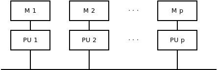
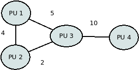
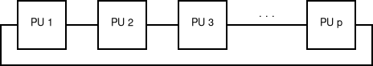
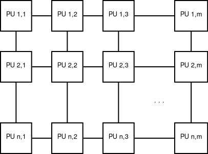
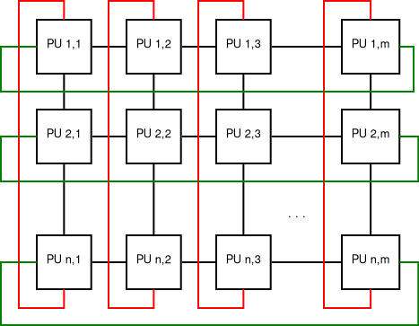
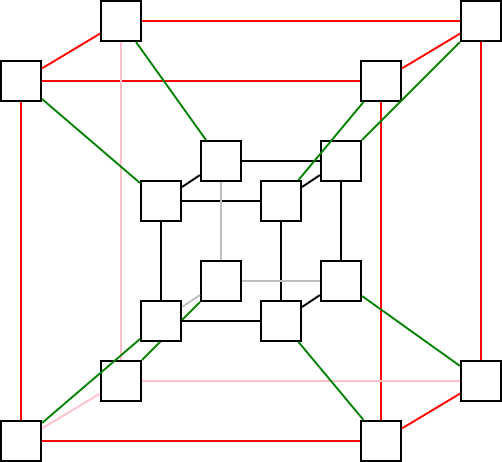
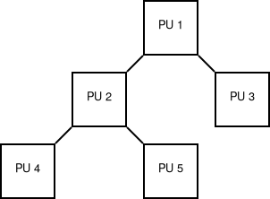
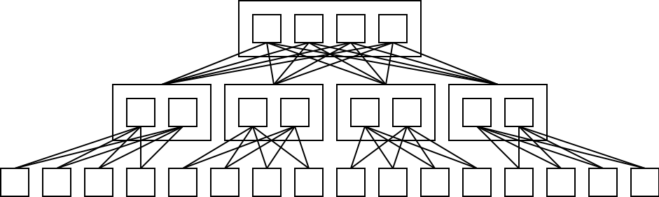

2. Előadás - Végrehajtási módok, modellek
=========================================

Párhuzamos végrehajtási módok
-----------------------------

A programok párhuzamos végrehajtását különböző formában, szinteken valósíthatjuk meg. Egy lehetséges felosztás az alábbi.

**Hálózat szint**

* Több, egymással összekapcsolt számítógépet használunk.
* Elsődlegesen az elosztott rendszerek témaköre foglalkozik ennek hatékony megvalósításával.

**Hardver szint**

* A hardverek egy jelentős része önmagában is képes több műveletet párhuzamosan végrehajtani.
* CPU szintű párhuzamosítás:

	* Instrukció szintű párhuzamosítás (*Instruction Level Parallelism*): out-of-order execution, speculative execution, branch prediction
	* Hyper-Threading: fizikai processzoronként 2 logikai processzor

* Dedikált hardverként az egyik legszemléletesebb példa a videókártya. OpenCL, kernelek

https://en.wikipedia.org/wiki/Instruction-level_parallelism

https://en.wikipedia.org/wiki/Hyper-threading

**Virtuális gépek**

* Egy számítógépen belül több operációs rendszer indítható el párhuzamosan.
* Az erőforrások hatékonyan kihasználhatók különösebb szoftverfejlesztési feladat nélkül.

**Folyamatok**

* Az operációs rendszer ütemezi a folyamatok működését. Amennyiben meg tudja oldani, úgy a párhuzamosan végrehajtható részeket párhuzamosan futtatja.
* Több szekvenciális végrehajtású program időben párhuzamosan tud így futni.
* Operációs rendszer szintjén felügyelhető a működés.
* Egy számítási feladat szempontjából ezek kommunikációjával is megoldhatjuk a párhuzamosítást.
* *Inter Process Communication*, *MPI szabvány*

**Szálak**

* Egy programon belül mi magunk kijelölhetjük azokat a részeket, amelyek végrehajtása időben átfedésbe kerülhet.
* A végrehajtás során nem garantált, hogy valóban párhuzamosan történik majd. (Az operációs rendszer dönti el.)

**Könnyű súlyú szálak**

* A felhasználói térben (*user space*) kerülnek ütemezésre.
* Szokták még nevezni zöld szálaknak, coroutine-oknak.
* Mivel a szálak implementációja rendszerenként eltérő, ezért nincs pontos határvonal a szálak és a könnyűsúlyú szálak között.
* A programozási nyelvekben egyedi megoldások vannak ezek használatára..

Memóriamodellek
---------------

:math:`\rhd` Gondoljuk át a memória és a számítási elemek közötti 1:N, N:1, N:M kapcsolatokat!

Lokális memória
~~~~~~~~~~~~~~~

Moduláris memória
~~~~~~~~~~~~~~~~~

.. image:: images/modular_memory.png

Osztott memória
~~~~~~~~~~~~~~~

.. image:: images/shared_memory.png

* Cache
* Cache update probléma
* Kritikus szakasz
* Kölcsönös kizárás

Hálózatok
---------

A párhuzamos végrehajtási mód megvalósítási módjától függetlenül tudjuk vizsgálni a rendszerek topológiáját és a számítási egységek közötti kommunikációt.

* Csomópontként jelöljük a számítási egységeket, esetlegesen a tárakat (memóriát, háttértárat).
* Az élek a kommunikációs csatornákat jelölik.
* A kommunikáció irányával külön is kellhet foglalkozni. Ilyen esetben irányított gráfokat használunk.

Nézzünk egy nagyon egyszerű példát egy ilyen topológiára!

Elterjedt topológiák
~~~~~~~~~~~~~~~~~~~~

* Az alapvető probléma az, hogy egy üzenetet (csomagot) el kell juttatni az egyik állomástól a másikig.
* A cél az, hogy ezt minél gyorsabban, hatékonyabban meg tudjuk tenni.
* A hálózatra úgy tekinthetünk, hogy a csomag csak az élek mentén tud haladni.
* Külön problémát jelent, hogy párhuzamosan több csomag is továbbításra kerül.
* Elvileg tetszőleges gráf lehetne a topológia.
* A következők elvi és praktikus okok miatt alakultak így.

Busz
~~~~

* Az egyik legegyszerűbb összeköttetési forma.
* A csomópontokat célszerű indexelni, amelyeken így értelmezett egy rendezés.
* Tekinthető a fa egy speciális esetének.

:math:`\rhd` Mennyi az élek száma általános esetben?

:math:`\rhd` Vizsgáljuk meg a :math:`p = 4` esetre a csomópontok közötti távolságokat?

:math:`\rhd` Adjuk meg a (0-nál nagyobb) távolságok eloszlását!

:math:`\rhd` Mennyi a maximális és az átlagos távolság a csomópontok között?

Gyűrű
~~~~~

* Célszerű itt is tudni, hogy merre felé van a címzett (de nem kötelező).

:math:`\rhd` Mennyi az élek száma általános esetben?

:math:`\rhd` Vizsgáljuk meg a :math:`p = 4` esetre a csomópontok közötti távolságokat?

:math:`\rhd` Adjuk meg a (0-nál nagyobb) távolságok eloszlását!

:math:`\rhd` Mennyi a maximális és az átlagos távolság a csomópontok között?

Rács
~~~~

* Tetszőleges dimenziós lehet, és nem csak négyzetes.
* A címzést dimenziószám részből álló címekkel előnyös megoldani.

:math:`\rhd` Mennyi az élek száma általános esetben?

:math:`\rhd` Vizsgáljuk meg a távolságokat egy :math:`4 \times 4` méretű rácsra!

:math:`\rhd` Mennyi a maximális távolság egy :math:`n \times m` méretű rácsban?

Tórusz
~~~~~~

* Szintén elképzelhető magasabb dimenziós és nem négyzetes változat is.
* Az :math:`n` és az :math:`m` számú plusz él beiktatása jelentősen csökkenti a csomópontok közötti távolságokat.

:math:`\rhd` Mennyi az élek száma általános esetben?

:math:`\rhd` Hogyan változnak a távolságok a plusz összeköttetéssel egy :math:`4 \times 4` méretű rácshoz képest?

Hiperkocka
~~~~~~~~~~

:math:`\rhd` Hogyan tudjuk címezni a csomópontokat?

:math:`\rhd` Adjuk meg, hogy a dimenziószám függvényében (például :math:`n`-nel jelölve), hogyan változik a csomópontok és az élek száma! (Írjuk fel hozzá táblázatban 0-tól 8 dimenzióig a csúcsok (:math:`|V|`) és élek (:math:`|E|`) számát!)

:math:`\rhd` Egy :math:`n` dimenziós hiperkockában mennyi lesz a csomópontok közötti minimális és maximális távolság?

Fa
~~

* Egy összefüggő, körmentes gráf.
* Szoktak még említeni csillag topológiát. Ezt tekinthetjük a fa speciális esetének.

:math:`\rhd` Hogyan oldható meg a csomópontok címzése (és ezzel kapcsolatosan a routing)?

:math:`\rhd` A példában szereplő fa esetében hogyan alakulnak a csomópontok közötti távolságok? Adjuk meg ezek eloszlását!

Fat-tree
~~~~~~~~

* Arra a feltételezésre épül, hogy a magasabb szintek között nagyobb sávszélességre van szükség. (Az "Oszd meg és uralkodj!" elven működő algoritmusoknál igen gyakran ez a helyzet.)

https://en.wikipedia.org/wiki/Fat_tree

https://en.wikipedia.org/wiki/Omega_network

Elvek és modellek
-----------------

Leképzés (map)
~~~~~~~~~~~~~~

* Az egyik legegyszerűbb és leghatékonyabban párhuzamosítható algoritmus.
* Tegyük fel, hogy adott egy :math:`x \in \mathbb{R}^n` vektor! Ki szeretnénk számítani egy :math:`y \in \mathbb{R}^n` vektort, melyre teljesül, hogy :math:`y_i = f(x_i), \forall i`, és :math:`f: \mathbb{R} \rightarrow \mathbb{R}` egy tetszőleges valós függvény.

Hogyan változik a munka, költség, gyorsítás és hatékonyság :math:`p` függvényében?

Osszd meg és uralkodj elv
~~~~~~~~~~~~~~~~~~~~~~~~~

* Felosztás :math:`\rightarrow` művelet :math:`\rightarrow` egyesítés
* Tipikusan rekurzív formában használatos

.. warning::

	A felosztás megfelelő szintjének meghatározása külön érdekes problémakör!
	(Jellemzően nem szerencsés az elemek szintjéig lemenni.)

Pipeline párhuzamosítás
~~~~~~~~~~~~~~~~~~~~~~~

* Tegyük fel, hogy vannak feldolgozandó elemeink, amelyeken adott sorrendben, mindig ugyanazokat a lépéseket kell végrehajtani.
* Feltételezzük, hogy a lépések végrehajtási ideje közel egyenlő.

.. image:: images/pipeline.png

:math:`\rhd` Mekkora gyorsítást tudunk így elérni?

:math:`\rhd` Mennyire lesz ez a módszer hatékony? (Írjuk fel :math:`p` és :math:`n` függvényében!)

Termelő-fogyasztó probléma
~~~~~~~~~~~~~~~~~~~~~~~~~~

* Task pool
* Gyors válaszidő, terhelés kiegyenlítés érdekében használják például.
* Általában sort használnak hozzá.

.. image:: images/producer_consumer.png

:math:`\rhd` Milyen előnyei vannak a módszernek?

:math:`\rhd` Milyen eseteket nem tud jól kezelni?

Lost Update probléma
~~~~~~~~~~~~~~~~~~~~

**Példa**

Feltételezzük, hogy A és B egy változó értékét szeretné módosítani. A következő műveletek kerülnek végrehajtásra.

* A kiolvassa a változó értékét.
* B kiolvassa a változó értékét.
* A növeli a változó értékét.
* B növeli a változó értékét.

Zárolási mechanizmusok
~~~~~~~~~~~~~~~~~~~~~~

Garantálnunk kell tudni, hogy adott erőforrásokhoz egyidejűleg csak egy valaki férhet hozzá.

**Lakat (Lock)**

* Egy jelzőbittel (*flag*-gel) megoldható.
* Jelezni kell, hogy mikor foglaljuk le, és mikor szabadítjuk fel az erőforrást.

**Szemafor**

* Egy számláló, amely nyilvántartja a lefoglalások és felszabadítások számát.

Kérdések
--------

* Mennyi a 0-nál nagyobb távolságok eloszlása egy 7 csomópontból álló buszon?
* Mennyi az átlagos távolság egy 8 csomópontból álló gyűrűben?
* Egy :math:`6 \times 6 \times 6` rács esetében mennyi élünk lesz? Mennyi lesz a csomópontok közötti maximális távolság?
* Mennyi csomópont és él lesz egy 5 dimenziós hiperkockában? Mennyi ez esetben a maximális távolság?

Feladatok
---------

Szekvencia diagram
~~~~~~~~~~~~~~~~~~

* Keressen példákat szekvencia diagramokra az Interneten! Vizsgálja meg, hogy miben hasonlítanak és különböznek a jelölések!
* Tegyük fel, hogy egy tanár 2 hallgatóval írat dolgozatot. A tanár sorban kiosztja a feladatsort. A hallgatók megoldják a feladatokat, majd beadják ahogy elkészültek. A tanár kiértékeli (egyszerre csak egyet), visszaadja a hallgatóknak átnézésre, majd visszakéri a dolgozatokat. Rajzoljon fel egy lehetséges szekvencia diagramot a dolgozat írásához!

Feladatmegosztás optimalizálása
~~~~~~~~~~~~~~~~~~~~~~~~~~~~~~~

Tegyük fel, hogy adott 2 gép, melyek hálózaton keresztül tudnak kommunikálni.

* A feladatokat egységnyieknek tekintjük.
* Összesen 3000 feladat van.
* Az első gép 1 feladatot 10 másodperc alatt old meg, a második pedig 5 másodperc alatt.
* A bemenet az első gépen áll rendelkezésre.
* A második gépre való küldés 2 másodpercet igényel feladatonként.
* A küldés és fogadás ideje alatt a gépek nem tudnak lényegi számítást végezni.
* Az eredményeknek az első gépre kell kerülniük.

Hogyan ossza meg a két gép a feladatokat, hogy a lehető legkevesebb ideig tartson összességében?

* Vezessünk be jelöléseket!
* Próbáljuk meg általánosan is megoldani a problémát!
* Ábrázoljuk grafikonon a párhuzamos végrehajtás idejét!

Mérések algoritmusok bonyolultságára vonatkozóan
~~~~~~~~~~~~~~~~~~~~~~~~~~~~~~~~~~~~~~~~~~~~~~~~

#. Készítsen el egy programot, amellyel egy tömbben lévő számértékeket lehet beolvasni.

   * Írjon egy függvényt az elemek összegének kiszámításához!
   * Valósítsa meg a minimum és a maximum értékének a meghatározását külön függvényekben!
   * Próbálja meg rekurzív függvényekkel is megoldani az előbbi számítási feladatokat!
   * Mérje le, gyűjtse össze táblázatba és ábrázolja grafikonon az iteratív és a rekurzív változatok számítási idejét az elemszám függvényében!
   * Adjon felső becslést a futási időre vonatkozóan! (:math:`T(n) = \mathcal{O}(?)`)

#. Generáljon egy tömböt úgy, hogy az elemek egész értékűek, és mindegyik különbözik!

   * Vizsgálja meg a tömb generálásának számítási idejét az elemszám függvényében!
   * 0.5 valószínűséggel duplikáljon benne néhány elemet!
   * Készítsen olyan függvényt, amely ellenőrzi, hogy a tömb minden eleme egyedi-e!
   * Vizsgálja meg a függvény bonyolultságát!

#. Generáljon egy tömböt, amelyben az elemek lebegőpontos értékek, és szigorúan monoton növekvő sorozatot alkotnak!

   * Készítsen függvényt a tulajdonság ellenörzéséhez!
   * Definiáljon egy függvényt, amely bináris kereséssel keres egy elemet a tömbben!
   * Készítse el az iteratív és a rekurzív változatát!
   * Véletlenszerűen kiválasztott és/vagy generált értékek keresése alapján mérje le a számítási idők eloszlását (adott elemszám mellett)!
   * Hasonlítsa össze az iteratív és a rekurzív változat futási idejét az elemszám függvényében!
   * Ábrázolja az egyes elemszámokhoz tartozó futási idők maximumát!

#. Generáljon egy szöveges fájlt az angol ábécé kis és nagy betűiből, számjegyekből, szóközökből és sortörésekből véletlenszerűen!

   * A generáláshoz paraméterként használja a generálandó karakterek számát!
   * Készítsen egy függvényt, amelyik meghatározza, hogy mennyi sort tartalmaz a szöveges fájl!
   * Próbáljon rekurzív megoldást is adni a problémára!
   * Hasonlítsa össze az iteratív és a rekurzív változat futási idejét!
   * Határozza meg az üres sorok számát!

Prefix számítás vizsgálata
~~~~~~~~~~~~~~~~~~~~~~~~~~

Tekintsük a prefix számítás esetében egységnyi idejűnek a :math:`\oplus` művelet elvégzését!

#. Készítsen egy programot, amely a CREW_PREFIX algoritmus végrehajtása során elvégzett hívásokat GraphViz segítségével egy hívási fában ábrázolja!

   * A program a kimenetet egy szöveges fájl formájában adja meg!
   * A megjelenítéshez használhat online gráf megjelenítőt, például: https://dreampuf.github.io/GraphvizOnline/
   * A csomópontokban tüntesse fel, hogy a hívás milyen intervallumra vonatkozott!
   * Próbálja megoldani, hogy a program tetszőleges :math:`n` méretű bemenetre működjön!

#. Az EREW_PREFIX algoritmus vizsgálatához készítsen egy programot, amellyel vizsgálható a párhuzamosan elvégzett számítások során a munka, költség, gyorsítás és a hatékonyság mértéke!

   * Egy szövegfájlba mentse le, hogy a számítások során a :math:`t` időpillanatban mennyi számítási egység végzett éppen hasznos munkát! (Itt a sorok mutassák az időt, az oszlopok pedig, hogy melyik számítási egységről van szó! Jelölje ``.`` karakter, hogy ha nem történt hasznos számítás, ``#`` pedig hogy ha igen!)
   * Határozza meg az említett :math:`W`, :math:`C`, :math:`S` és :math:`E` értékeket :math:`n = 100` bemenetméretig!
   * Gyűjtse össze az adatokat egy táblázatba!
   * Ábrázolja grafikonon a bemenet függvényében a gyorsítás és a hatékonyság mértékét!

#. Vizsgálja meg az OPTIMAL_PREFIX algoritmus működését!

   * Írjon fel egy saját példát :math:`n = 16` bemenet esetére! Rajzolja fel az ehhez tartozó Gantt diagramot!
   * Ábrázolja grafikonon, hogy :math:`n` méretű bemenet esetén mennyi processzorra van szükség a számításhoz!
   * Karakter tömb segítségével ábrázolja (például fájlba kimentve), hogy a :math:`t.` időegységben végzett-e hasznos számítást a :math:`p.` processzor!
   * Határozza meg az említett :math:`W`, :math:`C`, :math:`S` és :math:`E` értékeket :math:`n = 100` bemenetméretig!

Hálózati topológiák
~~~~~~~~~~~~~~~~~~~

#. Négyzetes rács topológia esetén végezze el a következő számításokat!

   * Számítsa ki :math:`n = 50`-ig, hogy egy :math:`n \times n` méretű rácsban mennyi csomópont és él van!
   * Határozza meg ezek arányát :math:`n` függvényében, és ábrázolja a kapott eredményt grafikonon!
   * Egy :math:`12 \times 12`-es méretű rács esetében határozza meg a pontok közötti távolságok eloszlását!
   * Ábrázolja a kapott eredményt hisztogramon!
   * Vizsgálja meg, hogy :math:`n = 24`-ig térbeli rács esetében hogyan változik a csomópontok és élek száma!
   * Hasonlítsa össze, hogy :math:`n` függvényében hogyan alakul az élek száma síkbeli és térbeli rácsok esetében!
   * Számítsa ki a csomópontok közötti távolságok eloszlását egy :math:`5 \times 5 \times 5` méretű térrácsban!

#. Végezze el az előbbi számításokat tórusz topológia esetében!

#. Végezzen számításokat hiperkocka topológia esetében!

   * Számítsa ki, hogy 30 dimenzióig hogyan változik a csomópontok és az élek száma!
   * Határozza meg 8 dimenzióban a csomópontok közötti távolságok eloszlását!
   * Ábrázolja a kapott eredményt hisztogramon!
   * Számítsa ki 20 dimenzióig az átlagos távolságokat!
   * Hasonlítsa össze ezeket a csomópontok száma alapján a síkbeli és térbeli rács topológiákkal!
