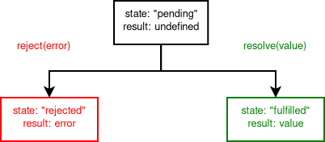

4. Előadás - Programnyelvi elemek
=================================

A korábbiakban a szálkezeléshez függvénykönyvtárak használatára került sor.
Alternatívaként megjelenik azonban a párhuzamos végrehajtás megvalósításához sajátos nyelvi elemek használata is.

OpenMP
------

Egy API többszálú alkalmazások írásához.

* Célja, hogy egyszerűsítse a programok írását C, C++ és Fortran nyelven. (2005-től, a 2.5-ös verziótól kezdve egységes az API minden nyelven.)
* Többségében fordító direktívákat használ.
* Figyelembe veszi a nyelv strukturális elemeit.
* Nyilvántartja, lekérdezhetővé teszi a szálak számát.
* A szálak azonosítóit 0-tól kezdve egészként adja meg. (Ezzel egyszerűsíti a problémák felosztását.)
* Kezeli a változók láthatóságát (*private*/*shared*).
* A szálak egymás között megosztott memórián keresztül tudnak kommunikálni.
* *Race condition*: a szálak ütemezése befolyásolja a program eredményeit.
* Az ütemezéstől független helyes futást szinkronizációval lehet garantálni.
* Van benne implicit és explicit barrier.
* Windows kompatibilis.

Esetünkben praktikusan úgy tekinthetünk rá, mint a C nyelv speciális makrókkal való kiegészítésére.

Alapvető nyelvi elemek
~~~~~~~~~~~~~~~~~~~~~~

A használatához az ``omp.h`` fejléc használatára van szükség:

.. code:: cpp

    #include <omp.h>

Fordításhoz az ``-fopenmp`` direktívát kell megadni, például:

.. code::

    gcc program.c -o program.exe -fopenmp

:math:`\rhd` Nézzük meg, hogy milyen hasonló ``-f``-el kezdődő opciók vannak a GCC-ben!

A kódrészek a következőképpen jelölhetők ki:

.. code:: cpp

    #pragma omp parallel
    {
        // ...
    }

A szálak számát a következőképpen lehet lekérdezni:

.. code:: cpp

    int n_threads;
    n_threads = omp_get_num_threads();

Az aktuális szál azonosítójának lekérdezése:

.. code:: cpp

    int thread_id;
    thread_id = omp_get_thread_num();

A kritikus szakaszok kijelöléséhez a következő makró használható:

.. code:: cpp

    #pragma omp critical

Ciklusok esetében a párhuzamosítás direkt módon is megadható:

.. code:: cpp

    #pragma omp for
    for (i = 0; i < N; ++i) {
        // ...
    }

Ez alapértelmezés szerint barrier-ként is szolgál. Ezt kikapcsolni a következőképpen lehet:

.. code:: cpp

    #pragma omp for nowait

A párhuzamosított blokkokon belül kijelölhetőek azok a változók, amelyekből a szálaknak saját, privát példánnyal is kellene rendelkezniük. Például:

.. code:: cpp

    int a, b, c;
    #pragma omp parallel private (a, b, c)

A programban ki lehet jelölni azt a részt, amelyet csak a főszálnak kellene tudnia végrehajtani.

.. code:: cpp

    #pragma omp master
    // ...
    #pragma omp barrier

Hasonlóképpen használható, mint fork-olásnál a processz egyedi azonosítója.

Mivel a redukció egy gyakori művelet, ezért készen tartalmaz hozzá elemeket. Például, hogy ha egy ``s`` változóba szeretnénk értékeket összegezni:

.. code:: cpp

    #pragma omp parallel for reduction (+:s)
    for (i = 0; i < N_VALUES; ++i) {
        s += values[i];
    }

Zárolás megvalósítása
~~~~~~~~~~~~~~~~~~~~~

Zár létrehozása:

.. code:: cpp

    omp_lock_t lock;

Inicializálás:

.. code:: cpp

    omp_init_lock(&lock);

Kritikus szakasz kijelölése:

.. code:: cpp

    omp_set_lock(&lock);
    // ...
    omp_unset_lock(&lock);

Zárhoz tartozó erőforrás felszabadítása:

.. code:: cpp

    omp_destroy_lock(&lock);

Szakaszok kijelölése
~~~~~~~~~~~~~~~~~~~~

Az OpenMP lehetővé teszi, hogy a program végrehajtását szakaszok kijelölésével párhuzamosan végrehajtható egységekre bontsuk.

.. code:: cpp

    #pragma omp parallel
    {
      #pragma omp sections
      {
        #pragma omp section
        // ...
        #pragma omp section
        // ...
        #pragma omp section
        // ...
      }
    }

JavaScript: async és await kulcsszavak
--------------------------------------

* A konkurrens végrehajtás kezelésére találták ki, nem a párhuzamos végrehajtás a cél.
* Lehetőséget ad a futtatókörnyezetnek a párhuzamos végrehajtásra.

Egy egyszerű példa az aszinkron végrehajtásra:

.. code:: javascript

    console.log("Start ...");
    setTimeout(() => { console.log("Ready!"); }, 4000);
    setTimeout(() => { console.log("Work ..."); }, 2000);
    console.log("I am here!");

Egy ``Promise`` objektumot a következőképpen hozhatunk létre.

.. code:: javascript

    let promise = new Promise(function(resolve, reject) {
        ...
    });

A ``Promise`` a létrehozását követően rögtön elindul.

A ``resolve`` és a ``reject`` callback függvények, mint paraméterek.

* Hogy ha a művelet sikeres volt, akkor a ``resolve`` függvényt kell meghívnunk,
* hogy ha sikertelen, akkor a ``reject``-et.

A ``Promise``-hoz tartozó állapotok és műveletek a következőképpen foglalhatók össze.

A ``Promise``-hoz tartozik 3 metódus:

* ``then``: Az eredmény értékét adja vissza, hogy ha rendben végrehajtásra került a művelet.
* ``catch``: Hibajelzésre szolgál. A hiba értékét adja vissza.
* ``finally``: Biztosan lefut a ``then`` vagy a ``catch`` *ág* után, függetlenül attól, hogy milyen lett az eredmény/állapot.

Mindegyik ág egy végrehajtandó függvényt vár.

.. code:: javascript

    let promise = new Promise(function(resolve, reject) {
      resolve(1234);
    });

    promise
      .then(value => { console.log("THEN: " + value); })
      .catch(error => { console.log("ERROR: " + error); })
      .finally(() => { console.log("FINALLY"); });

Az ``await`` kulcsszó segítségével meg lehet várni, hogy a ``Promise`` objektum visszaadja az értékét.

.. code:: javascript

    let promise = new Promise(function(resolve, reject) {
      resolve(1234);
    });
    let result = await promise;
    console.log("RESULT: " + result);

* Szinkron végrehajtást tesz lehetővé.
* Hibák esetén a JavaScript nyelv *try-catch* hibakezelési mechanizmusa használható.

.. code:: javascript

    let promise = new Promise(function(resolve, reject) {
      reject(1234);
    });
    try {
      let result = await promise;
      console.log("RESULT: " + result);
    } catch (error) {
      console.log("ERROR: " + error);
    }

Az ``async`` kulcsszóval egyszerűen definiálhatunk olyan függvényt, amely egy ``Promise`` objektumot ad vissza.

.. code:: javascript

    async function doSomething(...) {
        ...
    }

Az ``await`` kulcsszó csak aszinkron függvényen belül és modul szintjén használható.

.. code:: javascript

    function wrong() {
      let result = await new Promise();
      console.log("RESULT: " + result);
    }

.. warning

    Uncaught SyntaxError: await is only valid in async functions and the top level bodies of modules

A ``sleep`` függvényt, mint szinkron végrehajtandó egységet tekinthetjük. Például a következőképpen definiálhatjuk és használhatjuk:

.. code:: javascript

    async function sleep(ms) {
      return new Promise(resolve => setTimeout(resolve, ms));
    }

    async function sample() {
      console.log("First ...");
      await sleep(2000);
      console.log("Second ...");
      await sleep(2000);
      console.log("Third ...");
    }

    sample();

A szálkezeléssel olyan tekintetben vonhatunk párhuzamot, hogy egy aszinkron hívás végrehajtása ugyanúgy nem akasztja meg a további műveletek végrehajtását, mint ahogy egy új szál létrehozása.

.. code:: javascript

    async function sleep(ms) {
      return new Promise(resolve => setTimeout(resolve, ms));
    }

    async function worker1() {
      console.log("[1] Start ...");
      await sleep(2000);
      console.log("[1] Ready!");
    }

    async function worker2() {
      console.log("[2] Start ...");
      await sleep(3000);
      console.log("[2] Ready!");
    }

    async function worker3() {
      console.log("[3] Start ...");
      await sleep(1000);
      console.log("[3] Ready!");
    }

    async function sample() {
      worker1();
      worker2();
      worker3();
    }

    sample()

Forrás:

* https://developer.mozilla.org/en-US/docs/Web/JavaScript/Reference/Statements/async_function
* https://javascript.info/promise-basics

Python, Async IO, Coroutines
----------------------------

A Python-ban nyelvi elemként használhatók az ``async`` és az ``await`` kulcsszavak.

.. code:: python

    import asyncio

    async def main():
        print('Start ...')
        await asyncio.sleep(3)
        print('Ready!')

    asyncio.run(main())

* Alapvetően blokkolásmentes kód fejlesztéséhez használatos.
* Hogy ha a Python implementációban van GIL, akkor tényleges párhuzamosítást nem fog tudni végrehajtani.
* Fő alkalmazási területe az IO-ra való várakozás elkerülése. (*non-blocking IO*)
* Az ``async`` kulcsszóval létrehozott objektum ``coroutine`` típusú. (Közvetlenül nem lehet úgy meghívni, mint egy függvényt (``callable`` típust)).

Példa az alapvető, blokkolásos működésre függvényhívások esetében:

.. code:: python

    import time

    def worker_1():
        print("[1] Start ...")
        time.sleep(2)
        print("[1] Ready!")

    def worker_2():
        print("[2] Start ...")
        time.sleep(3)
        print("[2] Ready!")

    def worker_3():
        print("[3] Start ...")
        time.sleep(1)
        print("[3] Ready!")

    def sample():
        worker_1()
        worker_2()
        worker_3()

    sample()

Ugyanez aszinkron végrehajtással:

.. code:: python

    import asyncio

    async def worker_1():
        print("[1] Start ...")
        await asyncio.sleep(2)
        print("[1] Ready!")

    async def worker_2():
        print("[2] Start ...")
        await asyncio.sleep(3)
        print("[2] Ready!")

    async def worker_3():
        print("[3] Start ...")
        await asyncio.sleep(1)
        print("[3] Ready!")

    async def sample():
        task_1 = asyncio.create_task(worker_1())
        task_2 = asyncio.create_task(worker_2())
        task_3 = asyncio.create_task(worker_3())
        await task_1
        await task_2
        await task_3

    asyncio.run(sample())

.. warning::

    Az ``asyncio.sleep`` használata itt lényeges, mert egyébként blokkolásra kerülne a teljes végrehajtás.

A ``to_thread`` és a ``gather`` függvények segítségével külön szálban is történhet a végrehajtás, amelynél az előző probléma így nem jelentkezik:

.. code:: python

    import asyncio
    import time

    def worker_1():
        print("[1] Start ...")
        time.sleep(2)
        print("[1] Ready!")

    def worker_2():
        print("[2] Start ...")
        time.sleep(3)
        print("[2] Ready!")

    def worker_3():
        print("[3] Start ...")
        time.sleep(1)
        print("[3] Ready!")

    async def sample():
        task_1 = asyncio.to_thread(worker_1)
        task_2 = asyncio.to_thread(worker_2)
        task_3 = asyncio.to_thread(worker_3)
        await asyncio.gather(task_1, task_2, task_3)

    asyncio.run(sample())

Forrás:

* https://docs.python.org/3/library/asyncio-task.html

Kérdések
--------

* Milyen előnyei vannak az OpenMP használatának a POSIX szálakhoz képest?
* Mit jelent az, hogy az OpenMP implicit barrier-t használ? Hogyan kapcsolható ki?

Feladatok
---------

#. Generáljon egy tömböt, amely véletlenszerű valós értékeket tartalmaz! Számítsa ki ezen elemek szorzatát a következő módokon!

   * Szekvenciálisan.
   * A tömböt rekurzívan felezve rögzített maximális rekurzív hívási mélységgel.
   * Az előbbi számítást szervezze ki POSIX szálakba.
   * OpenMP párhuzamos for ciklus használatával.
   * OpenMP redukciós operátor használatával.

Vizsgálja meg, hogy rögzített problémaméret esetén melyik esetben milyen futási idők adódnak!

   * Gyűjtse össze a kapott eredményeket egy táblázatba!
   * Ismételje meg a mérést különböző méretű problémákra, majd ábrázolja a kapott eredményeket grafikonon!

#. Implementálja a ``CREW_PREFIX``, ``EREW_PREFIX`` és az ``OPTIMAL_PREFIX`` számításokat OpenMP segítségével!

   * Mérje le a futási időket különböző bemenetméretek esetében!
   * Gyűjtse össze a kapott eredményeket táblázatos formában! Ábrázolja azokat grafikonon!
   * Hasonlítsa össze a kapott eredményeket a POSIX szálas válatozattal!
