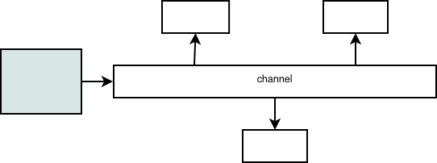
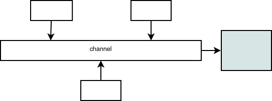
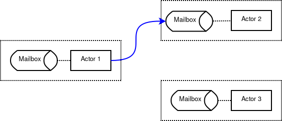

5. Előadás - Aszinkron végrehajtási modellek
============================================

A korábbiakban láthattuk, hogy

* több szál kezelése esetében tipikusan nem lesz determinisztikus a programok végrehajtása.
* Versenyhelyzetek (*race condition*) alakulhatnak ki, amelyek megoldásához szinkronizációs módszereket használhatunk.
* A lock-ok használata deadlock-hoz vezethet.
* Nehezen reprodukálható hibák keletkezhetnek.
* A szoftver megbízhatósága igen fontos szempont, ami így nehezen garantálható.

Processzek közötti kommunikáció, CSP
------------------------------------

* CSP - *Communicating Sequential Processes*
* Matematikai modell, Folyamat algebra
* A folyamat itt általános (implementációtól független) fogalom.
* Nem használ osztott memóriát.

**Csatorna**

* A folyamatok közötti kommunikáció oldható meg a segítségével.
* Nevesített csatornák vannak, amelyre fel lehet iratkozni, lehet rajta üzeneteket közzétenni. (*Publish-Subscribe model*)
* Megvalósítható egy-több és több-egy kapcsolat is.
* A kommunikáció résztvevői nem tudnak egymásról. (Nincs a folyamatoknak egyedi címe, dedikált címzett.)

Egy-több kapcsolat:

Több-egy kapcsolat:

Csatornák használata Go-ban
~~~~~~~~~~~~~~~~~~~~~~~~~~~

.. code:: go

    package main

    import "fmt"

    func main() {

        c := make(chan string)

        go func() {
            c <- "value"
        }()

        result := <-c
        fmt.Println(result)
    }

Bufferelt csatorna:

.. code:: go

    package main

    import "fmt"

    func main() {

        c := make(chan string, 3)

        c <- "first"
        c <- "second"
        c <- "third"

        fmt.Println(<-c)
        fmt.Println(<-c)
        fmt.Println(<-c)
    }

Szinkronizáció csatornák segítségével:

.. code:: go

    package main

    import (
        "fmt"
        "time"
    )

    func worker1(done chan bool) {
        fmt.Print("Worker 1 ...")
        done <- true
    }

    func worker2(done chan bool) {
        fmt.Print("Worker 2 ...")
        done <- true
    }

    func main() {

        done := make(chan bool)

        go worker1(done)
        go worker2(done)

        <-done
        <-done
    }

forrás:

* http://www.usingcsp.com/cspbook.pdf
* https://gobyexample.com/

Aktor modell
------------

Az aktorok jellemzői
~~~~~~~~~~~~~~~~~~~~

* Az aktorra úgy tekinthetünk, hogy az perzisztens módon létezik.
* Van belső állapota, amely el van szigetelve a külvilágtól.

Az aktorok műveletei
~~~~~~~~~~~~~~~~~~~~

* Létre tud hozni egy új aktort.
* Üzenetet tud küldeni egy másik aktornak.
* Üzenetet tud fogadni egy másik aktortól.

Az üzenet feldolgozása során megváltozhat az aktor belső állapota, abban mellékhatásokat fejthet ki.

Az üzenetküldés sajátosságai
~~~~~~~~~~~~~~~~~~~~~~~~~~~~

* Minden aktornak van egy egyedi címe.
* Minden folyamat egyszerre csak egy üzenetet kézbesít.
* A modellben nincs kitüntetett szerepe az időnek. Az aktor csak azzal foglalkozik, hogy hogyan dolgozza fel a beérkező üzeneteket, azok hatására milyen üzeneteket küldjön.
* Az üzenetek kézbesítésére vonatkozóan nincs időkorlát, időtúllépés.
* Az üzenetek kézbesítési sorrendjére nincsen garancia.
* Az aktorok címeit a létrehozásukkor, vagy a kapott üzenetekből lehet megtudni.
* Az elküldött üzenetek immutable adatnak tekinthetők.

Postaládák
~~~~~~~~~~

* *Mailbox*, *Message Queue*
* Minden aktor számára a modell biztosít egy postaládát.
* Ez tulajdonképpen egy üzenetsornak tekinthető (queue, FIFO).

Supervision
~~~~~~~~~~~

* Az aktorok más aktorokat felügyelhetnek.
* A *supervisor* aktor tudja ellenőrízni, hogy a felügyelt aktor helyesen működik-e. Szükség esetén újra tudja indítani.
* Az aktorok ilyen módon fa struktúrába szervezhetők.

A modell előnyei
~~~~~~~~~~~~~~~~

* Egyszerűen skálázható
* Hibatűrő, jól kezeli a hibákat (*fault tolerant*)
* Nem kezel megosztott állapotokat.

A modell hátrányai
~~~~~~~~~~~~~~~~~~

* A modell nem garantálja azt, hogy ne tudjanak kialakulni deadlock-ok.
* Az aktorokhoz tartozó mailbox-ok mérete véges, azok túlcsordulhatnak.
* Sok implementációtól függő elemet tartalmaz.

Az MPI szabvány
---------------

* MPI: *Message Passing Interface*
* Egy kommunikációs protokoll párhuzamos gépek számára.
* Alapvetően C, C++ és Fortran programokhoz, de már más nyelvekhez is elérhető.
* HPC: *High Performance Computing*

**Főverziók**

* MPI-1.1, 1992
* MPI-2.0, 1997
* MPI-3.0, 2012
* MPI-4.0, 2021

Kommunikáció a processzek között
~~~~~~~~~~~~~~~~~~~~~~~~~~~~~~~~

* Az MPI-vel a processzeket csoportokba szervezhetjük.
* Ezek között a kommunikációt egy *Communicator* végzi.
* Segíti a pont-pont kommunikációt és a több processz közötti kommunikációt is.
* Blokkoló és nem blokkoló üzenetátadást is alkalmaz.

**Adattípusai**

* ``MPI_BYTE``
* ``MPI_SHORT``
* ``MPI_INT``
* ``MPI_LONG``
* ``MPI_FLOAT``
* ``MPI_DOUBLE``

Megvannak ezek ``UNSIGNED`` változatai is.

Saját (összetett) típusok definiálására is lehetőséget ad.

Open MPI
~~~~~~~~

* Az MPI egy nyílt forráskódú implementációja.
* Nem csak egy függvénykönyvtár. Az Open MPI-vel készített programok futtatásához külön eszközök szükségesek.

A program fordítása:

.. code:: bash

    gcc hello.c -o hello -l mpi

A program futtatása:

.. code:: bash

    mpirun hello

Parancssori argumentumként megadhatjuk a processzek számát:

.. code:: bash

    mpirun -np 2 master_slave

A C függvénykönyvtár használata
~~~~~~~~~~~~~~~~~~~~~~~~~~~~~~~

MPI inicializálása:

.. code:: c

    MPI_Init(&argc, &argv);

* Az inicializálást minden, a kommunikációban résztvevő processznek el kell végeznie.
* A paraméterek a ``main`` függvényben megadott parancssori argumentumok tipikusan.

A kommunikációs közegből való kilépést explicit módon jelezni kell:

.. code:: c

    MPI_Finalize();

Minden processzhez tartozik egy rang (``rank``):

.. code:: c

    int rank;
    MPI_Comm_rank(MPI_COMM_WORLD, &rank);

Ennek a funkciója gyakorlatilag megegyezik a PID és TID szerepével.

A kommunikációban résztvevő processzek számának lekérdezése:

.. code:: c

    int n_tasks;
    MPI_Comm_size(MPI_COMM_WORLD, &n_tasks);

Pont-pont kommunikációval, blokkoló üzenetet küldeni az ``MPI_Send`` függvénnyel lehet:

.. code:: c

    MPI_Send(
        void* data,
        int count,
        MPI_Datatype datatype,
        int destination,
        int tag,
        MPI_Comm communicator
    );

Üzenetet fogadni az ``MPI_Recv`` függvénnyel lehet:

.. code:: c

    MPI_Recv(
        void* data,
        int count,
        MPI_Datatype datatype,
        int source,
        int tag,
        MPI_Comm communicator,
        MPI_Status* status
    );

Broadcast üzenetet küldeni az ``MPI_Bcast`` függvénnyel lehet:

.. code:: c

    MPI_Bcast(
        void* data,
        int count,
        MPI_Datatype datatype,
        int root,
        MPI_Comm communicator
    );

A redukció jellegű műveletekhez használhatjuk az ``MPI_Reduce`` függvényt:

.. code:: c

    MPI_Reduce(
        void* send_data,
        void* recv_data,
        int count,
        MPI_Datatype datatype,
        MPI_Op op,
        int root,
        MPI_Comm communicator
    );

A redukciós operátor (``op``) lehet például:

* ``MPI_SUM``
* ``MPI_PROD``
* ``MPI_MIN``
* ``MPI_MAX``

forrás:

* https://mpitutorial.com

Kérdések
--------

CSP
~~~

* A CSP modell esetében hogyan kommunikálnak egymással a folyamatok?
* Milyen előnyei és hátrányai vannak a CSP modellnek?

Aktor modell
~~~~~~~~~~~~

* Milyen műveletei vannak az aktoroknak?
* Egy aktor honnan tudhatja egy másik aktor címét?
* Milyen előnyei és hátrányai vannak az aktor modellnek?

MPI szabvány
~~~~~~~~~~~~

* Milyen problémát old meg az MPI szabvány?
* Miért definiál saját típusokat a függvénykönyvtára?
* Milyen kommunikációs módokat támogat az MPI szabvány?

Feladatok
---------

Szálbiztos tárolók implementálása
~~~~~~~~~~~~~~~~~~~~~~~~~~~~~~~~~

* Implementálja a (dinamikus) tömb (``Array``), a láncolt lista (``List``), a sor (``Queue``) és a verem (``Stack``) adatstruktúrákat (először szálkezelés nélkül)!
* Készítsen olyan példát, amely megmutatja, hogy több szál használata esetén nem garantált a helyes működés!
* Készítse el a struktúrák szálbiztos implementációját!
* Definiáljon függvényt a listában való kereséshez!
* Vizsgálja meg ennek az időbonyolultságát mérések segítségével! (Készítsen hozzá táblázatot és grafikont!)
* Definiáljon egy olyan függvényt, amely paraméterként várja a listához tartozó struktúrát, a keresett elemet, továbbá két függvényt, amelyből az első az elem megtalálásakor hívódik meg, a második pedig akkor, hogy ha a lista nem tartalmazza a keresett elemet!

Promise implementálása
~~~~~~~~~~~~~~~~~~~~~~

Definiáljon egy ``Promise`` struktúrát és hozzá tartozó függvényeket, amelyekkel a következő műveletek oldhatók meg!

* A struktúra tárolja egy számítás eredményét.
* A ``has_value`` függvénnyel lehessen lekérdezni, hogy van-e már eredmnény.
* A ``get_value`` függvénnyel lehessen lekérdezni a számítás eredményét. Adjon vissza NULL értéket, hogy ha még nem áll rendelkezésre az eredmény!
* Oldja meg a hibakezelést (például egy ``get_error`` függvénnyel)!
* Minden függvényhez készítsen használati esetet (mint példát)!

Publish-Subscribe modell implementálása
~~~~~~~~~~~~~~~~~~~~~~~~~~~~~~~~~~~~~~~

* Definiáljon egy ``Topic`` struktúrát és a hozzá tartozó műveleteket, függvényeket!
* Definiálja a ``subscribe`` függvényt, amellyel fel lehet iratkozni egy létrehozott *topic*-ra! (A feliratkozás során használjon callback függvényt!)
* Definiáljon egy ``publish`` függvényt, amellyel szöveges adatot lehet publikálni egy előzőleg létrehozott *topic*-ban!
* Készítsen példát, amelyen meg lehet vizsgálni az így létrehozott rendszer működését!
