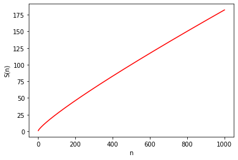
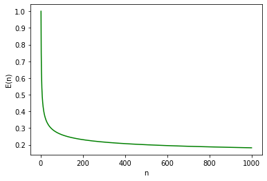
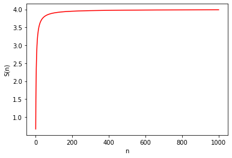
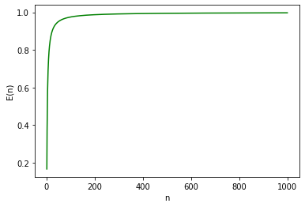
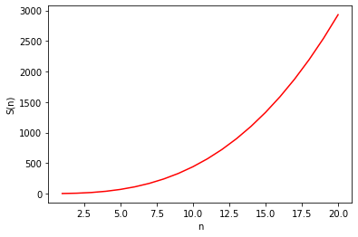

7. Előadás - Numerikus módszerek
================================

Skaláris szorzat
~~~~~~~~~~~~~~~~

Tegyük fel, hogy adott egy :math:`a \in \mathbb{R}^n` és egy :math:`b \in \mathbb{R}^n` vektor. Ezek skaláris szorzata a következőképpen számítható ki:

.. math::

    s = \displaystyle\sum_{i=1}^n a_i \cdot b_i.

A számítás párhuzamos végrehajtásához

* a szorzások időben egyszerre, egymástól függetlenül is elvégezhetők, majd
* a kapott :math:`n` számú elem összeadására van szükség.

**Időbonyolultság**

* Az :math:`s` kiszámításához :math:`n` darab szorzásra és :math:`n - 1` összeadásra van szükség.
* Szekvenciális esetben :math:`T(n) = \Theta(n)`.
* Párhuzamos esetben feltehetjük, hogy minden szorzás időben egyszerre végződik el (1 konstans lépés), az összegzés pedig logaritmikus időben, vagyis :math:`T(n) = \Theta(1 + \log_2 n)`.

**Munka**

Tegyük fel, hogy a szorzás és az összeadás számítási idejét egyenlőnek tekintjük! Szekvenciális esetben ekkor:

.. math::

    W(n) = 2n - 1.

(Párhuzamos esetben szintén ezt kapjuk.)

**Költség**

A költség attól függően változhat, hogy a gyorsításra, vagy a hatékonyságra optimalizálunk.

A gyorsítás esetében :math:`p = n` processzorra van szükségünk.

* Az első lépésben minden processzoron 1-1 darab szorzás műveletet hajtunk végre.
* :math:`\log_2 n` számú további lépésre van szükség.
* Ezen további lépésekben :math:`n - 1` összeadás történik.

Összességében azt kapjuk, hogy:

.. math::

    C_p(n) = n \cdot (1 + \log_2 n), \quad
    S_p(n) = \dfrac{2n - 1}{1 + \log_2 n}, \quad
    E_p(n) = \dfrac{2n - 1}{n \cdot (1 + \log_2 n)}.

Ábrázolva az eredményeket :math:`[1, 1000]` méretű bemenetekre:

Tegyük fel, hogy célként a hatékonyság maximalizálását tűzzük ki!

* Az :math:`[1, n]` intervallumot feloszthatjuk :math:`p` részre.
* Mindegyik részhez nagyságrendileg :math:`\dfrac{n}{p}` szorzás, és 1-gyel kevesebb összeadás fog tartozni.
* További :math:`p - 1` számú összeadásra van szükség, amely már :math:`\log_2 p` lépésben elvégezhető.

Összességében azt kapjuk, hogy:

.. math::

    \begin{align*}
    &C_p(n) = p \cdot \left(2 \cdot \dfrac{n}{p} - 1 + \log_2 p\right), \\
    &S_p(n) = \dfrac{2n - 1}{2 \cdot \dfrac{n}{p} - 1 + \log_2 p}, \\
    &E_p(n) = \dfrac{2n - 1}{p \cdot \left(2 \cdot \dfrac{n}{p} - 1 + \log_2 p\right)}.
    \end{align*}

A felírás természetesen egyszerűsíthető, hogy ha a

.. math::

    T_p(n) = 2 \cdot \dfrac{n}{p} - 1 + \log_2 p

formában adjuk meg a számítási lépések számát a párhuzamos végrehajtás esetében.

Ábrázolva az eredményeket :math:`[1, 1000]` méretű bemenetekre, :math:`p = 4` esetén:

Mátrix szorzás
~~~~~~~~~~~~~~

Legyen adott három mátrix:

* :math:`A \in \mathbb{R}^{n \times m}`,
* :math:`B \in \mathbb{R}^{m \times r}`,
* :math:`C \in \mathbb{R}^{n \times r}`.

Az :math:`A` és :math:`B` mátrixból a :math:`C` mátrixot, mint szorzatot a következőképpen kapjuk:

.. math::

    c_{ij} = \displaystyle\sum_{k=1}^m a_{ik} \cdot b_{kj}.

Jól látható, hogy

* a szorzat mátrix elemei időben egyszerre, egymástól függetlenül számolhatók, és
* mivel a :math:`C` minden eleme egy skaláris szorzat, így azon skaláris szorzatok számítása is megoldható párhuzamosítva.

**Munka**

* A teljes számítás elvégzéséhez :math:`n \cdot r` skaláris szorzatot kell kiszámítani.
* Minden szorzat :math:`m` elemű vektorok szorzását jelenti.
* :math:`m` elemű vektorokon :math:`m` szorzás és :math:`m - 1` összeadás elvégzésére van szükség.
* Feltételezhetjük, hogy az összeadás és a szorzás műveletideje azonos. (Praktikusan egy processzor ciklus alatt elvégezhető. Ez természetesen nem minden rendszerben szükségszerű feltételezés.)

.. math::

    W(n, m, r) = n \cdot r \cdot (m + m - 1)

**Számítási idő**

Szekvenciális esetben :math:`T(n, m, r) = W(n, m, r)`.

* Párhuzamosítás esetén elvileg minden :math:`c_{ij}` elem számítása időben egyszerre történhet.
* Egy :math:`c_{ij}` elem számításához elegendő :math:`T(m) = \Theta (1 + \log_2 m)` számítási lépést elvégezni.

**Gyorsítás**

Az előzőek alapján azt kapjuk, hogy

.. math::

    S_p(n, m, r) = \dfrac{n \cdot r \cdot (m + m - 1)}{1 + \log_2 m}.

Vizsgáljuk meg a gyorsítást négyzetes mátrixok esetében (vagyis amikor :math:`n = m = r`)!

.. math::

    S_p(n) = \dfrac{2n^3 - n^2}{1 + \log_2 n}.

Ez esetben feltételeztük, hogy tetszőleges nagy lehet a :math:`p` értéke.
Ahhoz, hogy ez valóban így adódjon

.. math::

    p = n \cdot r \cdot \dfrac{m}{2}

számítási egységre lenne szükségünk.

* A skaláris szorzat számítása kapcsán láthattuk, hogy adható hatékony párhuzamos algoritmus a számítására.
* A :math:`c_{ij}` értékek számítási egységek közötti elosztása szintén hatékonyan elvégezhető.
* :math:`p` függvényében adható tehát olyan algoritmus (problématér felosztás), amelyre a hatékonyság a probléma méretének növelésével 1-hez fog tartani.

Lineáris egyenletrendszerek megoldása
~~~~~~~~~~~~~~~~~~~~~~~~~~~~~~~~~~~~~

Tekintsük az :math:`Ax = b` egyenletrendszert, ahol

* :math:`A \in \mathbb{R}^{n \times n}` együtthatómátrix,
* :math:`b \in \mathbb{R}^n` vektor,
* :math:`x \in \mathbb{R}^n` ismeretleneket tartalmazó vektor.

A lineáris egyenletrendszer megoldásához Gauss eliminációt használhatunk.

**Felső háromszögmátrix számítása**

.. math::

	\begin{align*}
	&\text{CALC_TRIANGLE}(@A, @b) \\
	&\text{// Input}: A \in \mathrm{R}^{n \times n} \\
	&//\quad\quad\quad\, b \in \mathrm{R}^n \\
	&\text{// Output}: A \in \mathrm{R}^{n \times n} \\
	&//\quad\quad\quad\, b \in \mathrm{R}^n \\
    &\text{FOR }k \leftarrow 1\text{ TO }n - 1\text{ DO}\\
    &\quad\text{FOR }i \leftarrow k + 1\text{ TO }n\text{ DO}\\
    &\quad\quad a_{ik} \leftarrow \dfrac{a_{ik}}{a_{kk}}\\
    &\quad\quad \text{FOR }j \leftarrow k + 1\text{ TO }n\text{ DO}\\
    &\quad\quad\quad a_{ij} \leftarrow a_{ij} - a_{ik} \cdot a_{kj}\\
    &\quad\quad b_i \leftarrow b_i - a_{ik} \cdot b_k\\
	&\text{RETURN}(A, b) \\
	\end{align*}

**Visszahelyettesítés**

.. math::

	\begin{align*}
	&\text{BACK_SUBSTITUTE}(@A, @b, @x) \\
	&\text{// Input}: A \in \mathrm{R}^{n \times n} \\
	&//\quad\quad\quad\, b \in \mathrm{R}^n \\
	&\text{// Output}: x \in \mathrm{R}^n \\
    &\text{FOR }i \leftarrow n\text{ DOWNTO }1\text{ DO}\\
    &\quad x_i \leftarrow b_i\\
    &\quad \text{FOR }j \leftarrow i + 1\text{ TO }n\text{ DO}\\
    &\quad\quad x_i \leftarrow x_i - a_{ij} \cdot x_j\\
    &\quad x_i \leftarrow \dfrac{x_i}{a_{ii}}\\
	&\text{RETURN}(x) \\
	\end{align*}

.. warning::

    A lineáris egyenletrendszerek megoldásának ez az egyik legegyszerűbb esete.
    A gyakorlatban érdemes például főelemkiválasztást is használni hozzá!

**Párhuzamosítás**

A háromszögmátrix számítása esetében az :math:`i`-hez tartozó sorok párhuzamosan kiszámíthatók.

A visszahelyettesítés esetében a :math:`j`-hez tartozó ciklus szintén párhuzamosítható.

Bizonyos elemszám alatt a párhuzamosításnak már nincs értelme a gyakorlatban, így azt szekvenciális formában érdemes számolni.

Determináns számítása
~~~~~~~~~~~~~~~~~~~~~

* A Gauss eliminációt követően a felsőháromszög mátrix átlójában lévő elemeinek szorzatából számítható.
* A szorzat számítása logaritmikus idő alatt elvégezhető.

Interpoláció
~~~~~~~~~~~~

Legyenek adottak :math:`x_1, x_2, \ldots, x_n \in \mathbb{R}` pontok, és hozzá tartozó :math:`y_1, y_2, \ldots, y_n \in \mathbb{R}` értékek. A célunk az, hogy megadjunk egy olyan :math:`f: \mathbb{R} \rightarrow \mathbb{R}` függvényt, amelyre teljesül, hogy :math:`f(x_i) = y_i` bármilyen :math:`1 \leq i \leq n` érték esetén.

Az egyszerűség kedvéért feltételezzük, hogy :math:`i < j \Rightarrow x_i < x_j`.

**Lineáris interpoláció**

.. math::

    f(x) = y_i + \dfrac{x - x_i}{x_{i+1} - x_i} \cdot (y_{i+1} - y_i),

ahol :math:`x \in [x_i, x_{i+1}]`.

Hogy ha egyetlen :math:`y` értéket szeretnénk meghatározni, akkor a problémát alapvetően az :math:`i` érték számítása jelenti.

* Az :math:`x_i` értékek rendezettségét kihasználva az intervallum keresése logaritmikus időben elvégezhető.
* Minden részintervallumhoz egy számítási egységet rendelve konstans idő is elérhető. (Itt problémát jelenthet, hogy az adminisztratív költség nagyobb, mint maga az elvégzendő számítás.)
* Egyenközű felbontást feltételezve az index közvetlenül számítható az :math:`x` értékből.

Tegyük fel, hogy több helyen szeretnénk meghatározni az interpolációs függvény értékét!

* Feltételezve, hogy a behelyettesítendő :math:`x` értékek sorrendben következnek, nem szükséges, csak az első esetben meghatározni az intervallum indexét, majd minden lépésben figyelni, hogy még az adott intervallumban vagyunk-e.
* A feladat felbontható :math:`p` részre, amellyel így közel :math:`p`-szeres gyorsítás érhető el.

**Lagrange interpoláció**

.. math::

    L(x) = \displaystyle\sum_{i=1}^{n} y_i \cdot \mathcal{l}_i(x),

ahol

.. math::

    \mathcal{l}_i(x) = \displaystyle\prod_{k=1,k\neq i}^{n} \dfrac{x - x_k}{x_i - x_k}.

* A számítás szekvenciális esetben :math:`T(n) = \Theta(n^2)` idejű.
* A szumma tagjai és a produktum tényezői is időben egyszerre számolhatók.

Numerikus integrálás
~~~~~~~~~~~~~~~~~~~~

Az integrál közelítéséről számos módszer rendelkezésre áll.
Ezek közül a Trapéz módszer a következő formában ad közelítést egy :math:`[a, b)` rész intervallumra:

.. math::

    \int_{a}^{b} f(x) \mathrm{d}x \approx
    \dfrac{b - a}{2} (f(a) + f(b))

A párhuzamosítást egyszerűen a részintervallumokra bontással oldhatjuk meg.

* Ekvidisztáns intervallum felbontást alkalmazhatunk.
* Az egyes intervallumokon a számítást külön-külön elvégezhetjük.
* A kapott eredményeket párhuzamos algoritmus segítségével összegezhetjük.

:math:`\rhd` Hogyan rendelhetők a szálakhoz az intervallumok?

:math:`\rhd` Párhuzamos algoritmussal végezve az integrál közelítését mennyi lesz a :math:`W_p, C_p, S_p, E_p`?

:math:`\rhd` Hogyan adható az intervallum szélességére vonatkozó maximális értékkel a probléma megoldására rekurzív algoritmus?

Tegyük fel, hogy a közelítés pontosságát szeretnénk a rekurzív változat megállási feltételeként használni.

* Jelölje :math:`T(a, b)` az :math:`[a, b)` intervallumra vonatkozó közelítés értékét!
* Használjunk egy :math:`\varepsilon \in \mathbb{R}` hibaértéket!
* Az intervallumok közepét számítsuk ki a :math:`c = \dfrac{a + b}{2}` formában!
* A leállási feltételünk ekkor

.. math::

    |T(a, b) - (T(a, c) + T(c, b))| < \varepsilon.

:math:`\rhd` Milyen esetben adódhatnak problémák ezzel a számítási móddal?

Kérdések
--------

* Két :math:`n` elemű vektor skaláris szorzatának a számításakor teljesülhet-e, hogy az időbonyolultság :math:`T(n) = \mathcal{O}(\log_2 n)`? (Lássa is be!)
* Mennyi az elérhető maximális gyorsítás (elvi szinten) az :math:`A \in \mathbb{R}^{n \times m}` és :math:`B \in \mathbb{R}^{m \times r}` mátrixok szorzása esetében (CREW modellt feltételezve)?
* Mennyi összeadás és mennyi szorzás művelet elvégzésére van szükség két :math:`k \times k` méretű mátrix összeszorzása során?
* Tegyük fel, hogy adott egy :math:`A \in \mathbb{R}^{10 \times 30}` és egy :math:`B \in \mathbb{R}^{30 \times 20}` mátrix. Mennyi összeadás és szorzás elvégzésére van szükség a szorzatuk kiszámításához? Mennyi az elméleti minimum számítási lépés párhuzamos végrehajtás esetén? Mennyi az elérhető maximális gyorsítás?

Feladatok
---------

Mátrixok
~~~~~~~~

#. Készítsen párhuzamos programokat, amelyekkel megvizsgálható, hogy egy mátrix

    * egység mátrix-e,
    * diagonális-e,
    * szimmetrikus-e.

#. Készítsen egy olyan programot, amely megvizsgálja, hogy egy mátrixra elemeire teljesül-e bizonyos tulajdonság.

    * A tulajdonság megadásához definiáljon egy függvényt, amely a mátrix adott elemének értékétől, és a hozzá tartozó indexektől függ.

#. Vizsgáljuk meg az 1-es, 2-es és a végtelen normák számítási módját!

    * Készítsünk ezekhez párhuzamos algoritmust!
    * Számítsuk ki az elvért időbonyolultságot!
    * Implementáljuk POSIX szálak és/vagy OpenMP segítségével!
    * Végezzük méréseket, összegezzük, ábrázoljuk és értelmezzük a kapott eredményeket!

Skaláris szorzat
~~~~~~~~~~~~~~~~

* Az elméleti számításokba nem került figyelembevételre a probléma felbontásának a költsége. Végezzünk méréseket arra vonatkozóan, hogy különböző :math:`n` és :math:`p` értékek esetében milyen számítási időkkel, gyorsítással és hatékonysággal számolhatunk a gyakorlatban!

Interpoláció
~~~~~~~~~~~~

* Vizsgáljuk meg, hogy Lagrange interpoláció esetében mekkora az a problémaméret, amelytől kezdve már megéri a polinom értékét párhuzamosan számolni!

Numerikus integrálás
~~~~~~~~~~~~~~~~~~~~

#. Implementálja a téglalap és a trapéz módszert!

    * Adjon rájuk szekvenciális és párhuzamos implementációt!
    * Hasonlítsa össze ezek futási idejét és becslési pontosságát (ismert értékű határozott integrálok esetében)!
    * Az eredményeket gyűjtse össze táblázatok és grafikonok formájában!

.. Numerikus deriválás
.. Gauss-Jordan elimináció inverz számításához
.. Konjugált gradiens módszer
.. Sajátérték számítása
.. Hermite interpoláció
.. Spline
.. Lagrange, baricentrikus számítás
