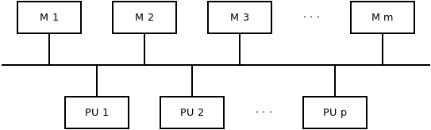
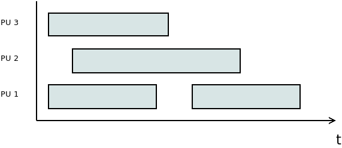
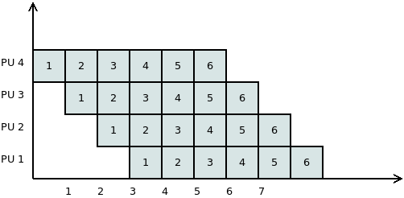
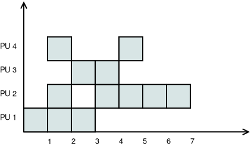

1. Párhuzamosítás, algoritmusok
===============================

A párhuzamosítás szükségessége
------------------------------

**Moore törvénye**

* Gordon Earle Moore, Intel társalapítója, 1965.
* A chip-ekben a tranzisztorok száma 18-24 havonat duplázódik.
* A törvény 1971-2011 mindenképpen érvényben volt.

https://en.wikipedia.org/wiki/Moore%27s_law

**Fizikális korlátok**

* Az elemi, elektromos számítási egységek sebessége tovább már nem növelhető.
* Magasabb órajelhez nagyobb feszültség kell. :math:`\rightarrow` Tápellátási és hűtési problémák.
* A vezetékek lehetséges vastagsága elérte a minimális limitet.

A számítási teljesítmény növelésére alapvetően a számítási egységek növelésével van lehetőség.

**Free lunch**

* Régebben lehetett arra hagyatkozni, hogy az új gépeken a szoftverek gyorsabban fognak tudni futni.
* Aktuálisan ez csak párhuzamosítással oldható meg.

**További szempontok**

* A számítási teljesítmény mellett a memória és tár is szükségessé teheti elosztott rendszer kialakítását.
* Bizonyos számításoknál a redundancia is szempont lehet. (Például blokkláncok, felhasználókhoz kiszervezett számítások.)
* Adott feladat gyorsabb megoldásán túl szempont lehet a korábbiaknál lényegesen nagyobb problémák megoldását kitűzni célul.
* A probléma nagysága jelenthet nagyobb számítási pontosságot is (például szimulációk, előrejelzések esetében).
* Egyre nagyobb mennyiségű adat áll rendelkezésre (például képek, videók, szenzoradatok).

**Programok párhuzamosítása**

* Lényegesen más megközelítést igényel. Más eszközök kellenek. Más problémák jelentkeznek.
* Gyakran az algoritmus egészét érinti a változás.
* Egyfajta érdekes optimalizálási problémáról beszélhetünk.

Alapfogalmak
------------

**Konkurrens**

* A feladatok végrehajtása időben átfedésben van.
* Például a második feladat hamarabb kezdődik, mint hogy az első véget ért volna.

**Párhuzamos**

* A végrehajtás időben egyszerre történik.
* Szimultán, szinkron

.. warning::

	A konkurrens végrehajtás jelenthet aszinkron vagy időosztásos működést is!

:math:`\rhd` Adjunk példát olyan konkurrens végrehajtásra, amely nem párhuzamos!

**Flynn-féle osztályozás**

* Michael J. Flynn, 1966.

SISD, SIMD, MISD, MIMD

Memóriamodellek
---------------

:math:`\rhd` Gondoljuk át a memória és a számítási elemek közötti 1:N, N:1, N:M kapcsolatokat!

Lokális memória
~~~~~~~~~~~~~~~

.. image:: images/local_memory.png

* Cache
* Cache update probléma

Moduláris memória
~~~~~~~~~~~~~~~~~

Osztott memória
~~~~~~~~~~~~~~~

.. image:: images/shared_memory.png

* Kritikus szakasz
* Kölcsönös kizárás

Párhuzamos gép modellek
-----------------------

PRAM modell
~~~~~~~~~~~

* PRAM: *Parallel Random Access Machine*
* PU: *Processing Unit*

Egy absztrakt modellről van szó.

* A PU-k száma tetszőleges sok lehet.
* A memória méretére vonatkozóan nem ad meg limitet.
* Minden PU szimultán hozzá tud férni a memóriához.

(Ezek a feltételezések valós gépek esetén sajnos nem állnak fenn.)

A modellt a memóriához való hozzáférés alapján tovább szokták pontosítani.

**CREW**: *Concurrent Read - Exclusive Write*

* Egy adott memóriacellát minden PU tud olvasni tetszőleges időpontban, viszont
* egyszerre csak egy tudja írni.

**CRCW**: *Concurrent Read - Concurrent Write*

Feltételezi, hogy mindegyik PU egyszerre tud olvasni és írni is egy adott memória cellát.
Ez az érték beállítása szempontjából problémás lehet, ezért erre vonatkozóan külön megközelítések vannak.

* *tetszőleges mód*: Nincs definiálva, hogy konkurrens hozzáférés esetén mi fog történni. Egy nem-determinisztikus gépet kapunk így.
* *konzisztens mód*: Mindegyik PU-nak ugyanazt az értéket lehet csak beírnia.
* *prioritásos mód*: A PU-k között van egy sorrend, amely alapján mindig eldönthető, hogy ütközés esetén melyiknek az értéke kerül be a memóriába.
* *fúziós mód*: Egyidejű írás esetén egy aggregálást hajt végre. A művelet kommutatív és asszociatív kell, hogy legyen, mint például a minimum, maximum, AND, OR, szummázás műveletek.

**EREW**: *Exclusive Read - Exclusive Write*

* Ez a leginkább realisztikus modell.
* Egyidejűleg egy cellához csak egy PU férhet hozzá.

:math:`\rhd` Melyik kombináció maradt ki? Mi lehet annak az oka?

Számítási költség és hatékonyság
~~~~~~~~~~~~~~~~~~~~~~~~~~~~~~~~

Vezessük be a következő jelöléseket!

* :math:`P`: a megoldandó probléma
* :math:`n`: a probléma mérete
* :math:`T_{\text{seq}}(n)`: számítási idő szekvenciális végrehajtás esetén
* :math:`T_{\text{par}}(p, n)`: számítási idő párhuzamos végrehajtás esetén :math:`p` darab PU-val.

**Költség (Cost)**

.. math::

  C_p(n) = p \cdot T_{\text{par}}(p, n)

**Munka (Work)**

:math:`W_p(n)`: Az összes PU-n elvégzett műveletek összege.

* Ideális esetben a munka és a költség meg kellene, hogy egyezzen.
* A költség akkor lesz minimális, hogy ha minden PU hasznosan tölti az időt (nem várakozik).
* Szekvenciális esetben a kettő megegyezik. (Ez tekinthető a :math:`p = 1` esetnek is.)

**Gyorsítás (Speed-Up)**

.. math::

  S_p(n) = \dfrac{T_{\text{seq}}(n)}{T_{\text{par}}(p, n)}

* Ideális esetben a párhuzamos végrehajtás gyorsabb, mint a szekvenciális, így egy 1-nél nagyobb értéket kapunk.
* A mennyiséget gyakran százalékos formában használják.

**Hatékonyság (Efficiency)**

.. math::

  E_p(n) = \dfrac{S_p(n)}{p} = \dfrac{T_{\text{seq}}(n)}{p \cdot T_{\text{par}}(p, n)}

:math:`\rhd` A definiált értékekből hogyan lehetne egyszerűen kiszámítani a hatékonyságot?

:math:`\rhd` Milyen intervallumon változhat a hatékonyság értéke?

A hatékonyság romlásának lehetséges okai:

* Kiegyenlítetlenség
* Kommunikációs költség, adminisztrációs költség (*overhead*)

:math:`\rhd` Miért lehet fontos a futási idő és a gyorsítás mellett a hatékonysággal is foglalkozni?

**Komplexitás mérése**

:math:`\rhd` Milyen ordo szimbólumok vannak, és mit jelentenek?

Párhuzamos komplexitás:

.. math::

	T_{par}(p, n) = \min(\max_i t_i), \quad 1 \leq i \leq p

:math:`\rhd` A kifejezésben hogy jelenik meg a problémaméret?

**Szimuláció kevesebb PU-val**

Tegyük fel, hogy egy :math:`\mathcal{A}` algoritmust egy :math:`p` darab PU-val rendelkező PRAM gépen :math:`t` idő alatt oldunk meg.
Ugyanezen számítás egy azonos típusú gépen :math:`p' \leq p` számú PU-val szimulálható :math:`\mathcal{O}\left(t \cdot \dfrac{p}{p'}\right)` idő alatt.

A :math:`p'` számú PU-val rendelkező gép költsége legfeljebb duplája lesz a :math:`p` számú PU-val rendelkezőjének.

*Bizonyítás*

Az :math:`\mathcal{A}` algoritmus minden lépése :math:`\left\lceil\dfrac{p}{p'}\right\rceil` időegység alatt szimulálható a :math:`p'` PU-val a konkurrens részek szekvenciálissá tételével.

Mivel az eredeti számítás :math:`t` időegységig tartott, ezért a szimulált :math:`t \cdot \left\lceil\dfrac{p}{p'}\right\rceil` lesz, amelyből megkapjuk, hogy az időbonyolultság :math:`\mathcal{O}\left(t \cdot \dfrac{p}{p'}\right)`.

Számítsuk ki a :math:`p'` PU-val rendelkező gép költségét!
Jelölje :math:`t'` ennek a gépnek a számítási idejét!

.. math::

  C_{p'}(n) = p' \cdot t' \leq p' \cdot t \cdot \left\lceil\dfrac{p}{p'}\right\rceil
  \leq p' \cdot t \cdot \left(\dfrac{p}{p'} + 1\right)
  = p \cdot t \left(1 + \dfrac{p'}{p}\right)
  \leq p \cdot t \cdot 2 = 2 \cdot C_p(n)

Így tehát azt kapjuk, hogy

.. math::

  C_{p'}(n) \leq 2 \cdot C_p(n). \quad \square

**Brent tétele**

Tegyük fel, hogy egy :math:`\mathcal{A}` algoritmus összesen :math:`m` művelet végrehajtásával jár, és :math:`t` ideig tart. Ugyanezen típusú gépen, :math:`p` darab PU-val :math:`\mathcal{O}\left(\dfrac{m}{p} + t\right)` idő alatt szimulálható.

*Bizonyítás*

Tegyük fel, hogy az :math:`\mathcal{A}` algoritmus az :math:`i`-edik lépésben :math:`m(i)` műveletet hajt végre. Az összes lépést elvégezve ez visszaadja :math:`m`-et:

.. math::

  m = \displaystyle \sum_{i=1}^{t} m(i).

Az :math:`i`-edik lépés szimulálható :math:`\left\lceil\dfrac{m(i)}{p}\right\rceil` időegység alatt, amelyre fennáll, hogy

.. math::

  \left\lceil\dfrac{m(i)}{p}\right\rceil \leq \dfrac{m(i)}{p} + 1.

Könnyen látható, hogy

.. math::

  \displaystyle \sum_{i=1}^{t} \left(\dfrac{m(i)}{p} + 1\right) = \dfrac{m}{p} + t,

amelyből adódik a tétel állítása. :math:`\square`

**Amdahl törvénye**

* Gene Amdahl, 1967.
* Azt mutatja meg, hogy egy program esetében a párhuzamosítható részek arányát ismerve ideális esetben mennyi lesz a gyorsítás (*speedup*) értéke.
* A probléma méretét rögzítettnek tekinti.
* Egy felső becslésről van szó.

Használjuk a következő jelöléseket!

* :math:`p`: a számítási egységek száma
* :math:`f`: a program egészére nézve a párhuzamosítható részek aránya

.. math::

	S_p = \dfrac{1}{(1 - f) + \dfrac{f}{p}}

.. warning::

	A törvény elméleti felső korlátot ad!

.. math::

	\lim_{p \rightarrow \infty} S_p = \dfrac{1}{1 - f}

:math:`\rhd` Vizsgáljuk meg az :math:`f \rightarrow 0` és az :math:`f \rightarrow 1` eseteket!

:math:`\rhd` Mennyinek kell lennie legalább a párhuzamosítható részek arányának, hogy ha legalább 10-szeres gyorsítást szeretnénk elérni?

:math:`\rhd` Mennyi lesz ez 1000-szeres gyorsítás esetében?

:math:`\rhd` Tegyük fel, hogy egy algoritmusban a párhuzamosítható részek aránya 80%. Legalább mennyi számítási egységre van szükségünk, hogy 4-szeres gyorsítást el tudjunk érni?

:math:`\rhd` Ábrázoljuk az összefüggést!

**Gustafson-Barsis törvény**

* John L. Gustafson, Edwin H. Barsis, 1988.
* Tetszőlegesen nagy méretű problémát feltételez.

Használjuk a következő jelöléseket!

* :math:`p`: a számítási egységek száma
* :math:`f`: a program egészére nézve a párhuzamosítható részek aránya

.. math::

	S_p = (1 - f) + p \cdot f

:math:`\rhd` Tegyük fel, hogy van egy 64 számítási egységet tartalmazó számítógépünk! Feltételezve, hogy tetszőlegesen sok időnk lehet, maximálisan mennyi lehet a gyorsítás mértéke, hogy ha a program 90%-a párhuzamosítható?

:math:`\rhd` Tegyük fel, hogy egy program 60%-a párhuzamosítható! A Gustafson-Barsis törvény alapján legalább mennyi számítási egységre van szükségünk, hogy 40-szeres gyorsítást tudjunk elérni?

:math:`\rhd` Ábrázoljuk az összefüggést!

Párhuzamosság ábrázolása
------------------------

:math:`\rhd` Adjunk példákat, hogy hol szoktak ilyen ábrázolási módokat használni!

Gantt diagram
~~~~~~~~~~~~~

Szekvencia diagram
~~~~~~~~~~~~~~~~~~

.. image:: images/sequence_diagram.png

Problématér felosztása
~~~~~~~~~~~~~~~~~~~~~~

.. image:: images/space_partition.png

Hívási fa
~~~~~~~~~

* Elsősorban nem párhuzamos végrehajtást szokás vele ábrázolni.
* Az *"Osszd meg és uralkodj!"* elv szerint a problématér felosztása (főleg rekurzív esetekben) nagyon szépen ábrázolható vele.

.. image:: images/call_tree.png

Hálózati topológia, sávszélesség
~~~~~~~~~~~~~~~~~~~~~~~~~~~~~~~~

.. image:: images/network_topology.png

Elterjedt topológiák
--------------------

* Busz
* Gyűrű
* Rács
* Tórusz
* Hiperkocka
* Fa
* Fat-tree

Elvileg tetszőleges gráf lehetne a topológia.
Ezek elvi és praktikus okok miatt alakultak így.

Elvek és modellek
-----------------

Osszd meg és uralkodj elv
~~~~~~~~~~~~~~~~~~~~~~~~~

* Felosztás :math:`\rightarrow` művelet :math:`\rightarrow` egyesítés
* Tipikusan rekurzív formában használatos

.. warning::

	A felosztás megfelelő szintjének meghatározása külön érdekes problémakör!
	(Jellemzően nem szerencsés az elemek szintjéig lemenni.)

Pipeline párhuzamosítás
~~~~~~~~~~~~~~~~~~~~~~~

* Tegyük fel, hogy vannak feldolgozandó elemeink, amelyeken adott sorrendben, mindig ugyanazokat a lépéseket kell végrehajtani.
* Feltételezzük, hogy a lépések végrehajtási ideje közel egyenlő.

* Mekkora gyorsítást tudunk így elérni?
* Mennyire lesz ez a módszer hatékony?

Termelő-fogyasztó probléma
~~~~~~~~~~~~~~~~~~~~~~~~~~

* Task pool
* Gyors válaszidő, terhelés kiegyenlítés érdekében használják például.
* Általában sort használnak hozzá.

.. image:: images/producer_consumer.png

* Milyen előnyei vannak a módszernek?
* Milyen eseteket nem tud jól kezelni?

Számítási példák
----------------

Alapvető értékek meghatározása
~~~~~~~~~~~~~~~~~~~~~~~~~~~~~~

Számítsuk ki a költség, munka, gyorsítás és hatékonyság értékeket!

Feladatmegosztás optimalizálása
~~~~~~~~~~~~~~~~~~~~~~~~~~~~~~~

Tegyük fel, hogy adott 2 gép, melyek hálózaton keresztül tudnak kommunikálni.

* A feladatokat egységnyieknek tekintjük.
* Összesen 3000 feladat van.
* Az első gép 1 feladatot 10 másodperc alatt old meg, a második pedig 5 másodperc alatt.
* A bemenet az első gépen áll rendelkezésre.
* A második gépre való küldés 2 másodpercet igényel feladatonként.
* A küldés és fogadás ideje alatt a gépek nem tudnak lényegi számítást végezni.
* Az eredményeknek az első gépre kell kerülniük.

Hogyan ossza meg a két gép a feladatokat, hogy a lehető legkevesebb ideig tartson összességében?

* Vezessünk be jelöléseket!
* Próbáljuk meg általánosan is megoldani a problémát!
* Ábrázoljuk grafikonon a párhuzamos végrehajtás idejét!

Algoritmusok
------------

Leképzés (map)
~~~~~~~~~~~~~~

* Az egyik legegyszerűbb és leghatékonyabban párhuzamosítható algoritmus.
* Tegyük fel, hogy adott egy :math:`x \in \mathbb{R}^n` vektor! Ki szeretnénk számítani egy :math:`y \in \mathbb{R}^n` vektort, melyre teljesül, hogy :math:`y_i = f(x_i), \forall i`, és :math:`f: \mathbb{R} \rightarrow \mathbb{R}` egy tetszőleges valós függvény.

Hogyan változik a munka, költség, gyorsítás és hatékonyság :math:`p` függvényében?

Aggregálás
~~~~~~~~~~

* Legyen adott egy :math:`n` elemű sorozat.
* Aggregálni szeretnénk az értékeket egy bináris, kommutatív, asszociatív művelettel (például: összeadás, szorzás, minimum- és maximum számítása).

A szekvenciális algoritmus ezt csak :math:`\mathcal{O}(n)` idő alatt képes kiszámítani.

* Mutassuk meg, hogy ez párhuzamosítással gyorsabban is megoldható!
* Vizsgáljuk meg, hogy :math:`n = 16` elem esetében hogyan történhet a végrehajtás!
* Tekintsük át a :math:`p = 1, 2, \ldots, 16` eseteket!
* Számítsuk ki a munka, költség, gyorsítás és hatékonyság értékeket!

Elem keresése egy sorozatban
~~~~~~~~~~~~~~~~~~~~~~~~~~~~

* A sorozatról nem feltételezünk rendezettséget.
* Egy elem létezését vagy annak indexét szeretnénk meghatározni.
* A probléma nagyon hasonlóan kezelhető az aggregáláshoz.

Hogy ha csak egy elem létezését vizsgáljuk, és tetszőlegesen sok számítási egységünk van, akkor mi jelenti a szűk keresztmetszetet?

Adott tulajdonságú elemek száma
~~~~~~~~~~~~~~~~~~~~~~~~~~~~~~~

* Szintén egy aggregálás jellegű műveletről van szó.
* Összeget számolhatunk úgy, hogy az elemek szintjén először egy összehasonlítást végzünk.

Pi közelítése
~~~~~~~~~~~~~

* Monte Carlo módszerrel
* Rögzített felosztás alapú numerikus integrálással

Mátrix szorzás
~~~~~~~~~~~~~~

* Vektor-vektor szorzás
* Vektor-mátrix szorzás
* Mátrix-mátrix szorzás

Vizsgáljunk meg egy olyan esetet, ahol :math:`n = 3, m = 2, p = 4`.
Feltételezzük, hogy egy CREW PRAM gépünk van.

* Mennyi számításra lenne szükségünk szekvenciális esetben?
* Milyen lehetőségek vannak párhuzamosításra?
* Hogyan változik a számítási bonyolultság az egyes esetekben?

Összefésülő rendezés
~~~~~~~~~~~~~~~~~~~~

* Elevenítsük fel az összefésülés algoritmusát!
* Vizsgáljuk meg az összefésülés, mint rekurzív algoritmus párhuzamosítását!
* Nézzük meg, hogy a Batcher-féle páros-páratlan összefésülés milyen előnyökkel járna!

Vizsgáljuk meg a következő tömb rendezését!

.. math::

  A = [21, 17, 13, 30, 24, 29, 36, 15]

Gyorsrendezés
~~~~~~~~~~~~~

* A gyorsrendezés algoritmusa a problémateret rekurzívan 2 részre bontja.
* Az egyes ágak külön is kiértékelhetőek.

Tűz szimuláció
~~~~~~~~~~~~~~

* Tegyük fel, hogy tűznek a lángjait szeretnénk szimulálni. A teret diszkretizáljuk úgy, hogy az aktuális hőmérsékletet egy :math:`T \in \mathbb{R}^{n \times m}` méretű mátrixba tároljuk. Feltételezzük, hogy a hő felfelé (a nagyobb indexű soroktól az alacsonyabbak felé) terjed.
* A peremfeltételek a mátrix alsó és oldalsó részein adottak. A bal- és jobb oldali szélen konstans 0-nak tekintjük.
* A hőmérséklet értékeket a :math:`(k+1)`-edik iterációban a következő összefüggés szerint számolhatjuk:

.. math::

   T_{i, j}^{(k + 1)} = \dfrac{
   T_{i, j}^{(k)} + T_{i + 1, j - 1}^{(k)} + T_{i + 1, j}^{(k)} + T_{i + 1, j + 1}^{(k)}
   }{4.05}.

Quatropoly
~~~~~~~~~~

* Mezők egyidejű kiértékelése
* Fában való keresés

Amőba
~~~~~

* Állapot kiértékelés
* Fa bejárás
* Paraméterek optimalizálása

Floodfill algoritmus
~~~~~~~~~~~~~~~~~~~~

* Tekinthető egy összefüggő részgráf keresési problémájának is.
* A számítási része egyszerű.
* Az adatok szinkronizálása, gyűjtése jelent kihívást.

Konvex burok számítása
~~~~~~~~~~~~~~~~~~~~~~

* Quickhull
* Mergehull

Genetikus algoritmus párhuzamosítása
~~~~~~~~~~~~~~~~~~~~~~~~~~~~~~~~~~~~

* Minden egyed jósági (*fittness*) értékét párhuzamosan ki lehet számítani.
* A jósági érték alapján a rendezés párhuzamosítható.
* Kereszteződést követően az új egyedek időben egyszerre létrehozhatók.
