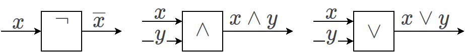
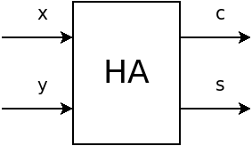
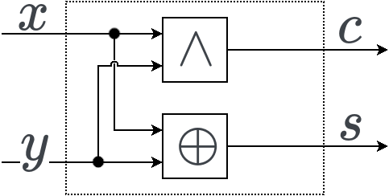
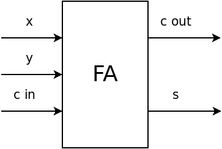
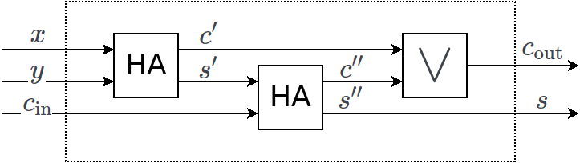
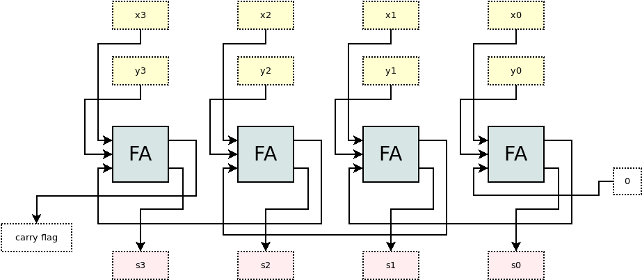

3. Logikai adattípus és műveletei
=================================

Logikai értékek
---------------

.. math::

  L = \{0, 1\}

Rengeteg elterjedt alternatív jelölés van:

* hamis, igaz
* false, true
* h, i
* F, T

A logikai absztrakt adattípus:

.. math::

  T = (L, M)

Logikai műveletek
-----------------

* Az operandusok száma szerint tudjuk csoportosítani őket.
* Az :math:`L` halmaz végessége miatt az összes műveletet fel tudjuk sorolni.

Egyváltozós műveletek
~~~~~~~~~~~~~~~~~~~~~

.. csv-table::
   :header-rows: 1

   :math:`x`,0,:math:`x`,:math:`\overline{x}`,1
   0,0,0,1,1
   1,0,1,0,1

* Az első oszlop tartalmazza a behelyettesítendő értékeket.
* A további oszlopokban az unáris műveletek szerepelnek.

Műveletek neve:

* **0**: konstans hamis
* :math:`x`: identikus függvény
* :math:`\overline{x}`: negáció, tagadás, NOT
* **1**: konstans igaz

A negáció műveletét szokás még így is jelölni: :math:`\neg x`

Kétváltozós műveletek
~~~~~~~~~~~~~~~~~~~~~

.. csv-table::
   :header-rows: 1

   :math:`x`,:math:`y`,:math:`x \wedge y`,:math:`x \vee y`,:math:`x \oplus y`,:math:`x \leftrightarrow y`,:math:`x \rightarrow y`,:math:`x \downarrow y`,:math:`x \mid y`
   0,0,0,0,0,1,1,1,1
   0,1,0,1,1,0,1,0,1
   1,0,0,1,1,0,0,0,1
   1,1,1,1,0,1,1,0,0

* Az első 2 oszlop a bemeneteket tartalmazza.
* A további oszlopokban a gyakrabban használt függvények szerepelnek.

.. warning::

  A felsoroltakon kívül is vannak még kétváltozós műveletek!

* :math:`x \wedge y`: "és", AND, konjunkció
* :math:`x \vee y`: "vagy", OR, diszjunkció
* :math:`x \oplus y`: "kizáró vagy", antivalencia
* :math:`x \leftrightarrow y`: ekvivalencia
* :math:`x \rightarrow y`: implikáció
* :math:`x \downarrow y`: Pierce nyíl
* :math:`x \mid y`: Scheffer vonás

:math:`n`-változós műveletek
~~~~~~~~~~~~~~~~~~~~~~~~~~~~

* Az előzőekhez hasonlóan fel tudnánk sorolni a 3 vagy annál több operandusú műveleteket is.
* A gyakorlatban ezekre ritkábban van szükség egy művelet formájában.

Minden :math:`n`-változós műveletet fel tudunk írni egy- és kétváltozós műveletek segítségével. Emiatt a logikai adattípust definiálhatjuk például a következő formában:

.. math::

  T = (\{0, 1\}, \{\neg, \wedge, \vee\})

**Műveletek száma**

Az :math:`n`-változós logikai műveletek száma :math:`2^{2^n}`.

Műveleti azonosságok
--------------------

**Kettős tagadás**

.. math::

  \overline{\overline{x}} = x

**Kommutativitás**

.. math::

	x \wedge y = y \wedge x, \quad x \vee y = y \vee x

**Asszociativitás**

.. math::

	(x \wedge y) \wedge z = x \wedge (y \wedge z), \quad (x \vee y) \vee z = x \vee (y \vee z)

**Disztributivitás**

.. math::

	x \wedge (y \vee z) = (x \wedge y) \vee (x \wedge z), \quad
  x \vee (y \wedge z) = (x \vee y) \wedge (x \vee z)

**De Morgan azonosság**

.. math::

	\overline{x \wedge y} = \overline{x} \vee \overline{y}, \quad \overline{x \vee y} = \overline{x} \wedge \overline{y}

**További összefüggések**

.. math::

  x \wedge 0 = 0, \quad x \vee 0 = x \\
  x \wedge x = x, \quad x \vee x = x \\
  x \wedge \overline{x} = 0, \quad x \vee \overline{x} = 1 \\
  x \wedge 1 = x, \quad x \vee 1 = 1 \\

**Antivalencia**

.. math::

  x \oplus y = (\overline{x} \wedge y) \vee (x \wedge \overline{y})
  = (x \vee y) \wedge (\overline{x} \vee \overline{y})

**Ekvivalencia**

.. math::

	x \leftrightarrow y = (x \wedge y) \vee (\overline{x} \wedge \overline{y})
  = (\overline{x} \vee y) \wedge (x \vee \overline{y})

**Implikáció**

.. math::

	x \rightarrow y = \overline{x} \vee y

Normálformák
------------

* Ugyanazon logikai függvény különböző formában is felírható (ahogy például az azonosságoknál is láthattuk.)
* A normálforma a lehetséges felírások egy leszűkítését jelenti.

Diszjunktív normálforma
~~~~~~~~~~~~~~~~~~~~~~~

**Elemi konjunkció**

Változók vagy negáltjaiknak a konjunkciója, melyben a változók legfeljebb egyszer fordulhatnak elő.

**Diszjunktív normálforma**

Elemi konjunkciók diszjunkciója.

*DNF: Diszjunktív Normál Forma*

**Példa**

Határozzuk meg az :math:`f(x, y, z) = x \oplus (z \rightarrow y)` diszjunktív normál formáját!

.. csv-table::
   :header-rows: 1

   :math:`x`,:math:`y`,:math:`z`,:math:`z \rightarrow y`,:math:`x \oplus (z \rightarrow y)`,elemi konjunkciók
   0,0,0,1,1,:math:`\overline{x} \wedge \overline{y} \wedge \overline{z}`
   0,0,1,0,0,
   0,1,0,1,1,:math:`\overline{x} \wedge y \wedge \overline{z}`
   0,1,1,1,1,:math:`\overline{x} \wedge y \wedge z`
   1,0,0,1,0,
   1,0,1,0,1,:math:`x \wedge \overline{y} \wedge z`
   1,1,0,1,0
   1,1,1,1,0

DNF:

.. math::

  f(x, y, z) = (\overline{x} \wedge \overline{y} \wedge \overline{z})
  \vee (\overline{x} \wedge y \wedge \overline{z})
  \vee (\overline{x} \wedge y \wedge z)
  \vee (x \wedge \overline{y} \wedge z)

Konjunktív normálforma
~~~~~~~~~~~~~~~~~~~~~~

**Elemi diszjunkció**

Változók vagy negáltjaiknak a diszjunkciója, melyben a változók legfeljebb egyszer fordulhatnak elő.

**Konjunktív normálforma**

Elemi diszjunkciók konjunkciója.

*KNF: Konjunktív Normál Forma*

**Példa**

Határozzuk meg az :math:`f(x, y, z) = (z \leftrightarrow z) \vee y` konjunktív normál formáját!

.. csv-table::
   :header-rows: 1

   :math:`x`,:math:`y`,:math:`z`,:math:`z \leftrightarrow x`,:math:`(z \leftrightarrow z) \vee y`,elemi diszjunkciók
   0,0,0,1,1,
   0,0,1,0,0,:math:`x \vee y \vee \overline{z}`
   0,1,0,1,1,
   0,1,1,0,1,
   1,0,0,0,0,:math:`\overline{x} \vee y \vee z`
   1,0,1,1,1,
   1,1,0,0,1,
   1,1,1,1,1,

KNF:

.. math::

	f(x, y, z) = (x \vee y \vee \overline{z}) \wedge (\overline{x} \vee y \vee z)

Logikai kapuáramkörök
---------------------

* A logikai műveleteket reprezentálhatjuk grafikusan kapukkal.
* A kapuknak a bal oldalán van a bemenetük, jobb oldalán pedig a kimenetük.
* A kaput téglalapként ábrázoljuk, melybe beleírjuk az általa végrehajtott műveletet.
* A nem kommutatív műveletek (például implikáció) esetében a bemeneteket fenntről-lefelé haladva tekintjük.
* A nem használt bemeneteket és kimeneteket jelöljük úgy, hogy egy üres karikához kötjük.

**Például**

Összeadó logikai áramkörök
--------------------------

Bináris formában adott egészek összeadására használható logikai kapuáramkör.

Félösszeadó
~~~~~~~~~~~

*HA: Half Adder*

**Művelettábla**

.. csv-table::
   :header-rows: 1

   :math:`x`,:math:`y`,:math:`c`,:math:`s`
   0,0,0,0
   0,1,0,1
   1,0,0,1
   1,1,1,0

* :math:`x`, :math:`y`: Az összeadandó értékek
* :math:`c`: átviteli bit (*carry*)
* :math:`s`: összeg (*sum*)

.. math::

  c = x \wedge y, \quad s = x \oplus y

**Logikai kapu**

**Belső felépítése**

Egész összeadó
~~~~~~~~~~~~~~

*FA: Full Adder*

**Művelettábla**

.. csv-table::
   :header-rows: 1

   :math:`x`,:math:`y`,:math:`c_{\text{in}}`,:math:`c_{\text{out}}`,:math:`s`
   0,0,0,0,0
   0,1,0,0,1
   1,0,0,0,1
   1,1,0,1,0
   0,0,1,0,1
   0,1,1,1,0
   1,0,1,1,0
   1,1,1,1,1

* :math:`x`, :math:`y`: Az összeadandó értékek
* :math:`c_{\text{in}}`: bemeneti átviteli bit
* :math:`c_{\text{out}}`: kimeneti átviteli bit
* :math:`s`: összeg (*sum*)

**Logikai kapu**

**Belső felépítése**

Több bites összeadó
~~~~~~~~~~~~~~~~~~~

Bitműveletek
------------

A programozási nyelvek különböző mértékben támogatják a bitműveleteket.

.. code::

  x & y;    // AND
  x | y;    // OR
  x ^ y;    // XOR
  ~x;       // Bitwise NOT
  x << n;   // Shift left by n bits
  x >> n;   // Shift right by n bits

Többértékű logikák
------------------

https://en.wikipedia.org/wiki/Many-valued_logic

* Az igaz és hamis mellett további értékek is megjelenhetnek.

.. csv-table::
  :header-rows: 1

  :math:`x`,:math:`\overline{x}`
  0,1
  ?,?
  1,0

**Kleene**

.. csv-table::

  :math:`\wedge`,0,?,1
  0,0,0,0
  ?,0,?,?
  1,0,?,1

.. csv-table::

  :math:`\vee`,0,?,1
  0,0,?,1
  ?,?,?,1
  1,1,1,1

**Bochvar**

.. csv-table::

  :math:`\wedge`,0,?,1
  0,0,?,0
  ?,?,?,?
  1,0,?,1

.. csv-table::

  :math:`\vee`,0,?,1
  0,0,?,1
  ?,?,?,?
  1,1,?,1

Folytonos logikák
-----------------

* Fuzzy logika
* Intuícionista logikák

Kérdések
========

* A lehetséges 16 bináris művelet közül melyek a kommutatívak és a nem kommutatívak?
* Mennyi 5 változós logikai művelet van?

Feladatok
=========

Normál formák
-------------

* Írjuk fel a 3 bemenetes többségi szavazás diszjunktív normál formáját, és rajzoljuk fel a kapuáramkört!

* Tervezzünk 4 bemenetes paritás ellenörző automatát!

* Fejezzük ki az antivalencia, implikáció és az ekvivalencia műveleteket az :math:`\wedge, \vee` és negáció műveletekkel!

* Tervezzünk 5 bemenetes automatát, amely a maximumot adja vissza! Írjuk fel a diszjunktív és a konjunktív normál formáját!

* Tervezzünk kapuáramkört az :math:`\wedge, \vee, \neg` műveletekkel az :math:`u = f(x, y, z) = (x \oplus y) \rightarrow z` logikai függvényhez, és írjuk fel a diszjunktív normál formáját!

* Írjuk fel az implikáció műveletének diszjunktív és konjunktív normál formáját!

* Egy függvény DNF-je :math:`(x \wedge \overline{y} \wedge z) \vee (\overline{x} \wedge \overline{y} \wedge z)`. Írja fel a függvény konjunktív normál formáját!

* Írjuk fel a Scheffer vonás és a Pierce nyíl DNF-jét és KNF-jét!

* A :math:`0` és :math:`1` értékeket, mint egész értékeket tekintve adjuk meg a :math:`<, >, \leq, \geq, =, \neq` logikai operátorok művelettábláját!

* Írjuk fel a minimum és a maximum függvények művelettábláját 3 változó esetén!

Függvények kiértékelése
-----------------------

Művelettáblájuk alapján ismerjük az :math:`f` és a :math:`g` három változós logikai függvényeket.

.. csv-table::
   :header-rows: 1

   :math:`x`,:math:`y`,:math:`z`,":math:`f(x, y, z)`",":math:`g(x, y, z)`"
   0,0,0,1,0
   0,0,1,0,0
   0,1,0,0,1
   0,1,1,1,1
   1,0,0,1,1
   1,0,1,1,0
   1,1,0,0,0
   1,1,1,0,1

Definiáljunk egy :math:`h` függvényt a következőképpen:

.. math::

  h(x, y, z) = g(x \oplus f(y \rightarrow z, x, z))

Határozzuk meg a :math:`h(1, 0, 0)`, :math:`h(0, 1, 0)` és a :math:`ḣ(0, 1, 1)` értékeket!

Azonosságok, levezetések
------------------------

* Írjuk fel a bináris műveleteket Scheffer vonás felhasználásával!

* Lássuk be, hogy a Scheffer vonás nem asszociatív!

* Lássuk be, hogy a Scheffer vonás nem disztributív az implikáció műveletére nézve!

* Lássuk be, hogy az ekvivalencia művelete asszociatív!

* Lássuk be a következőket!

.. math::

  &x \wedge (y \oplus z) = (x \wedge y) \oplus (x \wedge z) \\
  &(p \wedge q \wedge r) \rightarrow s = p \rightarrow (q \rightarrow (r \rightarrow s)) \\
  &(p \wedge (p \rightarrow q)) \rightarrow q = 1 \\
  &(a | b) \oplus (a \downarrow b) = a \oplus b \\

* Vizsgáljuk meg az alábbi azonosságokat!

.. math::

  &a \rightarrow ((b|a) \wedge \overline{b}) = a \\
  &\overline{a \wedge \overline{b \wedge \overline{c \wedge d}}} = \overline{\overline{\overline{a \wedge b} \wedge c} \wedge d} \\
  &\overline{(x \oplus y) \rightarrow z} = (x \wedge \overline{y} \wedge \overline{z}) \vee (\overline{x} \wedge y \wedge \overline{z}) \\
  &(a|b) \downarrow (c|d) = (d|a) \downarrow (c|b) \\

* Tekintsük a :math:`<` és a :math:`\leq` relációs jeleket, mint bináris logikai operátorokat. Lássuk be, hogy az alábbi összefüggés a negációt valósítja meg!

.. math::

  x < (x \leq x)

* Lássuk be, hogy a :math:`\downarrow` (Pierce nyíl) segítségével az összes logikai függvény felírható!

Logikai kapuáramkörök
---------------------

* Készítsünk egy logikai kapuáramkört, amelyik 3 bit bemenetre visszaadja bináris formában, hogy mennyi 1-es érték volt benne!
* Készítsünk egy 8 bemenetes, 1 kimenetes logikai kapuáramkört, amely egy előjel nélküli egész értékről meg tudja állapítani, hogy 15-nél nagyobb-e!
* Készítsünk egy 8 bemenetes, 1 kimenetes logikai kapuáramkört, amely jelzi, hogy a bemenetén kapott érték az egy pozitív páratlan szám-e!
