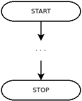
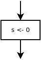
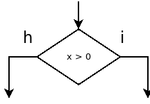
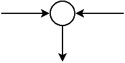
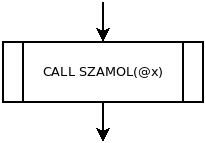
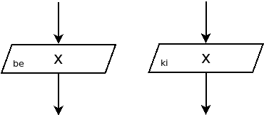
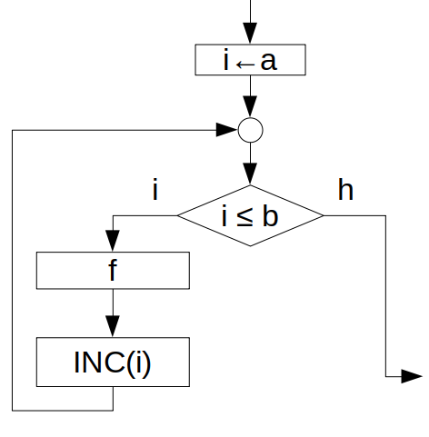

5. Algoritmusok lejegyzési módjai
=================================

Algoritmus
----------

* Egy számítási probléma megoldási eszköze.
* Az algoritmizálás során a problémát részlépésekre bontjuk.

Minden esetben vizsgálni kell

* a lehetséges bemenetek halmazát,
* a lehetséges kimenetek halmazát,
* a közbülső eredmények halmazát.

Alapvetően azt feltételezzük, hogy a megoldást véges lépésben minden esetben meg tudjuk kapni.

Változók
--------

**név**

* A változók neve a névtéren belül egyedi.

A változók nevére vonatkozóan programozási nyelvtől függően vannak bizonyos szabályok. Például

* mivel kezdődhet,
* milyen karaktereket tartalmazhat,
* mennyi lehet a maximális hossza,
* csak nem foglalt név lehet.

Elnevezési konvenciók

* Egy ajánlás arra vonatkozóan, hogy hogy érdemes a neveket megválasztani.
* A lehetséges változónevek halmazát ez tovább szűkíti.
* Itt helyenként keverednek a magyar és angol elnevezések, de a gyakorlatban az angol preferált.

**típus**

* A változó típusa alapján tudjuk meghatározni annak a méretét.

Típusok használata szerint:

* erősen típusos: a műveletekre vonatkozóan szigorú szabályok vannak a típusokra nézve.
* gyengén típusos:

A típusok megadása szerint:

* statikusan típusos: a változó típusa a program futása során nem változhat.
* dinamikusan típusos: a változó típusát futás közben lehet módosítani.

**cím**

* Natív, alacsonyabb szintű nyelvekben érhető el.
* Magasabb szintű nyelvekben inkább referencia, objektum azonosító a jellemző.

**hatókör**

* Ezt nevezik angolul *scope*-nak.
* A változó érvényességének helyére utal.
* Alapvetően lehet lokális vagy globális.
* Programozási nyelvenként előfordulhatnak változatosabb esetek is (pl.: csomag, modul, osztály, metódus szintű, külső szimbólum).

A hatókör meghatározása többféleképpen is történhet.

* *lexikális scope*: A változó hatóköre a forrásszöveg alapján meghatározható. A változó hatóköre a futás közben nem változhat.
* *dinamikus scope*: A változó hatóköre a végrehajtás során alakul ki, futás közben változik.

A manapság használt programozási nyelveknél a lexikális scope a gyakoribb.

:math:`\rhd`  Melyiknek mi az előnye?

:math:`\rhd`  Hogyan lehet ezeket implementálni?

**élettartam**

* A változó érvényességének az idejére utal.

Fajtái

* *statikus élettartam*: A változó a program futásának egésze alatt elérhető.
* *dinamikus élettartam*: A változó futás közben jön létre és szűnik meg.

:math:`\rhd` Vizsgáljuk meg, hogy milyen kombinációk fordulhatnak elő!

**immutabilitás**

* konstansok (*constant*)
* immutábilis változók (*immutable*)
* mutábilis változók (*mutable*)

Hivatkozások esetében a problémakör árnyaltabb. A hivatkozás maga és a hivatkozott érték is lehet egyaránt immutable vagy mutable típus.

:math:`\rhd` Vizsgáljuk meg a 4 esetet!

**változók létrehozása**

A következő fokozatokat/stádiumokat különböztethetjük meg.

* Deklaráció: A változónak megadunk egy nevet. (Típusos nyelvek esetében jellemzően típust is.)
* Definíció: A változóhoz tartozó értéknek helyet foglalunk.
* Inicializálás: Beállítjuk a változó kezdőértékét.

Programozási nyelvenként eltérő, hogy mikor melyiket és hogyan valósítják meg.

* Magas szintű, dinamikus nyelveknél előfordul, hogy a 3 egyszerre történik (például Python).

Kifejezések, utasítások
-----------------------

* Az alapvető különbség az az, hogy a kifejezéseknek van értéke, az utasításoknak viszont nincs.
* A programozási nyelvekben tipikusan vagy mindkettő előfordul, vagy csak kifejezések vannak.

Vezérlési szerkezetek
---------------------

Szekvenciaként végrehajtott utasítások sorozatával csak az algoritmusok egy része írható le.

* Az utasításokat, kifejezéseket úgy tekinthetjük, hogy azok címmel vannak ellátva.
* Bevezethetünk egy külön utasítást, amellyel a vezérlést egy másik ponton tudjuk folytatni.
* ``GOTO``, ``JMP``
* Az ugrást feltételhez köthetjük.
* Strukturált formában ezek adják majd az ``IF`` és a ``WHILE`` vezérlési szerkezeteket.
* Ebből a kettőből minden további vezérlési szerkezet felépíthető.

Belátható, hogy minden algoritmust fel tudnák írni

* csak feltételhez kötött ugrások használatával, vagy
* csak ``WHILE`` vezérlési szerkezet használatával.

A függvény és procedúra hívás is a vezérlés része lesz majd.

Függvények, procedúrák
~~~~~~~~~~~~~~~~~~~~~~

**Közös jellemzőik**

* Mindkettő egy logikailag összetartozó egységet jelöl ki a kódunkban.
* Tartozik hozzájuk egy egyedi név és egy formális paraméter lista.
* Programozási nyelvenként változó, hogy éppen melyiket lehet használni és milyen formában.

**Különbség**

* A függvényre úgy tekintünk, hogy annak van visszatérési értéke, a procedúrának viszont nincs.

**Átírhatóság**

* A visszatérési érték figyelmen kívül hagyásával, egy procedúrát mindig megadhatunk függvényként is.
* Egy függvényt mindig megadhatunk procedúraként is, hogy ha a visszatérési értékéhez külön rendelünk egy változót.

**Mellékhatásosság**

* Ideális esetben egy függvény/procedúra csak a paraméterezésén keresztül kaphat értéket, és csak azon keresztül, vagy visszatérési érték formájában módosíthatja a program egészének az állapotát.
* Globális (vagy lokális statikus) változók használata esetében ez nem teljesül.

Pszeudókód
----------

* A természetes nyelvű leírás és a futtatható programkód között van.
* Célja, hogy nyelvfüggetlen módon egy magasabb szintű leírást adjon egy algoritmusról.
* A nyelvfüggetlenséget nem fogja tudni elérni, mivel ez is egy nyelv.
* A segítségével el lehet vonatkoztatni az implementációs részletektől.

Elemei
~~~~~~

**Értékátadás**

Többféle jelöléssel szokás használni, például

.. math::

  x = 0\\
  x := 0\\
  x \leftarrow 0

* Aktuálisan a nyíl operátort fogjuk használni.
* Az értékátadás technikai részleteivel tipikusan nem foglalkozunk.

**Értékek összehasonlítása**

* Ezt a szokásos egyenlőségjellel tesszük meg.
* A programozási nyelv esetében ennek az operátora jellemzően a ``==``.

**Címképzés**

* Egy változó címét a ``@`` operátorral kérdezhetjük le.
* Az operátort a változó neve elé írjuk, például ``@x``.
* Ez a C programozási nyelvben használt ``&`` operátornak megfelelő.
* Az érvénytelen, nem létező címet :math:`NIL` operátorként használjuk.

**Mezők hivatkozása**

* Az adatstruktúrák attribútumait az attribútum nevével, majd szögletes zárójelben az objektum megadásával használhatjuk, például: :math:`\text{Hossz}[x]`.
* A programozási nyelvekben erre tipikusan a pont operátor szolgál, például: :math:`x.\text{Hossz}`.

**Értékek növelése, csökkentése**

.. math::

  &\text{INC}(x)\\
  &\text{DEC}(x)\\

**Megjegyzések**

* Magyarázatok, kommentek
* Soronként a ``//`` jelekkel adhatjuk meg (mint a C nyelv esetében).

**Blokkok**

Általánosan 3 fajta jelölésmód terjedt el:

* kapcsoszárójelek használata,
* ``BEGIN`` és ``END`` kulcsszavak használata,
* blokkok jelölése behúzással (indentálással).

A behúzásokkal történő jelölést fogjuk használni.

**Elágazás**

Amennyiben csak az igaz esetet vizsgáljuk:

.. math::

  &\text{IF } p\\
  &\quad \text{THEN } f\\

Igaz és hamis eset kezelése esetében:

.. math::

  &\text{IF } p\\
  &\quad \text{THEN } f\\
  &\quad \text{ELSE } g\\

:math:`\rhd` Írjuk át ``ELSE`` kulcsszó nélküli alakra!

**WHILE ciklus**

* Addig ismételjük a ciklusmagot, ameddig a feltétel igaz.
* Elöltesztelő ciklus.

.. math::

  &\text{WHILE } p \text{ DO}\\
  &\quad f\\

**DO-WHILE ciklus**

* Addig ismételjük a ciklusmagot, ameddig a feltétel igaz.
* Hátultesztelő ciklus.

:math:`\rhd` Írjuk fel ``WHILE`` ciklus segítségével!

.. math::

  &\text{DO } f\\
  &\quad \text{WHILE } p\\

**REPEAT-UNTIL ciklus**

* Addig ismételjük a ciklusmagot, ameddig a feltétel hamis.
* Hátultesztelő ciklus.

.. math::

  &\text{REPEAT } f\\
  &\quad \text{UNTIL } p\\

:math:`\rhd` Írjuk fel ``DO-WHILE`` ciklus segítségével!

:math:`\rhd` Írjuk fel ``WHILE`` ciklus segítségével!

**FOR ciklus**

* Egy adott értéktartományon mehetünk végig.

Növekvő sorrendben:

.. math::

  &\text{FOR } i \leftarrow a \text{ TO } b \text{ DO}\\
  &\quad f\\

Csökkenő sorrendben:

.. math::

  &\text{FOR } i \leftarrow b \text{ DOWNTO } a \text{ DO}\\
  &\quad f\\

:math:`\rhd` Írjuk fel ezeket ``WHILE`` ciklus segítségével!

**FOREACH ciklus**

Egy kollekció elemeit járjuk be.

.. math::

  &\text{FOREACH } x \in H \text{ DO}\\
  &\quad f\\

A programozási nyelvekben változatos megoldások vannak a jelölésére.

.. code::

  # Python
  for i in values: ...

  # C++
  for (auto i : values) { ... }

  # JavaScript
  for (let i of values) { ... }

  # PHP
  for ($values as $i) { ... }

**Feltétel nélküli ugrás**

* A végrehajtást a programkód adott sorszámú utasításán folytatja.
* GOTO n

:math:`\rhd` Írjuk fel a ``FOR`` ciklus általános alakját ``GOTO`` segítségével!

**Függvényhívás, procedúrahívás**

* A függvények meghívásához zárójelben fel kell sorolni a paramétereket a függvény neve után.
* A procedúrahívás esetében (általában) ``CALL`` kulcsszót használunk.

**I/O**

* Be- és kimenet kezelése

.. math::

  &\text{INPUT}(x)\\
  &\text{OUTPUT}(x)\\

Folyamatábra
------------

* Egy irányított gráf.
* Csomópontokból és folyamatvonalakból áll.
* Közel szabványos jelölésmódnak tekinthető.

Elemei
~~~~~~

**Be- és kilépési pont**

* Belépési pontból mindig pontosan csak egy lehet.
* Kilépési pontból lehet több is.
* Az áttekinthetőség kedvéért célszerű arra törekedni, hogy csak egy legyen.

Függvény vagy procedúra folyamatábrája esetében:

* A belépési pontba START helyett a függvény/procedúra nevét írjuk be és a paraméterezését,
* a kilépési pontot RETURN-nel és a visszaadott értékkel adjuk meg.

**Utasítás**

Egy téglalappal jelöljük, amelybe beleírjuk az elvégzendő műveletet.

**Döntési pont, elágazás**

**Gyűjtőpont**

* Két élt fog össze.
* Az élek csak így találkozhatnak egymásban.

.. warning::

	Bizonyos jelölésrendszerek megengedik, hogy más elembe is közvetlenül mutathasson több nyíl, de itt ezt kerüljük!

**Procedúra vagy függvény hívása**

**Be- és kimenetek**

**Megyjegyzések**

Szaggatott vagy pontozott vonallal kötjük hozzá a vonatkozó elemhez.

**FOR ciklus**

UML szabvány
~~~~~~~~~~~~

* *Unified Modeling Language*
* A programok felépítésének, működésének a leírásához egy szabványos, alapvetően grafikus leírási módot ad.
* https://www.omg.org/spec/UML/2.5.1/PDF

Kérdések
========

* Hogyan írható át egy ``IF-THEN-ELSE`` szerkezet csak ``IF-THEN`` szerkezetek használatával?
* Hogyan írható fel egy ``FOR`` ciklus ``WHILE`` ciklus segítségével? Adja meg a pszeudó kódot és a folyamatábrát!
* Hogyan írható át egy ``REPEAT-UNTIL`` ciklus ``WHILE`` ciklusra?
* Hogyan írható át egy ``REPEAT-UNTIL`` ciklus ``DO-WHILE`` ciklusra?

Feladatok
=========

Pszeudókód, folyamatábra
------------------------

* Írjuk fel annak az algoritmusnak a pszeudó kódját, amely kiírja 101 és 171 között a páratlan számokat!
* Írjunk fel azt az algoritmust, amely az összes 3 jegyű (10 számrendszerbeli) szám közül kiírja azokat, amelyeknek az utolsó 2 számjegye, mint egy 2 jegyű szám 7-tel osztható!
* Írjunk fel egy procedúrát, amelyik két szám négyzetösszegének a gyökét számítja ki! Adjuk meg ugyanezt függvény formájában is!

* Írjuk fel az Orosz-paraszt módszer algoritmusának pszeudó kódját és folyamatábráját!
