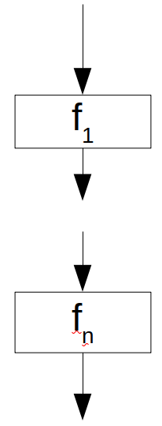
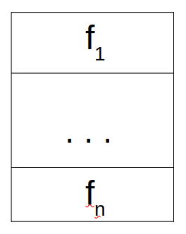
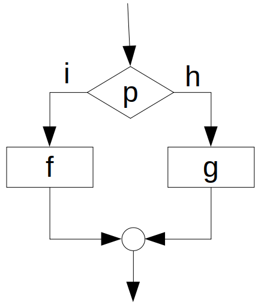
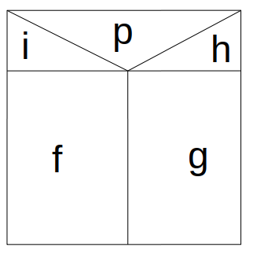
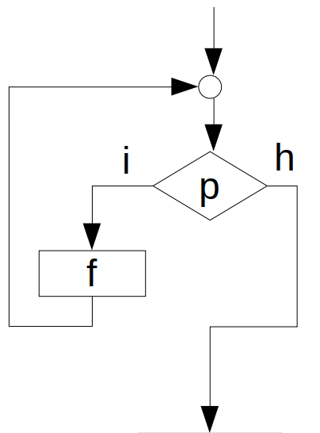
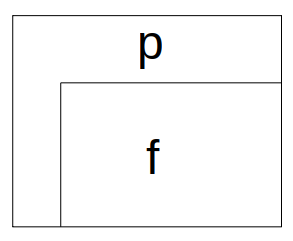
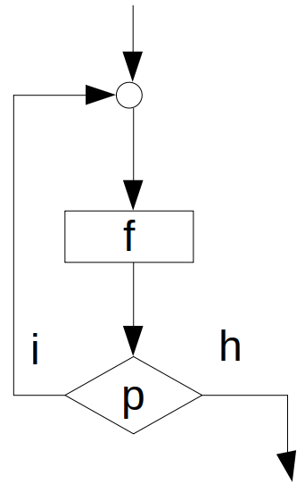
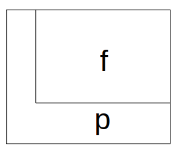

7. Strukturált programozás
==========================

**Strukturáltság**

* Általában fa struktúrát érthetünk alatta.
* A problématerünket egymásba ágyazott diszjunkt részhalmazokra bontjuk.
* Az ágakat gyakran rendezettnek tekintjük.
* Lokalitás, esetek szétválasztása
* C, ``struct``

**Két program ekvivalenciája**

Két programot ekvivalensnek nevezünk, hogy ha az összes lehetséges bemenet esetében
azonos bemenetekre azonos kimeneteket eredményeznek.

A program állapotát, mint egy pontot tekintve az állapottérben azt is mondhatjuk, hogy
azonos kezdőpontból azonos végpontba jutnak el.

**Programgráf / Vezérlési gráf**

Olyan összefüggő, irányított gráf, amely

* vonalakból (folyamatvonalakból),
* szekvenciákból (függvényekből),
* elágazásokból (predikátum egy befutó, két kifutó éllel),
* gyűjtőpontokból (két befutó, egy kifutó él)

épül fel.

.. A programgráf esetében pontosan 1 START és 1 STOP csomópontot használunk.

**Teljes élhalmazos jelölés**

* Minden csomóponthoz rendelünk valamilyen betűjelölést.
* A gráfot, mint élek halmazát adjuk meg.
* Elágazás esetén az igaz és a hamis esetet az élhez külön jelölni kell.

.. math::

  G = \{(START, A), (A, B/i), (A, C/h), (B, D), (C, D), (D, STOP)\}

**Tömör élhalmazos jelölés**

* Az éleket az áttekinthetőség kedvéért csak nyilakkal adjuk meg.
* A gyűjtőpontokat külön nem jelöljük.

.. math::

  G = \{START \rightarrow A, A \rightarrow (B, C),
  B \rightarrow STOP, C \rightarrow STOP\}

**Valódi program**

Egy programot valódi programnak nevezünk, hogy ha

* programgráfja véges számú bemenő és kimenő éllel rendelkezik,
* programgráfjának csomópontjai predikátumok, függvények és gyűjtőpontok,
* a programgráfjának minden pontján keresztül vezet útvonal, amely a belépési ponttól a kilépési pontig tart.

:math:`\rhd` Adjunk példát nem valódi programokra, melyek a felsorolt feltételekből csak egyet-egyet nem teljesítenek!

Strukturált alapelemek
----------------------

**Elemek jelölési módjai**

* Formula
* Programgráf
* Struktogram (Nassi-Schneidermann ábra)

Szekvencia
~~~~~~~~~~

.. math::

  S(f_1, \ldots, f_n)

Elágazás
~~~~~~~~

.. math::

  E(p; f, g)

Ciklus
~~~~~~

.. math::

  C(p; f)

Kvázi strukturált alapelem
--------------------------

Iteráció
~~~~~~~~

.. math::

  I(p; f)

Egyszerűen belátható, hogy

.. math::

  I(p; f) = S(f, C(p; f))

Minden strukturált alapelemnek pontosan egy belépési és egy kilépési pontja van.

:math:`\rhd` Milyen előnyei és hátrányai vannak az egyes jelölési módoknak?

Strukturált programok
---------------------

**Vezérlőgráf lebontása**

Vezérlőgráf lebontásának nevezzük azt az eljárást, amelyben minden lépésben egy strukturált
alapelemet egy függvénycsomóponttal helyettesítünk.
Ezt addig folytatjuk, ameddig lehetséges.

Az egyetlen csomópontból álló gráfot egyetlen irányított élre cserélünk (melyet üres programnak nevezünk).

**Strukturált program**

Strukturált programnak nevezzük az olyan programot, amely programgráfja lebontható az önmagában álló irányított élre.

:math:`\rhd` Lássuk be, hogy a definíció fordított lépések sorozatával is megadható lett volna!

**Strukturált program formulája**

Egy program csak akkor strukturált, hogy ha a formulája felírható a szekvencia, elágazás és a ciklus formulájából.

**Böhm-Jacopini tétel**

Minden valódi program megadható ekvivalens, strukturált program formájában.

* A tétel csak azt mondja ki, hogy *megadható*, de közvetlenül az átírás formáját nem részletezi.
* Az átírás nem egyértelmű. (Általában több ekvivalens strukturált program is megadható.)

**Segédváltozó használata**

Bizonyos esetekben a strukturált program felírása csak segédváltozó bevezetésével oldható meg.
Ehhez egy *flag* nevű segédváltozót fogunk használni, amelyhez a következő műveletek tartoznak hozzá:

* flag :math:`\leftarrow` igaz: a segédváltozó értékét beállítja igaz értékre,
* flag :math:`\leftarrow` hamis: a segédváltozó értékét beállítja hamis értékre,
* flag = igaz: egy predikátum, amely a segédváltozó értéke alapján dönt,
* FREE(flag): felszabadítja a lefoglalt segédváltozót.

:math:`\rhd` Adjunk példát nem strukturált programra, amelyben predikátum predikátumot követ!

:math:`\rhd` Írjuk fel az ekvivalens strukturált programot (az előforduló jelölési módokkal)!

:math:`\rhd` Lássuk be, hogy a kapott program valóban strukturált!

Programok bonyolultsága
-----------------------

**Programgráf ciklikus bonyolultsága**

A :math:`P` programgráf ciklikus bonyolultságának nevezzük az :math:`m(P) = e - c` értéket,
ahol :math:`e` az élek száma, :math:`c` pedig a csúcsok száma a programgráfban.

**Programgráf ciklikus bonyolultságának a tétele**

Egy programgráf ciklikus bonyolultsága az :math:`m(P) = p + 1` formában is számolható,
ahol :math:`p` a programgráfban lévő predikátumok számát jelöli.

*Bizonyítás*

Vezessük be a következő jelöléseket!

* :math:`p`: predikátumok száma
* :math:`f`: függvénycsomópontok száma
* :math:`g`: gyüjtőpontok száma
* :math:`e`: élek száma
* :math:`c`: csúcsok száma

Könnyen látható, hogy :math:`c = p + f + g`.

Határozzuk meg az élek számát a bemenő és a kimenő éleket tekintve:

.. math::

  &e = p + f + 2g + 1,\\
  &e = 2p + f + g + 1.\\

Tegyük ezt a kettőt egyenlővé egymással:

.. math::

  p + f + 2g + 1 = 2p + f + g + 1,

amiből azt kapjuk, hogy

.. math::

  p = g.

A csúcsok és élek számát tehát a következő formában is felírhatjuk:

.. math::

  &c = 2p + f,\\
  &e = 3p + f + 1.\\

Visszahelyettesítve a ciklikus bonyolultság képletébe, egyszerűen adódik a tétel állítása:

.. math::

  m(P) = e - c = (3p + f + 1) - (2p + f) = p + 1. \quad \square

**Nem strukturált program ciklikus bonyolultságának tétele**

Hogy ha :math:`P` egy nem strukturált program, akkor annak programgráfjának ciklikus bonyolultsága legalább 3, vagyis :math:`m(P) \geq 3`.

**Programgráf lényeges bonyolultsága**

Egy programgráf lényeges bonyolultságát az :math:`M(P) = m(P) - k` formában definiáljuk,
ahol :math:`k` a programgráfban elvégezhető lebontási lépések maximális száma, amelyben predikátumot vettünk ki a gráfból.

**Strukturált program lényeges bonyolultságának tétele**

A strukturált programok lényeges bonyolultsága mindig 1, tehát
:math:`M(P) = 1`, hogy ha :math:`P` strukturált.

*Bizonyítás*

A lényeges bonyolultság az :math:`M(P) = m(P) - k` formában számolható.
Strukturált program esetében :math:`k = p`, így

.. math::

  M(P) = m(P) - k = m(P) - p = p + 1 - p = 1. \quad \square

Kérdések
========

* Van-e olyan program, amelyik strukturált, de nem valódi? Ha igen, akkor adjon rá példát, ha nincs, akkor miért nincs?
* Garantálja-e a struktogram felrajzolása, hogy a program valódi?
* Garantálja-e a struktogram felrajzolása, hogy a program strukturált?

Feladatok
=========

A következő, tömör élhalmazos formában megadott programokhoz készítsünk

* programgráfot,
* írjuk fel az eredeti és az ekvivalens struktúrált program pszeudó kódját,
* rajzoljuk fel a struktogramot,
* írjuk fel a formuláját,
* számítsuk ki a ciklikus és a lényeges bonyolultságot!

.. math::

  &P = \{START \rightarrow A, A \rightarrow (B, C), B \rightarrow (D, E), C \rightarrow E, D \rightarrow A, E \rightarrow STOP\}\\

.. math::

  &P = \{START \rightarrow A, A \rightarrow B, B \rightarrow (C, D), C \rightarrow B, D \rightarrow E, E \rightarrow (A, STOP)\}\\

.. math::

  &P = \{START \rightarrow A, A \rightarrow B, B \rightarrow (C, D), C \rightarrow B, D \rightarrow (C, E), E \rightarrow (A, STOP)\}\\

.. math::

  &P = \{START \rightarrow A, A \rightarrow (B, C), B \rightarrow D, C \rightarrow E, D \rightarrow (A, F), E \rightarrow (A, F), F \rightarrow STOP\}\\

.. math::

  &P = \{
  START \rightarrow A, A \rightarrow (B, C), B \rightarrow (D, E), C \rightarrow A, D \rightarrow A, E \rightarrow (D, STOP)
  \}\\

.. math::

  &P = \{
  START \rightarrow A, A \rightarrow (B, C), B \rightarrow (D, E), C \rightarrow E, D \rightarrow A, E \rightarrow STOP
  \}\\

.. math::

  &P = \{
  START \rightarrow A, A \rightarrow B, B \rightarrow (C, D), C \rightarrow (B, STOP), D \rightarrow (C, A)
  \}\\

.. math::

  &P = \{
  START \rightarrow A, A \rightarrow (B, E), B \rightarrow C, C \rightarrow (D, G), D \rightarrow A, E \rightarrow (F, STOP), F \rightarrow G, G \rightarrow STOP
  \}\\

.. math::

  &P = \{
  START \rightarrow A, A \rightarrow (D, B), B \rightarrow C, C \rightarrow (E, STOP), D \rightarrow F, E \rightarrow A, F \rightarrow (B, C)
  \}\\
