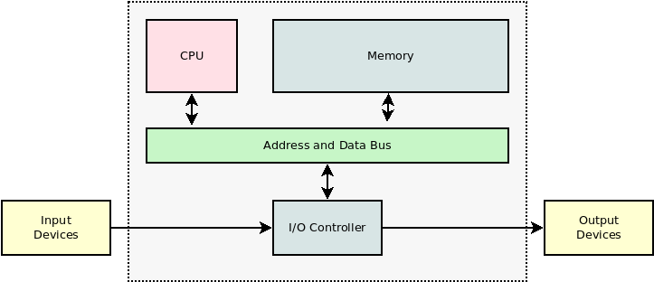
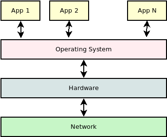

8. Programok végrehajtása
=========================

A számítógép elvi felépítése
----------------------------

* PC: Personal Computer
* Neumann architektúra
* A memóriában az instrukció és az adat vegyesen fordul elő.

CPU részei
----------

* ALU (*Arithmetical-Control Unit*)
* CU (*Control Unit*)
* Regiszterek
* Gyorsítótárak (*cache*)

**Regiszterek** (Intel esetében)

https://www.eecg.utoronto.ca/~amza/www.mindsec.com/files/x86regs.html

* Általános regiszterek: ``AX``, ``BX``, ``CX``, ``DX``
* Alsó-, felső- és kiterjesztett regiszterek, pl.: ``AL``, ``AH``, ``EAX``
* Kód szegmens: ``CS``
* Adat szegmens: ``DS``
* Verem szegmens: ``SS``
* Extra szegmens regiszterek: ``ES``, ``FS``, ``GS`` (például videó memóriához)
* Flag regiszterek: *Carry Flag* ``CF``, *Parity Flag* ``PF``, *Zero Flag* ``ZF``
* *Instruction Pointer* ``IP``, a következő utastásra mutat a kód szegmensen belül

Az ARM architektúrákon esetében

* több, általános célú regiszter,
* rövidebb, egyszerűbb utasítások.

Gépi kód
--------

* A számítógépeknek van egy nagyon egyszerű, alacsony szintű nyelvük.
* A gépi kódban számok szerepelnek, melyekhez jelentést társítunk, és a hardvert úgy készítik el, hogy annak megfelelően működjön.
* Ezeket a műveleti kódokat *opcode*-nak nevezik.

**Jellemző műveletek**

* Regiszterek értékének beállítása
* Megszakítások (*interruptok*) végrehajtása
* Ugrás műveletek

A program a gépi kód esetében számok sorozatát jelenti, amelyet a számítógép értelmezni tud.

Assembly nyelvek
----------------

* A gépi kódnál már egy fokkal emberközelibb nyelvek.
* Különböző szintűek lehetnek, például NASM (*Netwide Assembler*), MASM (*Microsoft Assembler*), HLA (*High Level Assembly*)
* Az opcode-okhoz mnemoikokat (könnyebben megjegyezhető rövidítéseket) rendelnek.
* A nyelvek hardverhez, hardver családokhoz kötődnek (például Intel, ARM processzorok).
* Az assembly kódból aránylag egyszerűen elő lehet állítani a gépi kódot.

.. code::

    DOSSEG
    .MODEL TINY
    .DATA
    TXT DB "Hello world!$"
    .CODE
    START:
    	MOV ax, @DATA
    	MOV ds, ax

    	MOV ah, 09h		; prepare output function
    	MOV dx, OFFSET TXT	; set offset
    	INT 21h			; output string TXT

    	MOV AX, 4C00h 		; go back to DOS
    	INT 21h
    END START

forrás: http://www.rosettacode.org/wiki/Hello_world/Text#8086_Assembly

Interpretálás és fordítás
-------------------------

A programokat jellemzően valamilyen magasabb szintű programozási nyelven szoktuk elkészíteni.
A végrehajtásukhoz a következő alternatívák állnak rendelkezésre.

**Interpretálás**

* Adott egy interpreter, amelyik megkapja a végrehajtandó programot forráskódként.
* Az utasításokat olyan sorrendben elemzi, ahogyan azok következnek.
* Dinamikus, gyengén típusos nyelveknél jellemző.

*Előnyei*

* A kód feldolgozására azonnal sor kerül.
* Egyszer futtatandó kisebb programok (például szkriptek esetében) praktikus.
* Lehet tudni, hogy konkrétan hol tart a futás (forráskód szintjén).
* A forráskód könnyebben átvihető más rendszerekre is. (Az interpreternek kell elérhetőnek lennie az adott platformon.)
* Az interpreter egyszerűbben implementálható, mint a fordító.

*Hátrányai*

* A végrehajtás szükségszerűen lassabb, mint ha már le lett volna fordítva a kód.
* Előfordulhat, hogy egyszerűbb szintaktikai hibák sem derülnek ki, amíg oda nem ér a végrehajtás.
* A program terjesztése során alapvetően a forráskódot adjuk át.

:math:`\rhd` Hogyan védhető az ki, hogy interpretált végrehajtás esetén odaadjuk a forráskódot?

**Fordítás**

* Főként statikusan, erősen típusos nyelveknél használják.
* A fordító a forráskódból tárgykódot készít, amely már az adott gép saját nyelvén (gépi kódban) van.
* A fordítási folyamat egy igen bonyolult, több lépéses transzformációt jelent.
* A fordítást el szokták különíteni gép független és gép függő részekre. (Ez jelenthet például magasabb szintű assembly nyelvre való fordítást első nagyobb lépésben.)

*Előnyei*

* A program az adott gépre optimalizáltan tud működni.
* Szintaktikai és szemantikai ellenőrzésre is van lehetőség.
* A bináris változatból az eredeti forráskód elvi szinten nem állítható vissza.

:math:`\rhd` Miért nem működik visszafelé a transzformáció?

*Hátrányai*

* A fordítási folyamat jellemzően lassú és számításigényes.
* Az elkészült tárgykód a platformok között nehezebben átvihető.
* A hibakeresés (rendszer szempontjából) bonyolultabb. (A modern hibakereső eszközök ezt a problémát többségében megoldják.)

:math:`\rhd` Mit ellenőrízhet egy fordító?

*Fordítási egységek*

* A nagyobb programokat nem érdemes minden esetben a teljes forráskódból lefordítani.
* Egy *build* folyamat alakítható ki.
* A programot fordítási egységekre lehet bontani, amely jellemzően követi a program felépítését.
* A lefordított tárgykód önmagában még tipikusan nem futtatható.
* Állomány típusok
* Szimbólumok
* Linkelés

**Byte-kód interpretált nyelvek**

* Az interpretálás és fordítás előnyeit igyekszik ötvözni.
* Az interpreter ebben az esetben egy assembly nyelvet értelmez.

:math:`\rhd` Milyen előnyök és hátrányok jelennek meg?

A hívási verem
--------------

* Angolul *Call Stack*
* Az elemei a keretek (*Stack Frame*)
* A függvények, procedúrák végrehajtásához szokták használni.
* A végrehajtás verem nélkül is megoldható, hogy ha nincs rekurzió.

A verembe kerülhetnek például

* az átadott paraméterek,
* a visszatérési cím,
* a lokális változók értékei.

:math:`\rhd` Az átadott paramétereknek milyen lesz a sorrendje?

:math:`\rhd` Vizsgáljuk meg hibakereső eszközzel, hogy hogy változik a hívási verem!

Memória allokáció
-----------------

Az alapvető probléma, hogy a program végrehajtásához szükséges adatokat mikor és hol érdemes tárolni.

* Elérési idők
* Allokációs költségek
* Memória limitek

Jellemzően a felhasznált adatok a program futása közben a következő helyenek fordulhatnak elő.

* Regiszterek: a lehető leggyorsabb, de limitált számú és méretű.
* Verem allokált memória: a dinamikusan létrejövő lokális változók kapnak benne helyet.
* Heap allokált memória: a ``malloc`` hívással tudunk memóriát lefoglalni ezen a területen.
* Gyorsítótárak, háttértár, közvetítő bufferek

Alkalmazások futtatása
----------------------

* Az alkalmazásokat az operációs rendszer alapvetően folyamatokként (*processzekként*) kezeli.
* Nem feltétlenül 1:1 kapcsolatról van szó.
* Az alkalmazások csak az OS-sel tudnak kommunikálni.
* Minden esetben absztrakt (virtuális) gépről beszélhetünk.
* Rendszerhívások

Kérdések
========

* Mit nevezünk gépi kódnak?
* Milyen előnyei és hátrányai vannak a program fordításának?
* Milyen előnyei és hátrányai vannak az interpretált végrehajtásnak?
* Miért vezették be a fordítási egységeket?
* A program futtatása során mihez szokott szükség lenni veremre?

Feladatok
=========

* Egy sorozatból vegyük (hagyjuk) ki a negatív értékeket! Oldjuk meg a problémát segédtömb használatával és a nélkül is!
* Határozzuk meg, hogy egy sorozatban mennyi van az :math:`[1, 10]` egész értékekből. A darabszámokat egy külön sorozatban adjuk vissza, melynél az index jelzi, hogy melyik értékre vonatkozik a darabszám.
* Válogassuk ki síkbeli pontok sorozatából az origó :math:`r` sugarú környezetébe eső pontokat!
* Nemnegatív egészek sorozatából gyűjtsük ki azokat az értékeket, amelyek 2 byte-on ábrázolhatóak, és azokat amelyek 4 byte-on ábrázolhatóak. Az eredmény legyen 2 kimeneti sorozat!
* Adja meg azt a procedúrát, amelyik 2 halmaz esetében megvizsgálja, hogy az egyik a másiknak részhalmaza-e! (Feltételezzük, hogy a bemenetek halmazok.)
* Egy valós számsorozat elemeit válogassuk szét az átlagnál kisebb és nem kisebb értékekre!
* Adjuk meg a halmazkülönbség számításának procedúráját!
* Írjunk egy procedúrát, amelyik egy nemnegatív számhoz kiszámítja annak kettes számrendszerbeli alakját számjegyek sorozataként! (Elöl, a kisebb indexeken legyenek a magasabb helyiértékek!)
* Egy számsorozatot rendezzünk át úgy, hogy az elejére kerüljenek a negatív, a végére pedig a nemnegatív értékek!
* Egy pozitív egész számnak számítsuk ki a prímtényezős felbontását!
* Számítsuk ki, hogy egy sorozatban mennyi az átlagnál kisebb és nem kisebb elemeknek a száma!
* Gyűjtsük ki a Fibonacci számsorozat elemeit, amelyek az :math:`[a, b]` indextartományba esnek! (A kimeneti sorozatban tehát az :math:`F_a, \ldots, F_b` értékeknek kell majd szerepelniük.)
* A bemenetként kapott számsorozatban határozzuk meg 2 olyan elemnek az idexét, amelyek négyzetösszege kisebb, mint 1000.
* Vizsgáljuk meg, hogy egy sorozat minden első felében szereplő elem szerepel-e a másodikban felében is!
