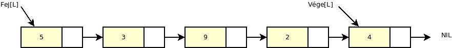
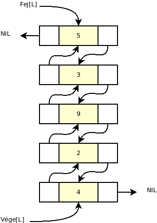
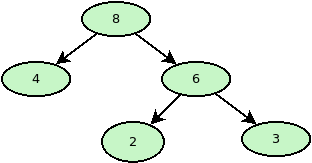
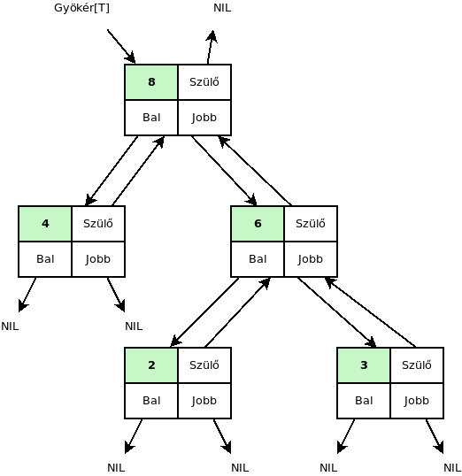

9. Mátrixok, listák, fák
========================

Vektorok
--------

* Azonos típusú elemeket tárolhatunk benne index szerint elérhető formában.
* Az azonos típus jelenthet általános objektumot is.
* Gyakran szinonímaként használják rá a tömb megnevezést.
* Feltételezzük, hogy minden elem azonos méretű.

.. math::

  @(v_i) = @v + (i - 1) \cdot h

ahol

* :math:`v \in \mathbb{T}^n`, egy :math:`n` elemű vektor,
* :math:`h \in \mathbb{N}`, egy tárolt elem mérete.

**Példa**

Tegyük fle, hogy egy vektor a 100-as címen kezdődik, és 4 byte-osak az elemei. Mi lesz a címe a 45. byte-nak?

.. math::

  &@v = 100 \\
  &h = 4 \\
  &i = 45 \\
  &@(v_{45}) = 100 + (45 - 1) \cdot 4 = 276

.. warning::

   * A :math:`\mathbb{T}` egy általános típust jelöl. Valós vektorok esetében ez az :math:`\mathbb{R}` halmaz lenne például.
   * A típus lehet akár összetett (például rekord) is.

:math:`\rhd` Hogyan címezhetők a rekord típusú elemek?

:math:`\rhd` Hogyan számolhatjuk vissza, hogy egy adott című byte hanyadik elem, melyik részén található?

:math:`\rhd` Hogyan működne a címszámítás 0-ás alapú indexelés esetében?

Két dimenziós tömbök, mátrixok
------------------------------

* A mátrix esetében azonos típusú elemek táblázatos elrendezésben szerepelnek.
* Több indexet is használhatunk az elemek eléréséhez.

Legyen :math:`A \in \mathbb{T}^{n \times m}` egy mátrix.

* :math:`n` darab sora van.
* :math:`m` darab oszlopa van.
* Tudjuk, hogy egy elemnek a mérete :math:`h`.

**Példa**

.. math::

  A = \begin{bmatrix}
      1 & 2 & 3 \\
      4 & 5 & 5 \\
      \end{bmatrix} \in \mathbb{R}^{2 \times 3}

Sorfolytonos tárolás
~~~~~~~~~~~~~~~~~~~~

.. math::

  @(a_{ij}) = @A + [(i - 1) \cdot m + (j - 1)] \cdot h

**Példa**

Az elemek a memóriában a következő sorrendben fognak elhelyezkedni:

.. math::

  [1, 2, 3, 4, 5, 6]

Oszlopfolytonos tárolás
~~~~~~~~~~~~~~~~~~~~~~~

.. math::

  @(a_{ij}) = @A + [(j - 1) \cdot n + (i - 1)] \cdot h

**Példa**

  Az elemek a memóriában a következő sorrendben fognak elhelyezkedni:

  .. math::

    [1, 4, 2, 5, 3, 6]

:math:`\rhd` Hogyan néznének ki ezek a számítások 0 alapú indexeléssel?

Háromszög mátrixok
~~~~~~~~~~~~~~~~~~

* A mátrix főátló alatti, vagy feletti része nincs kitöltve.
* Ettől függően beszélhetünk alsó- és felsőháromszög mátrixokról.

.. math::

  @(a_{ij}) = @A + \left[\dfrac{i \cdot (i - 1)}{2} + j\right] \cdot h

**Példa**

:math:`A \in \mathbb{R}^{4 \times 4}`

.. math::

  A = \begin{bmatrix}
      1 & 0 & 0 & 0 \\
      2 & 3 & 0 & 0 \\
      4 & 5 & 6 & 0 \\
      7 & 8 & 9 & 10 \\
      \end{bmatrix}

Szimmetrikus mátrixok
---------------------

Olyan négyzetes mátrixok, amelyekre teljesül, hogy :math:`a_{ij} = a_{ji}`.

* A háromszög mátrixokhoz hasonlóan tárolhatók.

Diagonális mátrix
~~~~~~~~~~~~~~~~~

* A mátrixnak csak a főátlóban tartalmaz nem nulla elemeket.

.. math::

  A = \begin{bmatrix}
      4 & 0 & 0 & 0 \\
      0 & 3 & 0 & 0 \\
      0 & 0 & 1 & 0 \\
      0 & 0 & 0 & 8 \\
      \end{bmatrix}

.. math::

  @(a_{ii}) = @A + (i - 1) \cdot h

Egység mátrix
~~~~~~~~~~~~~

A főátlóban 1-esek, azon kívül pedig 0 értékek szerepelnek.

**Példa**

.. math::

  A = \begin{bmatrix}
      1 & 0 & 0 & 0 \\
      0 & 1 & 0 & 0 \\
      0 & 0 & 1 & 0 \\
      0 & 0 & 0 & 1 \\
      \end{bmatrix}

Nem szükséges tárolni az elemek értékét. Függvényként felírható.

.. math::

  a_{ij} = \begin{cases}
  1, & i = j, \\
  0, & i \neq j. \\
  \end{cases}

Ritka mátrixok
~~~~~~~~~~~~~~

A nullától (vagy egyéb üresnek tekintett értéktől) különböző elemből aránylag kevés van. (Változó, hogy éppen mit értenek kevés alatt.)

Tipikus megoldás lehet például, hogy az adott elem indexe és értéke is tárolásra kerül táblázatos formában.

**Példa**

.. math::

  A = \begin{bmatrix}
      0 & 0 & 0 & 0 \\
      0 & 0 & 0 & 6 \\
      7 & 0 & 0 & 0 \\
      4 & 0 & 5 & 0 \\
      \end{bmatrix}

Egy lehetséges tárolási mód:

.. csv-table::
   :header-rows: 1

   i,j,value
   2,4,6
   3,1,7
   4,1,4
   4,3,5

:math:`\rhd` Milyen más alternatívák jöhetnek még szóba?

Listák
------

* A rekordokban címet is tudunk tárolni, így az adatainkat listákba tudjuk szervezni.
* A listának van feje (Fej attribútum) és vége (Vége attribútum).
* A következő elemre mutató attribútum neve Köv.

**Példa**

Tegyük fel, hogy az 5, 3, 9, 2, 4 értékeket listában szeretnénk tárolni.

* Kétszeresen (duplán) láncolt lista esetében az előző elemre is hivatkozik attribútum (Elő).

.. warning::

	A memóriában a láncszemek általában nem sorrendben, és nem folytonosan (hézag mentesen) helyezkednek el.

Fák
---

A csomópontokban több címet is tárolhatunk, így fa struktúrákat is ki tudunk alakítani.

**Példa**

Tekintsük az alábbi bináris fát!

Bináris fa esetén egy rekordban például a következő attribútumokat adhatjuk meg:

* Kulcs: az elemben tárolt érték.
* Bal: a bal gyerek címe.
* Jobb: a jobb gyerek címe.
* Szülő: a szülő elem címe.

A rekordok a következő formában hivatkoznak majd egymásra.

* A szülő mutatója nem kötelező elem.
* Általánosan a csomópontban lehet lista is, amely a gyerekelemek címeit tartalmazza.

Kérdések
========

* Hogyan számítható ki a vektorok elemeinek a címe a memóriában?
* Mit jelent mátrixok esetében a sorfolytonos tárolási mód?
* Mit jelent mátrixok esetében az oszlopfolytonos tárolási mód?
* Hogyan érdemes tárolni a diagonális mátrixok elemeit?
* Mit nevezünk láncolt listának?
* Mit nevezünk kétszeresen láncolt listának?

Feladatok
=========

Vektorok
--------

* Készítsünk egy procedúrát, amelyik meghatározza két :math:`n` dimenziós vektor euklideszi távolságát!
* Készítsünk egy procedúrát két :math:`n` hosszúságú vektor összeadásához!

Mátrixok
--------

* Készítsen egy procedúrát, amelyik megvizsgálja egy mátrixról, hogy egység mátrix-e!
* Készítsen egy procedúrát, amelyik megvizsgálja egy mátrixról, hogy diagonális mátrix-e!
* Készítsen egy procedúrát, amelyik megvizsgálja egy mátrixról, hogy felső háromszög mátrix-e!
* Készítsen egy procedúrát, amelyik megvizsgálja egy mátrixról, hogy az szimmetrikus-e!
* Készítsen egy procedúrát, amelyik meghatározza egy valós mátrix sorösszegeinek maximumát!
* Készítsen egy procedúrát, amelyik meghatározza egy mátrix oszlopaiban lévő maximum értékeinek szorzatát!
* Készítsen egy procedúrát, amelyik meghatározza, hogy egy mátrixban mennyi nullától különböző elem van!
* Készítsen egy procedúrát, amelyik meghatározza, hogy egy valós mátrix maximális értékének mi a sor és oszlop indexe!
* Adja meg azt a procedúrát, amellyel két mátrixot össze lehet adni!
* Készítsen egy procedúrát, amelyik meghatározza, hogy egy valós mátrixban van-e ismétlődő elem!

Listák
------

* Készítsen egy procedúrát, amelyik meghatározza egy lista hosszát!
* Készítsen egy procedúrát, amelyik meghatározza egy lista értékinek összegét!
* Készítsen egy procedúrát, amelyik meghatározza egy lista értékeinek maximumát!
* Készítsen egy procedúrát, amelyik megvizsgálja, hogy egy listában van-e ismétlődő elem-e!
* Készítsen egy procedúrát, amelyik megvizsgálja, hogy egy listában minden elem ismétlődő elem-e!

Fák
---

* Készítsen egy procedúrát, amelyik meghatározza egy bináris fában a kulcsok összegét!
* Készítsen egy procedúrát, amelyik meghatározza egy bináris fában a kulcsok maximumát!
