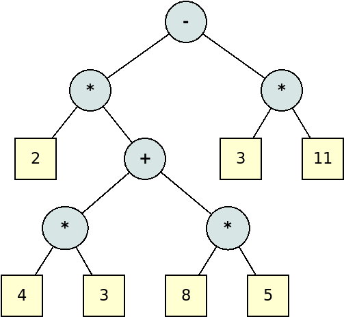
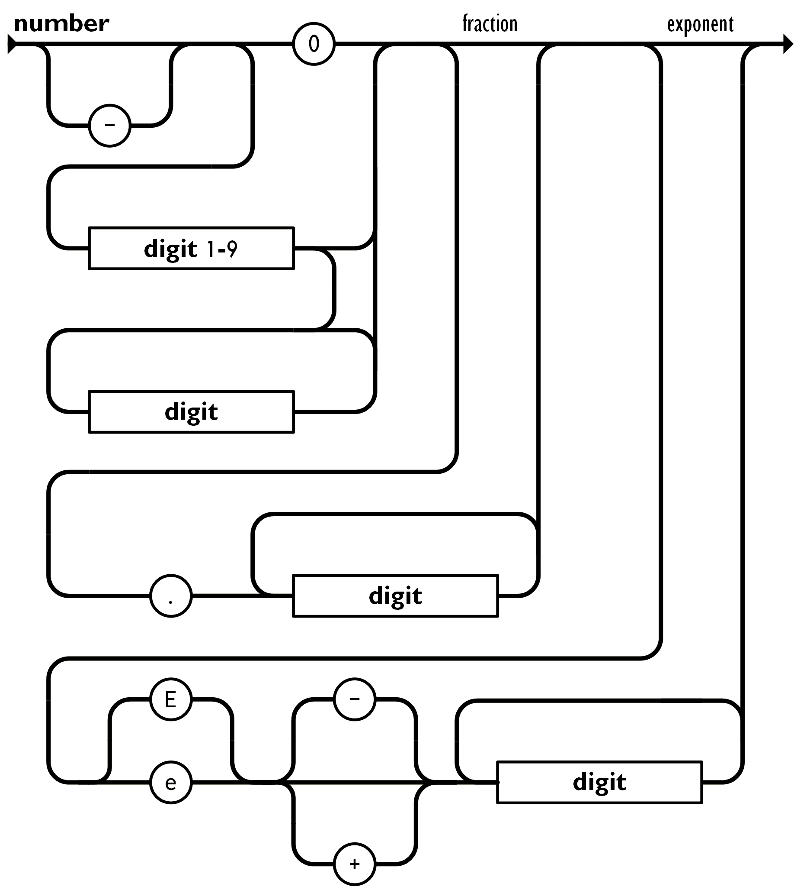

11. Típus konverziók
====================

Formulák
--------

Vizsgáljuk meg, hogy hogyan értékelhető ki a következő kifejezés!

.. code::

  ((2 * ((4 * 3) + (8 * 5))) - (3 * 11))

* A program forrását, mint szövegláncot tekinthetjük.
* A feldolgozásához azt tokenekre kell bontanunk.
* Megkülönböztethetünk literálokat, operátorokat, zárójeleket.
* A felesleges karakterek eldobhatók.

A nyelvtan definíciója:

.. code::

  <expr> ::= <int> | '(' <expr> <op> <expr> ')'
  <op>   ::= '+' | '-' | '*' | '/'

* A kifejezésekből kifejezésfákat építhetünk.
* Általában, hogy ha a kifejezésfát fel sikerült építeni, az azt jelzi, hogy a kód szintaxisa megfelelő.

:math:`\rhd` A kifejezés szöveges leírása alapján milyen algoritmussal tudnánk felépíteni a fát?

A kiértékeléséhez először adjuk meg a post-order bejárását a fának.

.. code::

  2 4 3 * 8 5 * + * 3 11 * -

Ezt a felírást nevezik fordított lengyel formának is.

* Először szerepelnek az operandusok, utána az operátorok.
* Az operátoroknál ismert a paraméterek száma.
* A kiértékelést verem segítségével egyszerűen meg lehet oldani.
* Az eredmény a verem tetején marad majd.

:math:`\rhd` Vizsgáljuk meg a számítás menetét végigkövetve a verem állapotát!

Szám-szöveg
-----------

* El kell végezni hozzá a számrendszeri átalakítást.
* A kapott értékekhez karaktereket kell rendelni.

Szöveg-szám
-----------

* Szövegfeldolgozási probléma.
* Egyáltalán nem garantált, hogy az érték átalakítható (hogy ha nincs egyéb ellenőrzés, megkötés előtte).

Lebegőpontos számok
-------------------

forrás: https://www.json.org/json-en.html

Dátum és idő konverziója
------------------------

* A dátum és idő formátumok sajnos közel sem egységesek.
* Rendszertől függően lokalizációs beállításokra van szükség.
* Van rá vonatkozó ISO szabvány

.. code::

  2021-11-15 10:32:55.668001

Feladatok
=========

* Készítsünk egy procedúrát, amelyik egy szöveges formában kapott formuláról eldönti, hogy az megfelelően zárójelezett-e!
* Készítsünk olyan procedúrát, amelyik a `()`, `[]` és a `{}` jeleket egyidejűleg tudja ellenőrízni, hogy helyes zárójelezést adnak!
